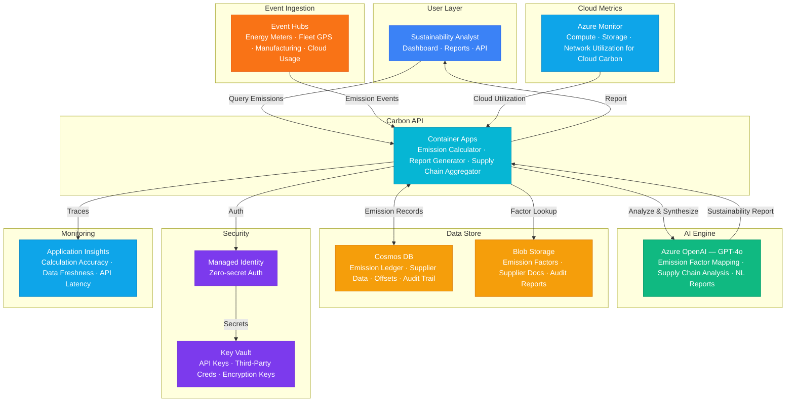

# Play 69 — Carbon Footprint Tracker

AI-powered carbon tracking — Scope 1 (direct fuel), Scope 2 (location + market-based electricity), Scope 3 (AI-classified spend-based estimation), emission factor database (GHG Protocol 2024), multi-framework reporting (GHG Protocol/CDP/TCFD), reduction recommendations with ROI, and complete data lineage for audit.

## Architecture

| Component | Azure Service | Purpose |
|-----------|--------------|---------|
| Spend Classification | Azure OpenAI (GPT-4o-mini) | Scope 3 spend → emission category |
| Report Generation | Azure OpenAI (GPT-4o) | GHG Protocol/CDP/TCFD reports |
| Emission Data | Azure Cosmos DB | Calculations, audit trail, lineage |
| Tracker API | Azure Container Apps | Calculation + reporting endpoint |
| Dashboard | Azure Static Web Apps | Emission visualization |
| Secrets | Azure Key Vault | API keys |

📐 [Full architecture details](architecture.md)

## How It Differs from Related Plays

| Aspect | Play 70 (ESG Compliance) | **Play 69 (Carbon Tracker)** |
|--------|-------------------------|------------------------------|
| Scope | Full ESG (E+S+G) | **Environmental (carbon) focused** |
| Calculation | ESG scoring | **Scope 1/2/3 emission calculation** |
| Output | ESG compliance report | **Carbon footprint report + reduction plan** |
| Factors | ESG frameworks | **GHG Protocol emission factors** |
| AI Role | ESG risk analysis | **Spend classification + recommendation** |
| Standard | Multiple ESG standards | **GHG Protocol, CDP, TCFD** |

## Key Metrics

| Metric | Target | Description |
|--------|--------|-------------|
| Scope 1 Accuracy | > 99% | Deterministic fuel × factor |
| Scope 3 Estimation | Within ±25% | LLM-classified spend-based |
| Spend Classification | > 85% | Correct emission category |
| GHG Protocol Compliance | 100% | All required sections |
| Data Lineage | 100% | Every calculation traceable |

## Cost Estimate

| Service | Dev | Prod | Enterprise |
|---------|-----|------|------------|
| Azure OpenAI | $25 | $180 | $700 |
| Azure Monitor | $0 | $40 | $150 |
| Cosmos DB | $3 | $50 | $180 |
| Event Hubs | $11 | $22 | $90 |
| Container Apps | $10 | $80 | $220 |
| Blob Storage | $2 | $15 | $50 |
| Key Vault | $1 | $3 | $10 |
| Application Insights | $0 | $20 | $70 |
| **Total** | **$52/mo** | **$410/mo** | **$1,470/mo** |

> Estimates based on Azure retail pricing. Actual costs vary by region, usage, and enterprise agreements.

💰 [Full cost breakdown](cost.json)

## WAF Alignment

| Pillar | Implementation |
|--------|---------------|
| **Responsible AI** | LLM for classification only (not calculation), transparent factors |
| **Reliability** | Deterministic Scope 1/2 formulas, auditable lineage |
| **Operational Excellence** | Multi-framework reporting, annual factor updates |
| **Cost Optimization** | gpt-4o-mini for classification, batch processing, ~$56/mo |
| **Security** | Emission data in Cosmos DB, Key Vault for secrets |
| **Performance Efficiency** | Batch spend classification, cached vendor categories |

## FAI Manifest

| Field | Value |
|-------|-------|
| Play | `69-carbon-footprint-tracker` |
| Version | `1.0.0` |
| Knowledge | T3-Production-Patterns, O5-AI-Infrastructure, F1-GenAI-Foundations |
| WAF Pillars | cost-optimization, operational-excellence, responsible-ai, reliability |
