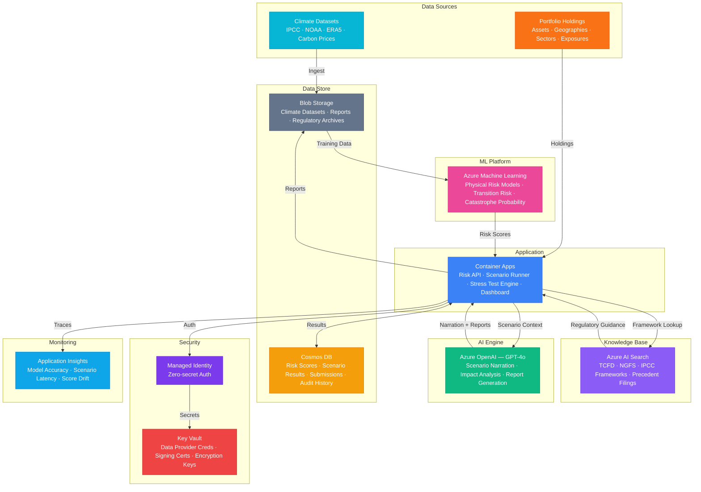

# Play 72 — Climate Risk Assessor 🌍

> AI climate risk assessment — physical risk scoring, transition risk analysis, NGFS scenarios, TCFD-aligned reporting.

Assess climate risks for companies at asset-level granularity. Physical risks (floods, heat, sea level, wildfire, storms) scored by location, transition risks (carbon pricing, stranded assets, market shift) analyzed by sector, financial impacts quantified across NGFS scenarios.

## Quick Start
```bash
cd solution-plays/72-climate-risk-assessor
az deployment group create -g $RG -f infra/main.bicep -p infra/parameters.json
code .
# Use @builder to implement, @reviewer to audit, @tuner to optimize
```

## Architecture



📐 [Full architecture details](architecture.md)

## Pre-Tuned Defaults
- Scenarios: Orderly / Disorderly / Hot House (NGFS v4)
- Time Horizons: Short (1-3y) · Medium (3-10y) · Long (10-30y)
- Physical Risk: 5 hazards weighted by sector (flood, heat, sea level, wildfire, storm)
- TCFD: All 4 pillars (Governance, Strategy, Risk Mgmt, Metrics & Targets)

## DevKit (AI-Assisted Development)
| Primitive | What It Does |
|-----------|-------------|
| `agent.md` | Root orchestrator with builder→reviewer→tuner handoffs |
| `copilot-instructions.md` | Climate risk domain (NGFS, TCFD, physical/transition risk pitfalls) |
| 3 agents | Builder (gpt-4o), Reviewer (gpt-4o-mini), Tuner (gpt-4o-mini) |
| 3 skills | Deploy (170+ lines), Evaluate (120+ lines), Tune (210+ lines) |
| 4 prompts | `/deploy`, `/test`, `/review`, `/evaluate` with agent routing |

## Cost Estimate

| Service | Dev | Prod | Enterprise |
|---------|-----|------|------------|
| Azure OpenAI | $35 | $300 | $1,200 |
| Azure Machine Learning | $0 | $350 | $1,200 |
| Cosmos DB | $3 | $75 | $300 |
| Azure AI Search | $0 | $250 | $500 |
| Container Apps | $10 | $120 | $350 |
| Blob Storage | $3 | $30 | $80 |
| Key Vault | $1 | $5 | $15 |
| Application Insights | $0 | $30 | $120 |
| **Total** | **$52** | **$1,160** | **$3,765** |

💰 [Full cost breakdown](cost.json)

## vs. Play 70 (ESG Compliance Agent)
| Aspect | Play 70 | Play 72 |
|--------|---------|---------|
| Focus | Multi-framework ESG compliance (GRI/SASB/CSRD) | Climate risk (physical + transition) |
| Output | ESG score + gap analysis | Risk assessment + TCFD report |
| Data | Company sustainability reports | Geospatial climate layers + financial data |
| Scenarios | N/A | 3+ NGFS scenarios with time horizons |

📖 [Full documentation](spec/README.md) · 🌐 [frootai.dev/solution-plays/72-climate-risk-assessor](https://frootai.dev/solution-plays/72-climate-risk-assessor) · 📦 [FAI Protocol](spec/fai-manifest.json)


## FAI Manifest

| Field | Value |
|-------|-------|
| Play | `72-climate-risk-assessor` |
| Version | `1.0.0` |
| Knowledge | R2-RAG-Architecture, T2-Responsible-AI, T3-Production-Patterns, F1-GenAI-Foundations |
| WAF Pillars | responsible-ai, reliability, security, cost-optimization |
