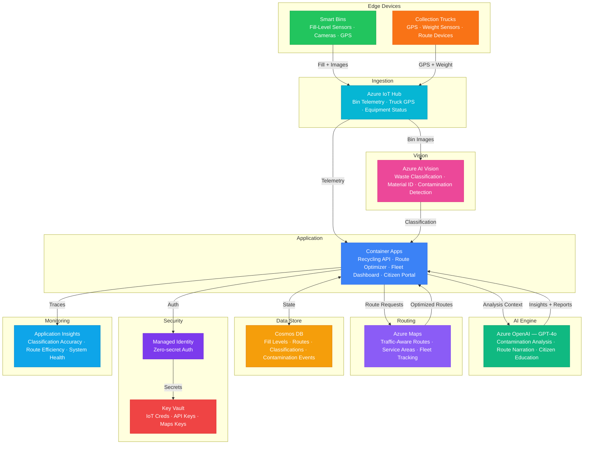

# Play 73 — Waste Recycling Optimizer ♻️

> AI waste management — material classification (CV), contamination detection, route optimization, circular economy tracking.

Build an intelligent waste management system. ONNX vision models classify materials (9 categories), contamination detection prevents batch rejection, OR-Tools optimizes collection routes, and IoT sensors trigger dynamic collection scheduling.

## Quick Start
```bash
cd solution-plays/73-waste-recycling-optimizer
az deployment group create -g $RG -f infra/main.bicep -p infra/parameters.json
code .
# Use @builder to implement, @reviewer to audit, @tuner to optimize
```

## Architecture



📐 [Full architecture details](architecture.md)

## Pre-Tuned Defaults
- Classification: 9 categories · confidence threshold 0.75 · ONNX < 100ms
- Contamination: 4 types (food, liquid, mixed, hazardous) · auto-reject hazardous
- Routes: TSP with time windows · 70% fill trigger · 40 max stops
- Recovery: Plastic 50% · Metal 70% · Paper 65% · Glass 80% · Organic 60%

## DevKit (AI-Assisted Development)
| Primitive | What It Does |
|-----------|-------------|
| `agent.md` | Root orchestrator with builder→reviewer→tuner handoffs |
| `copilot-instructions.md` | Waste AI domain (CV pipeline, contamination, route optimization pitfalls) |
| 3 agents | Builder (gpt-4o), Reviewer (gpt-4o-mini), Tuner (gpt-4o-mini) |
| 3 skills | Deploy (180+ lines), Evaluate (130+ lines), Tune (220+ lines) |
| 4 prompts | `/deploy`, `/test`, `/review`, `/evaluate` with agent routing |

## Cost Estimate

| Service | Dev | Prod | Enterprise |
|---------|-----|------|------------|
| Azure AI Vision | $0 | $150 | $500 |
| Azure OpenAI | $20 | $150 | $500 |
| Azure IoT Hub | $0 | $25 | $250 |
| Container Apps | $10 | $100 | $280 |
| Cosmos DB | $3 | $50 | $180 |
| Azure Maps | $5 | $60 | $200 |
| Key Vault | $1 | $3 | $5 |
| Application Insights | $0 | $20 | $80 |
| **Total** | **$39** | **$558** | **$1,995** |

💰 [Full cost breakdown](cost.json)

## vs. Play 69 (Carbon Footprint Tracker)
| Aspect | Play 69 | Play 73 |
|--------|---------|---------|
| Focus | Scope 1/2/3 emissions tracking | Material recovery optimization |
| AI Role | Emission factor estimation | Computer vision classification |
| Data Flow | Reports → scoring | Images → classification → sorting |
| Infrastructure | Cosmos DB + Functions | Custom Vision + IoT Hub + Maps |

📖 [Full documentation](spec/README.md) · 🌐 [frootai.dev/solution-plays/73-waste-recycling-optimizer](https://frootai.dev/solution-plays/73-waste-recycling-optimizer) · 📦 [FAI Protocol](spec/fai-manifest.json)


## FAI Manifest

| Field | Value |
|-------|-------|
| Play | `73-waste-recycling-optimizer` |
| Version | `1.0.0` |
| Knowledge | F1-GenAI-Foundations, O2-AI-Agents, T3-Production-Patterns |
| WAF Pillars | responsible-ai, cost-optimization, performance-efficiency, reliability |
