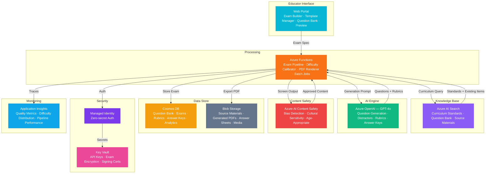

# Play 75 — Exam Generation Engine 📝

> AI exam creation — question generation from learning materials, Bloom's taxonomy distribution, MCQ distractor generation, IRT calibration.

Build an intelligent exam generation system. Extract content from learning materials (PDF/DOCX), generate questions across Bloom's taxonomy levels, create plausible distractors grounded in common misconceptions, and calibrate difficulty via Item Response Theory.

## Quick Start
```bash
cd solution-plays/75-exam-generation-engine
az deployment group create -g $RG -f infra/main.bicep -p infra/parameters.json
code .
# Use @builder to implement, @reviewer to audit, @tuner to optimize
```

## Architecture



📐 [Full architecture details](architecture.md)

## Pre-Tuned Defaults
- Bloom's: Remember 15% · Understand 25% · Apply 30% · Analyze 20% · Evaluate 7% · Create 3%
- Question Types: MCQ 50% · Short Answer 25% · Essay 15% · True/False 10%
- Difficulty: Easy 30% · Medium 45% · Hard 25% · Target mean 70%
- Distractors: 3 per MCQ · misconception-grounded · ±20% length tolerance

## DevKit (AI-Assisted Development)
| Primitive | What It Does |
|-----------|-------------|
| `agent.md` | Root orchestrator with builder→reviewer→tuner handoffs |
| `copilot-instructions.md` | Exam domain (Bloom's, distractors, IRT, question type constraints) |
| 3 agents | Builder (gpt-4o), Reviewer (gpt-4o-mini), Tuner (gpt-4o-mini) |
| 3 skills | Deploy (195+ lines), Evaluate (130+ lines), Tune (225+ lines) |
| 4 prompts | `/deploy`, `/test`, `/review`, `/evaluate` with agent routing |

## Cost Estimate

| Service | Dev | Prod | Enterprise |
|---------|-----|------|------------|
| Azure OpenAI | $25 | $200 | $600 |
| Cosmos DB | $3 | $50 | $180 |
| Blob Storage | $2 | $15 | $40 |
| Azure Functions | $0 | $30 | $150 |
| Azure AI Content Safety | $0 | $20 | $60 |
| Azure AI Search | $0 | $75 | $250 |
| Key Vault | $1 | $3 | $10 |
| Application Insights | $0 | $15 | $50 |
| **Total** | **$31** | **$408** | **$1,340** |

💰 [Full cost breakdown](cost.json)

## vs. Play 74 (AI Tutoring Agent)
| Aspect | Play 74 | Play 75 |
|--------|---------|---------|
| Focus | Real-time Socratic tutoring | Exam/assessment generation |
| Interaction | Multi-turn conversation | Batch generation + export |
| Output | Personalized dialogue | Exam PDF with answer key + rubrics |
| Calibration | Adaptive difficulty per student | IRT calibration across population |

📖 [Full documentation](spec/README.md) · 🌐 [frootai.dev/solution-plays/75-exam-generation-engine](https://frootai.dev/solution-plays/75-exam-generation-engine) · 📦 [FAI Protocol](spec/fai-manifest.json)


## FAI Manifest

| Field | Value |
|-------|-------|
| Play | `75-exam-generation-engine` |
| Version | `1.0.0` |
| Knowledge | F1-GenAI-Foundations, R1-Prompt-Engineering, T2-Responsible-AI |
| WAF Pillars | responsible-ai, reliability, performance-efficiency |
