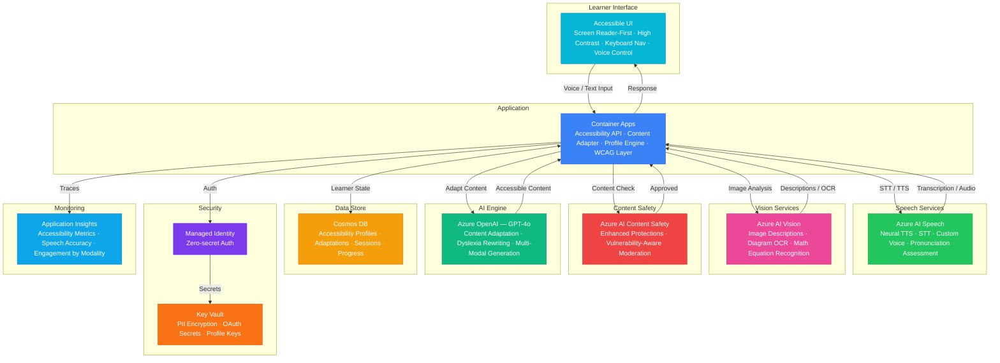

# Play 76 — Accessibility Learning Agent ♿

> AI accessibility compliance — WCAG 2.2 checking, alt-text generation, cognitive load assessment, screen reader optimization.

Build an intelligent accessibility auditor. Combines axe-core automated checks with AI-enhanced analysis (cognitive load, reading order, plain language), generates context-aware alt text via GPT-4o Vision, and provides actionable remediation recommendations with effort estimates.

## Quick Start
```bash
cd solution-plays/76-accessibility-learning-agent
az deployment group create -g $RG -f infra/main.bicep -p infra/parameters.json
code .
# Use @builder to implement, @reviewer to audit, @tuner to optimize
```

## Architecture



📐 [Full architecture details](architecture.md)

## Pre-Tuned Defaults
- WCAG: 2.2 AA target · 4 principles (POUR) · crawl depth 3
- Alt-text: ≤ 125 chars · context-aware · decorative detection · no "Image of" prefix
- Cognitive: Grade 8 reading level · 2000 max words · 10 max form fields
- Severity: Block deploy on critical + serious violations

## DevKit (AI-Assisted Development)
| Primitive | What It Does |
|-----------|-------------|
| `agent.md` | Root orchestrator with builder→reviewer→tuner handoffs |
| `copilot-instructions.md` | WCAG domain (automated vs AI checks, alt-text best practices, cognitive load) |
| 3 agents | Builder (gpt-4o), Reviewer (gpt-4o-mini), Tuner (gpt-4o-mini) |
| 3 skills | Deploy (185+ lines), Evaluate (120+ lines), Tune (220+ lines) |
| 4 prompts | `/deploy`, `/test`, `/review`, `/evaluate` with agent routing |

## Cost Estimate

| Service | Dev | Prod | Enterprise |
|---------|-----|------|------------|
| Azure AI Speech | $0 | $200 | $700 |
| Azure OpenAI | $30 | $300 | $1,200 |
| Azure AI Vision | $0 | $80 | $250 |
| Container Apps | $10 | $150 | $400 |
| Cosmos DB | $3 | $75 | $300 |
| Azure AI Content Safety | $0 | $30 | $100 |
| Key Vault | $1 | $5 | $15 |
| Application Insights | $0 | $30 | $100 |
| **Total** | **$44** | **$870** | **$3,065** |

💰 [Full cost breakdown](cost.json)

## vs. Play 74 (AI Tutoring Agent)
| Aspect | Play 74 | Play 76 |
|--------|---------|---------|
| Focus | Socratic tutoring for students | WCAG compliance for web content |
| AI Role | Guide student reasoning | Detect violations + generate alt text |
| Users | Students (possibly minors) | Developers + content authors |
| Output | Adaptive conversation | Compliance report + remediation list |

📖 [Full documentation](spec/README.md) · 🌐 [frootai.dev/solution-plays/76-accessibility-learning-agent](https://frootai.dev/solution-plays/76-accessibility-learning-agent) · 📦 [FAI Protocol](spec/fai-manifest.json)


## FAI Manifest

| Field | Value |
|-------|-------|
| Play | `76-accessibility-learning-agent` |
| Version | `1.0.0` |
| Knowledge | F1-GenAI-Foundations, O2-AI-Agents, T2-Responsible-AI |
| WAF Pillars | responsible-ai, reliability, performance-efficiency, security |
