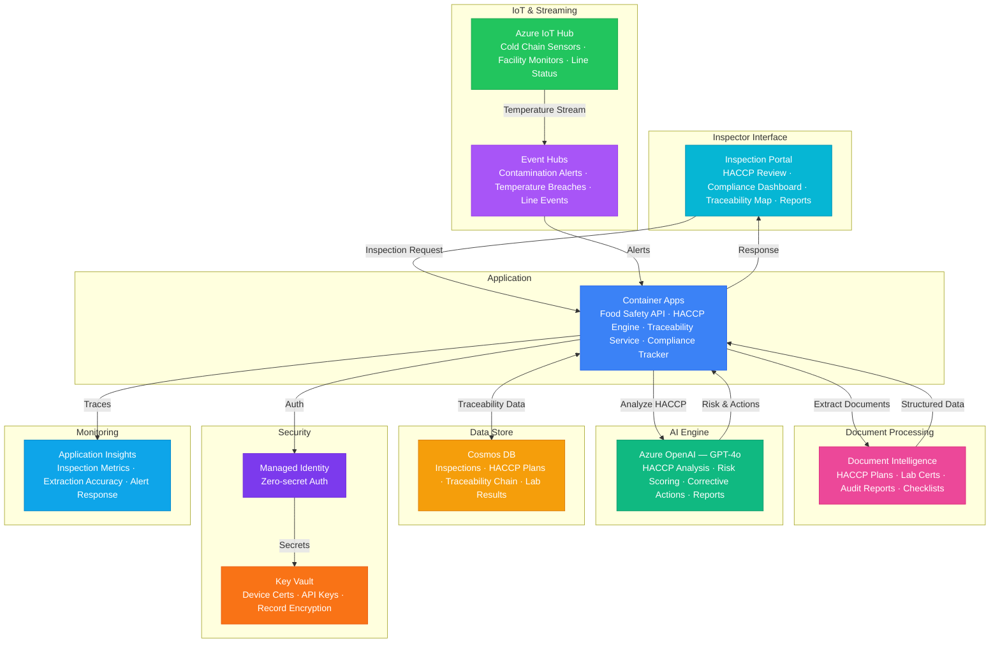

# Play 79 — Food Safety Inspector AI 🍴

> AI food safety — HACCP monitoring, contamination risk scoring, supply chain traceability, recall management, FDA/EFSA regulatory reporting.

Build an intelligent food safety inspection system. IoT sensors monitor Critical Control Points (temperature, humidity), AI detects violation patterns across inspections, full supply chain traceability enables rapid recall simulations, and regulatory reports auto-generate for FDA/EFSA compliance.

## Quick Start
```bash
cd solution-plays/79-food-safety-inspector-ai
az deployment group create -g $RG -f infra/main.bicep -p infra/parameters.json
code .
# Use @builder to implement, @reviewer to audit, @tuner to optimize
```

## Architecture



📐 [Full architecture details](architecture.md)

## Pre-Tuned Defaults
- HACCP: 5 CCPs (receiving, storage, cooking, cooling, hot holding) with FDA limits
- Alerts: 90% warning threshold · 15 min escalation · 120s door-open debounce
- Patterns: 3-month history · recurring+trending+seasonal+shift detection
- Traceability: FSMA 204 compliant · one-up-one-back · 2-year retention

## DevKit (AI-Assisted Development)
| Primitive | What It Does |
|-----------|-------------|
| `agent.md` | Root orchestrator with builder→reviewer→tuner handoffs |
| `copilot-instructions.md` | Food safety domain (HACCP plans, FDA limits, traceability, recall management) |
| 3 agents | Builder (gpt-4o), Reviewer (gpt-4o-mini), Tuner (gpt-4o-mini) |
| 3 skills | Deploy (210+ lines), Evaluate (125+ lines), Tune (240+ lines) |
| 4 prompts | `/deploy`, `/test`, `/review`, `/evaluate` with agent routing |

## Cost Estimate

| Service | Dev | Prod | Enterprise |
|---------|-----|------|------------|
| Azure Document Intelligence | $0 | $120 | $400 |
| Azure OpenAI | $30 | $350 | $1,400 |
| Cosmos DB | $3 | $75 | $300 |
| Azure Event Hubs | $5 | $50 | $250 |
| Azure IoT Hub | $0 | $25 | $250 |
| Container Apps | $10 | $150 | $400 |
| Key Vault | $1 | $5 | $15 |
| Application Insights | $0 | $30 | $100 |
| **Total** | **$49** | **$805** | **$3,115** |

💰 [Full cost breakdown](cost.json)

## vs. Play 78 (Precision Agriculture Agent)
| Aspect | Play 78 | Play 79 |
|--------|---------|---------|
| Focus | Crop health monitoring | Food processing safety |
| Sensors | Soil moisture/pH + satellite | Temperature/humidity at CCPs |
| AI Role | Stress detection + yield | Violation patterns + recall trace |
| Regulation | N/A | FDA HACCP, FSMA 204 |

📖 [Full documentation](spec/README.md) · 🌐 [frootai.dev/solution-plays/79-food-safety-inspector-ai](https://frootai.dev/solution-plays/79-food-safety-inspector-ai) · 📦 [FAI Protocol](spec/fai-manifest.json)


## FAI Manifest

| Field | Value |
|-------|-------|
| Play | `79-food-safety-inspector-ai` |
| Version | `1.0.0` |
| Knowledge | R2-RAG-Architecture, T2-Responsible-AI, T3-Production-Patterns |
| WAF Pillars | security, reliability, responsible-ai, operational-excellence |
