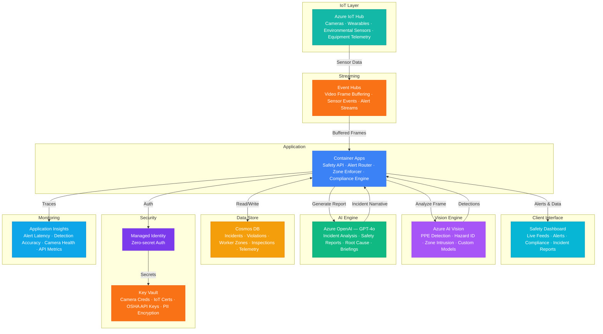

# Play 82 — Construction Safety AI 🏗️

> AI construction safety — PPE detection (YOLO), hazard zone monitoring, incident prediction, real-time worker alerts, OSHA compliance reporting.

Build an intelligent construction safety system. YOLOv8 detects PPE compliance at 2 FPS on IoT Edge devices, geo-fenced hazard zones trigger intrusion alerts, gradient boosting predicts incident risk from weather/fatigue/workforce patterns, and real-time alerts reach supervisors via push notification within 30 seconds.

## Quick Start
```bash
cd solution-plays/82-construction-safety-ai
az deployment group create -g $RG -f infra/main.bicep -p infra/parameters.json
code .
# Use @builder to implement, @reviewer to audit, @tuner to optimize
```

## Architecture



📐 [Full architecture details](architecture.md)

## Pre-Tuned Defaults
- PPE: 5 items (hard hat, vest, boots, gloves, glasses) · 0.80 confidence · temporal smoothing
- Zones: Critical (crane) / High (excavation) / Standard · buffer 2-3m · max worker limits
- Alerts: Dedup 5 min · max 10/hour · escalation after 3 repeats · multi-channel
- Prediction: 6 risk factors (time, weather, PPE rate, new workers, trades)

## DevKit (AI-Assisted Development)
| Primitive | What It Does |
|-----------|-------------|
| `agent.md` | Root orchestrator with builder→reviewer→tuner handoffs |
| `copilot-instructions.md` | Safety domain (PPE detection, hazard zones, OSHA compliance, edge inference) |
| 3 agents | Builder (gpt-4o), Reviewer (gpt-4o-mini), Tuner (gpt-4o-mini) |
| 3 skills | Deploy (215+ lines), Evaluate (125+ lines), Tune (240+ lines) |
| 4 prompts | `/deploy`, `/test`, `/review`, `/evaluate` with agent routing |

## Cost Estimate

| Service | Dev/Test | Production | Enterprise |
|---------|----------|------------|------------|
| Azure AI Vision | $0 (Free) | $350 (Standard S1) | $1,200 (Standard S1) |
| Azure IoT Hub | $0 (Free) | $250 (Standard S2) | $1,250 (Standard S3) |
| Azure OpenAI | $20 (PAYG) | $250 (PAYG) | $1,000 (PTU Reserved) |
| Container Apps | $10 (Consumption) | $180 (Dedicated) | $500 (Dedicated HA) |
| Cosmos DB | $3 (Serverless) | $90 (1500 RU/s) | $350 (6000 RU/s) |
| Event Hubs | $12 (Basic) | $100 (Standard) | $400 (Premium) |
| Key Vault | $1 (Standard) | $5 (Standard) | $15 (Premium HSM) |
| Application Insights | $0 (Free) | $40 (Pay-per-GB) | $120 (Pay-per-GB) |
| **Total** | **$46/mo** | **$1,265/mo** | **$4,835/mo** |

💰 [Full cost breakdown](cost.json)

## vs. Play 79 (Food Safety Inspector AI)
| Aspect | Play 79 | Play 82 |
|--------|---------|---------|
| Focus | Food HACCP compliance | Construction worker safety |
| Detection | Temperature sensors (IoT) | Computer vision (cameras + YOLO) |
| Real-time | Sensor violation alerts | PPE + zone intrusion alerts |
| Edge | N/A | IoT Edge for on-site inference |
| Regulation | FDA HACCP, FSMA 204 | OSHA construction standards |

📖 [Full documentation](spec/README.md) · 🌐 [frootai.dev/solution-plays/82-construction-safety-ai](https://frootai.dev/solution-plays/82-construction-safety-ai) · 📦 [FAI Protocol](spec/fai-manifest.json)


## FAI Manifest

| Field | Value |
|-------|-------|
| Play | `82-construction-safety-ai` |
| Version | `1.0.0` |
| Knowledge | O2-AI-Agents, T3-Production-Patterns, F1-GenAI-Foundations |
| WAF Pillars | responsible-ai, reliability, security, performance-efficiency |
