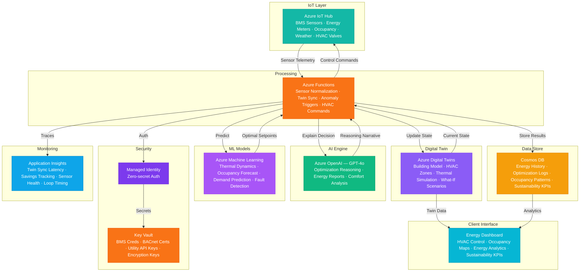

# Play 83 — Building Energy Optimizer 🏢

> AI building energy management — occupancy-based HVAC scheduling, zone setpoint optimization, fault detection, sustainability reporting.

Build an intelligent building energy optimizer. Occupancy prediction fuses badge-in, WiFi, CO2, and calendar data to drive zone-based HVAC setpoints, pre-conditioning anticipates arrivals, fault detection catches stuck valves and energy anomalies, and sustainability reports track CO₂ reductions.

## Quick Start
```bash
cd solution-plays/83-building-energy-optimizer
az deployment group create -g $RG -f infra/main.bicep -p infra/parameters.json
code .
# Use @builder to implement, @reviewer to audit, @tuner to optimize
```

## Architecture



📐 [Full architecture details](architecture.md)

## Pre-Tuned Defaults
- Comfort: ASHRAE 55 ranges · cooling 73-79°F · heating 68-76°F
- Setback: 85°F cooling / 55°F heating when empty · 30 min pre-conditioning
- Occupancy: 5 data sources fused · 24h horizon · 15 min updates
- Faults: Stuck valve, simultaneous heat/cool, energy anomaly, sensor drift

## DevKit (AI-Assisted Development)
| Primitive | What It Does |
|-----------|-------------|
| `agent.md` | Root orchestrator with builder→reviewer→tuner handoffs |
| `copilot-instructions.md` | Building energy domain (HVAC control, occupancy, fault detection pitfalls) |
| 3 agents | Builder (gpt-4o), Reviewer (gpt-4o-mini), Tuner (gpt-4o-mini) |
| 3 skills | Deploy (200+ lines), Evaluate (120+ lines), Tune (235+ lines) |
| 4 prompts | `/deploy`, `/test`, `/review`, `/evaluate` with agent routing |

## Cost Estimate

| Service | Dev/Test | Production | Enterprise |
|---------|----------|------------|------------|
| Azure Digital Twins | $10 (Standard) | $150 (Standard) | $600 (Standard) |
| Azure IoT Hub | $0 (Free) | $250 (Standard S2) | $1,250 (Standard S3) |
| Azure OpenAI | $20 (PAYG) | $200 (PAYG) | $800 (PTU Reserved) |
| Azure Functions | $0 (Consumption) | $180 (Premium EP2) | $450 (Premium EP3) |
| Cosmos DB | $3 (Serverless) | $120 (2000 RU/s) | $450 (8000 RU/s) |
| Azure Machine Learning | $15 (Basic) | $200 (Standard) | $700 (Standard GPU) |
| Key Vault | $1 (Standard) | $5 (Standard) | $15 (Premium HSM) |
| Application Insights | $0 (Free) | $40 (Pay-per-GB) | $120 (Pay-per-GB) |
| **Total** | **$49/mo** | **$1,145/mo** | **$4,385/mo** |

💰 [Full cost breakdown](cost.json)

## vs. Play 71 (Smart Energy Grid AI)
| Aspect | Play 71 | Play 83 |
|--------|---------|---------|
| Focus | Grid-level energy management | Building-level HVAC optimization |
| Scale | City/region (MW) | Single building (kW) |
| Optimization | Renewable dispatch + demand response | Zone setpoints + occupancy scheduling |
| ROI | Grid stability + peak shaving | 15-20% energy bill reduction |

📖 [Full documentation](spec/README.md) · 🌐 [frootai.dev/solution-plays/83-building-energy-optimizer](https://frootai.dev/solution-plays/83-building-energy-optimizer) · 📦 [FAI Protocol](spec/fai-manifest.json)


## FAI Manifest

| Field | Value |
|-------|-------|
| Play | `83-building-energy-optimizer` |
| Version | `1.0.0` |
| Knowledge | T3-Production-Patterns, O5-AI-Infrastructure, F1-GenAI-Foundations |
| WAF Pillars | cost-optimization, performance-efficiency, reliability, responsible-ai |
