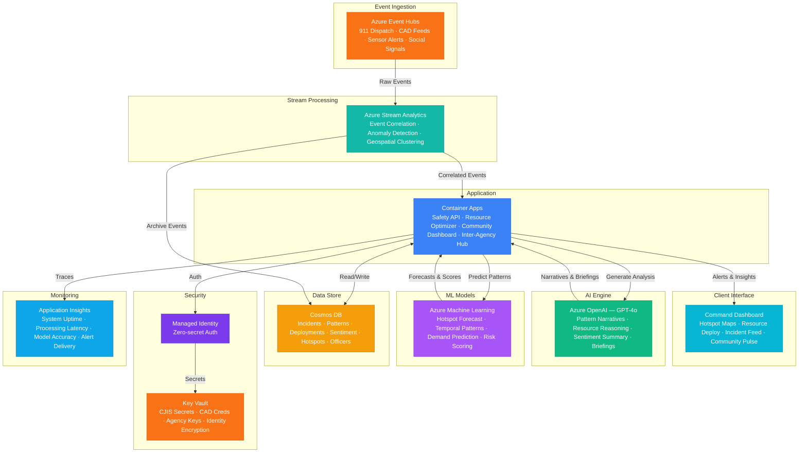

# Play 86 — Public Safety Analytics 🚨

> Ethical public safety AI — incident pattern analysis, resource allocation optimization, bias-mitigated analytics, community transparency dashboards.

Build an ethical public safety analytics platform. Temporal pattern analysis (NOT geographic targeting) identifies demand peaks, resource optimization improves response times while ensuring demographic parity, bias audits catch enforcement-driven data skew, and public dashboards provide full methodology transparency.

## Quick Start
```bash
cd solution-plays/86-public-safety-analytics
az deployment group create -g $RG -f infra/main.bicep -p infra/parameters.json
code .
# Use @builder to implement, @reviewer to audit, @tuner to optimize
```

## Architecture



📐 [Full architecture details](architecture.md)

## Pre-Tuned Defaults
- Patterns: Temporal only (no geographic targeting) · source weighting (patrol 0.7×)
- Resources: Priority 1 < 8 min · min 3 active units · max 2 min response parity
- Privacy: Block-level addresses · k=5 anonymity · PII scrubbed narratives · 365-day retention
- Prohibited: Predictive policing, individual targeting, facial recognition, social media monitoring

## DevKit (AI-Assisted Development)
| Primitive | What It Does |
|-----------|-------------|
| `agent.md` | Root orchestrator with builder→reviewer→tuner handoffs |
| `copilot-instructions.md` | Safety domain (ethical analysis, bias mitigation, transparency requirements) |
| 3 agents | Builder (gpt-4o), Reviewer (gpt-4o-mini), Tuner (gpt-4o-mini) |
| 3 skills | Deploy (210+ lines), Evaluate (110+ lines), Tune (240+ lines) |
| 4 prompts | `/deploy`, `/test`, `/review`, `/evaluate` with agent routing |

## Cost Estimate

| Service | Dev/Test | Production | Enterprise |
|---------|----------|------------|------------|
| Azure OpenAI | $25 (PAYG) | $300 (PAYG) | $1,200 (PTU Reserved) |
| Azure Machine Learning | $15 (Basic) | $250 (Standard) | $800 (Standard GPU) |
| Azure Event Hubs | $12 (Basic) | $150 (Standard) | $600 (Premium) |
| Cosmos DB | $3 (Serverless) | $120 (2000 RU/s) | $450 (8000 RU/s) |
| Azure Stream Analytics | $80 (Standard) | $320 (Standard) | $800 (Standard) |
| Container Apps | $10 (Consumption) | $180 (Dedicated) | $500 (Dedicated HA) |
| Key Vault | $1 (Standard) | $15 (Premium HSM) | $30 (Premium HSM) |
| Application Insights | $0 (Free) | $50 (Pay-per-GB) | $150 (Pay-per-GB) |
| **Total** | **$146/mo** | **$1,385/mo** | **$4,530/mo** |

💰 [Full cost breakdown](cost.json)

## vs. Play 84 (Citizen Services Chatbot)
| Aspect | Play 84 | Play 86 |
|--------|---------|---------|
| Focus | Citizen Q&A + complaint routing | Safety pattern analysis + resource optimization |
| Users | Citizens | Safety agency analysts + community oversight |
| AI Role | Answer questions, route complaints | Pattern detection, resource allocation |
| Bias Concern | Non-partisan language | Geographic targeting, enforcement bias |

📖 [Full documentation](spec/README.md) · 🌐 [frootai.dev/solution-plays/86-public-safety-analytics](https://frootai.dev/solution-plays/86-public-safety-analytics) · 📦 [FAI Protocol](spec/fai-manifest.json)


## FAI Manifest

| Field | Value |
|-------|-------|
| Play | `86-public-safety-analytics` |
| Version | `1.0.0` |
| Knowledge | T3-Production-Patterns, T2-Responsible-AI, O2-AI-Agents |
| WAF Pillars | responsible-ai, security, reliability, performance-efficiency |
