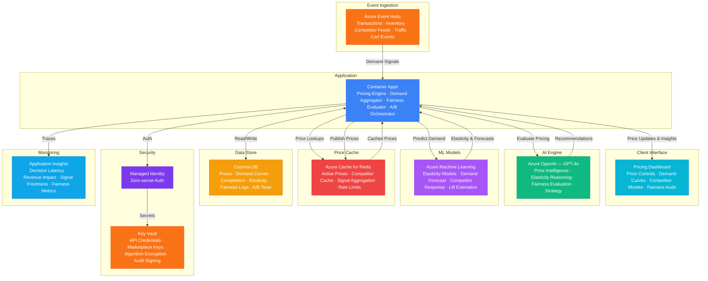

# Play 87 — Dynamic Pricing Engine 💰

> AI dynamic pricing — demand-based optimization, competitor monitoring, elasticity modeling, A/B testing, fairness-constrained pricing.

Build a dynamic pricing engine. ML elasticity models predict demand sensitivity, scipy optimization finds revenue-maximizing prices within fairness constraints (margin floor, change caps, no demographic discrimination), competitor monitoring maintains market positioning, and A/B testing validates price points with statistical significance.

## Quick Start
```bash
cd solution-plays/87-dynamic-pricing-engine
az deployment group create -g $RG -f infra/main.bicep -p infra/parameters.json
code .
# Use @builder to implement, @reviewer to audit, @tuner to optimize
```

## Architecture



📐 [Full architecture details](architecture.md)

## Pre-Tuned Defaults
- Constraints: 15% min margin · ±10% max daily change · 2× surge cap · no demographic pricing
- Elasticity: Gradient boosting · 10 features · weekly retrain · cross-elasticity enabled
- Optimization: Revenue 60% / margin 40% · hourly updates · 0.7 dampening
- A/B: 1000 min samples · 95% confidence · 14-day max duration

## DevKit (AI-Assisted Development)
| Primitive | What It Does |
|-----------|-------------|
| `agent.md` | Root orchestrator with builder→reviewer→tuner handoffs |
| `copilot-instructions.md` | Pricing domain (elasticity, fairness, A/B testing, surge caps) |
| 3 agents | Builder (gpt-4o), Reviewer (gpt-4o-mini), Tuner (gpt-4o-mini) |
| 3 skills | Deploy (215+ lines), Evaluate (120+ lines), Tune (240+ lines) |
| 4 prompts | `/deploy`, `/test`, `/review`, `/evaluate` with agent routing |

## Cost Estimate

| Service | Dev/Test | Production | Enterprise |
|---------|----------|------------|------------|
| Azure OpenAI | $30 (PAYG) | $400 (PAYG) | $1,500 (PTU Reserved) |
| Azure Event Hubs | $12 (Basic) | $200 (Standard) | $750 (Premium) |
| Cosmos DB | $5 (Serverless) | $180 (3000 RU/s) | $600 (10000 RU/s) |
| Azure Cache for Redis | $15 (Basic C0) | $150 (Standard C2) | $500 (Enterprise E10) |
| Azure Machine Learning | $15 (Basic) | $300 (Standard) | $900 (Standard GPU) |
| Container Apps | $10 (Consumption) | $200 (Dedicated) | $550 (Dedicated HA) |
| Key Vault | $1 (Standard) | $8 (Standard) | $25 (Premium HSM) |
| Application Insights | $0 (Free) | $45 (Pay-per-GB) | $150 (Pay-per-GB) |
| **Total** | **$88/mo** | **$1,483/mo** | **$4,975/mo** |

💰 [Full cost breakdown](cost.json)

## vs. Play 14 (Cost-Optimized AI Gateway)
| Aspect | Play 14 | Play 87 |
|--------|---------|---------|
| Focus | AI service cost optimization | Product price optimization |
| Optimization | Model routing + caching | Elasticity + competitor positioning |
| Fairness | N/A | No demographic discrimination, surge caps |
| A/B Testing | N/A | Price point experimentation |

📖 [Full documentation](spec/README.md) · 🌐 [frootai.dev/solution-plays/87-dynamic-pricing-engine](https://frootai.dev/solution-plays/87-dynamic-pricing-engine) · 📦 [FAI Protocol](spec/fai-manifest.json)


## FAI Manifest

| Field | Value |
|-------|-------|
| Play | `87-dynamic-pricing-engine` |
| Version | `1.0.0` |
| Knowledge | T3-Production-Patterns, O2-AI-Agents, F1-GenAI-Foundations |
| WAF Pillars | cost-optimization, performance-efficiency, reliability, responsible-ai |
