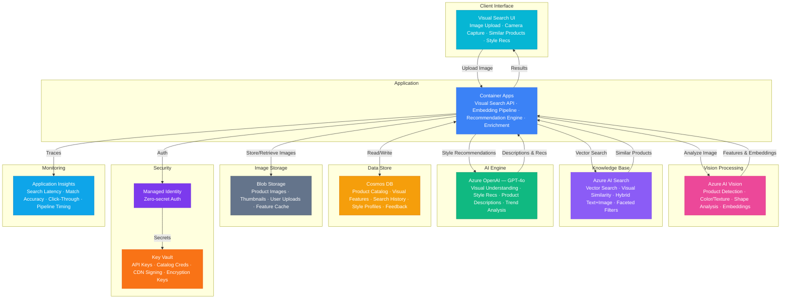

# Play 88 — Visual Product Search 🔍

> AI visual commerce — image-based product matching, multi-modal search (image+text), shoppable image recognition, visual similarity ranking.

Build a visual product search engine. CLIP/Florence encodes product catalog into vector embeddings, AI Search provides sub-200ms vector similarity search, multi-modal fusion combines image + text queries ("blue version of this"), shoppable images detect individual products in lifestyle photos, and click-through feedback continuously improves ranking.

## Quick Start
```bash
cd solution-plays/88-visual-product-search
az deployment group create -g $RG -f infra/main.bicep -p infra/parameters.json
code .
# Use @builder to implement, @reviewer to audit, @tuner to optimize
```

## Architecture



📐 [Full architecture details](architecture.md)

## Pre-Tuned Defaults
- Encoding: CLIP ViT-L/14 · 768-dim · background removal · center crop
- Search: HNSW index · cosine similarity · threshold 0.65 · top 10 results
- Reranking: Visual similarity 50% · in-stock 15% · popularity 15% · price 10% · recency 10%
- Multi-modal: Image 70% / text 30% · text overrides color/size/material

## DevKit (AI-Assisted Development)
| Primitive | What It Does |
|-----------|-------------|
| `agent.md` | Root orchestrator with builder→reviewer→tuner handoffs |
| `copilot-instructions.md` | Visual search domain (CLIP embeddings, multi-modal, shoppable images) |
| 3 agents | Builder (gpt-4o), Reviewer (gpt-4o-mini), Tuner (gpt-4o-mini) |
| 3 skills | Deploy (210+ lines), Evaluate (120+ lines), Tune (225+ lines) |
| 4 prompts | `/deploy`, `/test`, `/review`, `/evaluate` with agent routing |

## Cost Estimate

| Service | Dev/Test | Production | Enterprise |
|---------|----------|------------|------------|
| Azure AI Vision | $0 (Free) | $250 (Standard S1) | $800 (Standard S1) |
| Azure OpenAI | $25 (PAYG) | $350 (PAYG) | $1,200 (PTU Reserved) |
| Azure AI Search | $0 (Free) | $500 (Standard S2) | $1,000 (Standard S3) |
| Container Apps | $10 (Consumption) | $200 (Dedicated) | $500 (Dedicated HA) |
| Cosmos DB | $3 (Serverless) | $150 (2500 RU/s) | $450 (8000 RU/s) |
| Blob Storage | $2 (Hot LRS) | $50 (Hot ZRS) | $200 (Hot GRS) |
| Key Vault | $1 (Standard) | $5 (Standard) | $15 (Premium HSM) |
| Application Insights | $0 (Free) | $40 (Pay-per-GB) | $120 (Pay-per-GB) |
| **Total** | **$41/mo** | **$1,545/mo** | **$4,285/mo** |

💰 [Full cost breakdown](cost.json)

## vs. Play 09 (AI Search Portal)
| Aspect | Play 09 | Play 88 |
|--------|---------|---------|
| Focus | Text-based hybrid search | Image-based visual search |
| Query | Text keywords | Upload photo + optional text |
| Encoding | text-embedding-3-large | CLIP ViT-L/14 visual encoder |
| Use Case | Enterprise document search | Retail product discovery |

📖 [Full documentation](spec/README.md) · 🌐 [frootai.dev/solution-plays/88-visual-product-search](https://frootai.dev/solution-plays/88-visual-product-search) · 📦 [FAI Protocol](spec/fai-manifest.json)


## FAI Manifest

| Field | Value |
|-------|-------|
| Play | `88-visual-product-search` |
| Version | `1.0.0` |
| Knowledge | R2-RAG-Architecture, F1-GenAI-Foundations, O2-AI-Agents |
| WAF Pillars | performance-efficiency, reliability, responsible-ai, cost-optimization |
