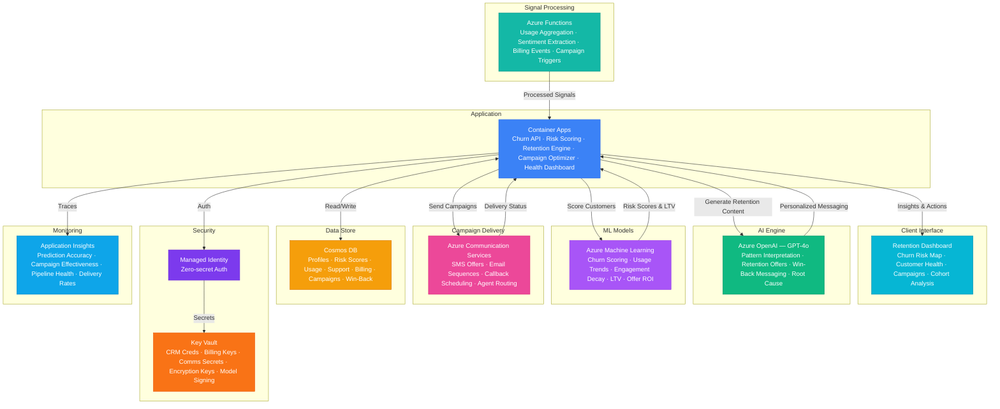

# Play 91 — Customer Churn Predictor 📉

> AI churn prediction — multi-signal risk scoring, SHAP explainability, segment-specific retention, automated intervention workflows.

Build a customer churn prediction system. LightGBM scores risk from 4 signal categories (usage, engagement, billing, support), SHAP explains top 3 churn drivers per customer, segment-specific retention playbooks auto-trigger personalized interventions, and LLM personalizes retention messaging.

## Quick Start
```bash
cd solution-plays/91-customer-churn-predictor
az deployment group create -g $RG -f infra/main.bicep -p infra/parameters.json
code .
# Use @builder to implement, @reviewer to audit, @tuner to optimize
```

## Architecture



📐 [Full architecture details](architecture.md)

## Pre-Tuned Defaults
- Risk: High >0.70 · Medium 0.40-0.70 · Low <0.40 · daily scoring for high risk
- Features: 4 signal groups (usage, engagement, billing, support) · 30 max features · SHAP top 3
- Retention: 5 playbooks (price-sensitive, feature-gap, support, engagement, contract) · budget caps
- Model: LightGBM · scale_pos_weight for class imbalance · weekly retrain

## DevKit (AI-Assisted Development)
| Primitive | What It Does |
|-----------|-------------|
| `agent.md` | Root orchestrator with builder→reviewer→tuner handoffs |
| `copilot-instructions.md` | Churn domain (signals, explainability, retention playbooks) |
| 3 agents | Builder (gpt-4o), Reviewer (gpt-4o-mini), Tuner (gpt-4o-mini) |
| 3 skills | Deploy (215+ lines), Evaluate (115+ lines), Tune (225+ lines) |
| 4 prompts | `/deploy`, `/test`, `/review`, `/evaluate` with agent routing |

## Cost Estimate

| Service | Dev/Test | Production | Enterprise |
|---------|----------|------------|------------|
| Azure OpenAI | $25 (PAYG) | $300 (PAYG) | $1,100 (PTU Reserved) |
| Azure Machine Learning | $15 (Basic) | $300 (Standard) | $900 (Standard GPU) |
| Cosmos DB | $3 (Serverless) | $120 (2000 RU/s) | $450 (8000 RU/s) |
| Azure Communication Services | $5 (PAYG) | $150 (PAYG) | $500 (PAYG) |
| Azure Functions | $0 (Consumption) | $180 (Premium EP2) | $450 (Premium EP3) |
| Container Apps | $10 (Consumption) | $150 (Dedicated) | $400 (Dedicated HA) |
| Key Vault | $1 (Standard) | $5 (Standard) | $15 (Premium HSM) |
| Application Insights | $0 (Free) | $35 (Pay-per-GB) | $120 (Pay-per-GB) |
| **Total** | **$59/mo** | **$1,240/mo** | **$3,935/mo** |

💰 [Full cost breakdown](cost.json)

## vs. Play 64 (AI Sales Assistant)
| Aspect | Play 64 | Play 91 |
|--------|---------|---------|
| Focus | New customer acquisition | Existing customer retention |
| Model | Lead scoring + opportunity | Churn risk + retention action |
| Action | Personalized sales outreach | Segment-specific retention playbook |
| Metric | Win rate + pipeline | AUC-ROC + retention lift + ROI |

📖 [Full documentation](spec/README.md) · 🌐 [frootai.dev/solution-plays/91-customer-churn-predictor](https://frootai.dev/solution-plays/91-customer-churn-predictor) · 📦 [FAI Protocol](spec/fai-manifest.json)


## FAI Manifest

| Field | Value |
|-------|-------|
| Play | `91-customer-churn-predictor` |
| Version | `1.0.0` |
| Knowledge | T3-Production-Patterns, O2-AI-Agents, F1-GenAI-Foundations |
| WAF Pillars | cost-optimization, reliability, responsible-ai, performance-efficiency |
