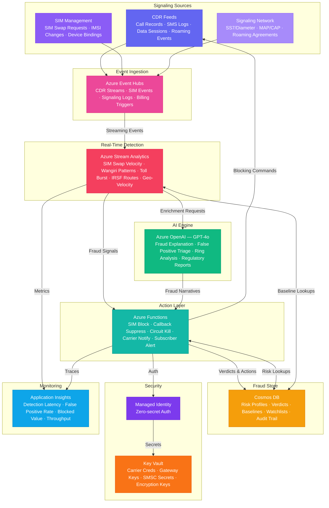

# Play 92 — Telecom Fraud Shield 🛡️

> Real-time telecom fraud detection — SIM swap, IRSF, Wangiri, subscription fraud, CDR anomaly scoring with sub-5-second blocking.

Build a telecom fraud detection system. Stream Analytics processes millions of CDRs/sec with velocity rules, multi-pattern engines detect SIM swap (5 indicators), IRSF (premium number ranges), and Wangiri (short-call burst patterns), Isolation Forest catches novel anomalies, and Redis velocity counters enable sub-millisecond rate limiting.

## Quick Start
```bash
cd solution-plays/92-telecom-fraud-shield
az deployment group create -g $RG -f infra/main.bicep -p infra/parameters.json
code .
# Use @builder to implement, @reviewer to audit, @tuner to optimize
```

## Architecture



📐 [Full architecture details](architecture.md)

| Service | Purpose |
|---------|---------|
| Event Hubs (Standard) | Real-time CDR ingestion (millions/sec) |
| Azure Stream Analytics | Rule engine for velocity + pattern detection |
| Azure ML | Anomaly detection model serving |
| Azure Redis Cache | Subscriber velocity counters (sub-ms lookups) |
| Azure OpenAI (gpt-4o) | Fraud investigation report generation |
| Cosmos DB (Serverless) | Subscriber profiles, fraud cases, IRSF ranges |

## Pre-Tuned Defaults
- SIM Swap: 5 indicators · ≥3 required · auto-block on critical
- IRSF: GSMA range DB · 10 max intl/hour · 3 max premium/day · auto-update weekly
- Velocity: Per-segment limits (consumer/business/enterprise/prepaid) · adaptive baseline
- Anomaly: Isolation Forest · 0.01 contamination · per-subscriber baseline · 0.80 alert threshold

## DevKit (AI-Assisted Development)
| Primitive | What It Does |
|-----------|-------------|
| `agent.md` | Root orchestrator with builder→reviewer→tuner handoffs |
| `copilot-instructions.md` | Telecom fraud domain (SIM swap, IRSF, Wangiri, CDR patterns) |
| 3 agents | Builder (gpt-4o), Reviewer (gpt-4o-mini), Tuner (gpt-4o-mini) |
| 3 skills | Deploy (245+ lines), Evaluate (115+ lines), Tune (240+ lines) |
| 4 prompts | `/deploy`, `/test`, `/review`, `/evaluate` with agent routing |

## Cost Estimate
| Service | Dev/mo | Prod/mo | Enterprise/mo |
|---------|--------|---------|---------------|
| Azure Event Hubs | $12 (Basic) | $250 (Standard 8 TU) | $900 (Premium 16 PU) |
| Azure Stream Analytics | $80 (Standard 1 SU) | $480 (Standard 6 SU) | $1,920 (Standard 24 SU) |
| Azure OpenAI | $20 (PAYG) | $350 (PAYG) | $1,200 (PTU Reserved) |
| Cosmos DB | $5 (Serverless) | $230 (4000 RU/s) | $950 (20000 RU/s) |
| Azure Functions | $0 (Consumption) | $200 (Premium EP2) | $500 (Premium EP3) |
| Key Vault | $1 (Standard) | $5 (Standard) | $20 (Premium HSM) |
| Application Insights | $0 (Free) | $45 (Pay-per-GB) | $150 (Pay-per-GB) |
| **Total** | **$118** | **$1,560** | **$5,640** |

💰 [Full cost breakdown](cost.json)

## vs. Play 63 (Fraud Detection Agent)
| Aspect | Play 63 | Play 92 |
|--------|---------|---------|
| Focus | Financial transaction fraud | Telecom CDR fraud |
| Patterns | Rule→ML→graph fraud rings | SIM swap, IRSF, Wangiri, subscription |
| Data | Payment transactions | Call Detail Records (CDRs) |
| Speed | Near real-time | Real-time (<5 sec) with Redis velocity |

📖 [Full documentation](spec/README.md) · 🌐 [frootai.dev/solution-plays/92-telecom-fraud-shield](https://frootai.dev/solution-plays/92-telecom-fraud-shield) · 📦 [FAI Protocol](spec/fai-manifest.json)


## FAI Manifest

| Field | Value |
|-------|-------|
| Play | `92-telecom-fraud-shield` |
| Version | `1.0.0` |
| Knowledge | T3-Production-Patterns, R3-Deterministic-AI, O2-AI-Agents |
| WAF Pillars | security, reliability, performance-efficiency, responsible-ai |
