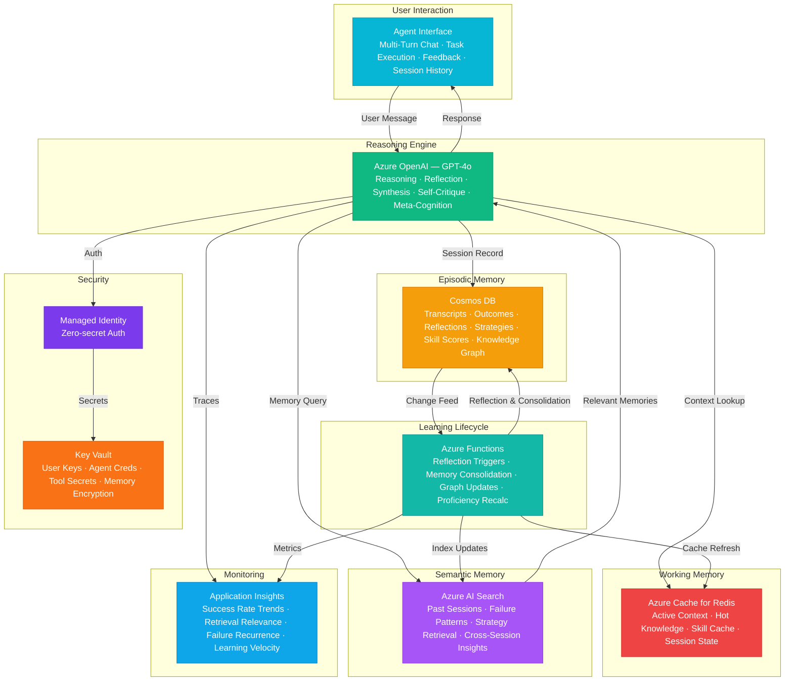

# Play 93 — Continual Learning Agent 🧠

> Self-improving AI agent — persistent memory (episodic+semantic+procedural), reflection loops, knowledge distillation, skill acquisition, adaptive decay.

Build a continual learning agent that improves across sessions. Three memory types (episodic experiences, semantic patterns, procedural skills) persist between conversations, reflection loops analyze what worked and what didn't, knowledge distillation compresses episodes into generalizable patterns, and importance-based decay prevents memory bloat.

## Quick Start
```bash
cd solution-plays/93-continual-learning-agent
az deployment group create -g $RG -f infra/main.bicep -p infra/parameters.json
code .
# Use @builder to implement, @reviewer to audit, @tuner to optimize
```

## Architecture



📐 [Full architecture details](architecture.md)

| Service | Purpose |
|---------|---------|
| Azure OpenAI (gpt-4o) | Reasoning + reflection + distillation |
| Azure AI Search (Standard) | Episodic memory vector store |
| Cosmos DB (Serverless) | Semantic memory (knowledge graph) + procedural skills |
| Container Apps | Agent API |

## Pre-Tuned Defaults
- Episodic: 10K max episodes · text-embedding-3-large · 0.65 similarity threshold
- Semantic: Distill after 3+ similar episodes · 0.70 confidence · conflict resolution by recency
- Procedural: Update on ≥10% improvement · 500 max skills
- Decay: Critical 0.999/day · Normal 0.970/day · Low 0.900/day · archive at 0.10

## DevKit (AI-Assisted Development)
| Primitive | What It Does |
|-----------|-------------|
| `agent.md` | Root orchestrator with builder→reviewer→tuner handoffs |
| `copilot-instructions.md` | Continual learning domain (3-memory arch, reflection, distillation, forgetting) |
| 3 agents | Builder (gpt-4o), Reviewer (gpt-4o-mini), Tuner (gpt-4o-mini) |
| 3 skills | Deploy (215+ lines), Evaluate (120+ lines), Tune (240+ lines) |
| 4 prompts | `/deploy`, `/test`, `/review`, `/evaluate` with agent routing |

## Cost Estimate
| Service | Dev/mo | Prod/mo | Enterprise/mo |
|---------|--------|---------|---------------|
| Azure OpenAI | $30 (PAYG) | $400 (PAYG) | $1,400 (PTU Reserved) |
| Cosmos DB | $5 (Serverless) | $180 (3000 RU/s) | $600 (10000 RU/s) |
| Azure AI Search | $0 (Free) | $250 (Standard S1) | $1,000 (Standard S2) |
| Azure Cache for Redis | $15 (Basic C0) | $150 (Standard C2) | $450 (Premium P2) |
| Azure Functions | $0 (Consumption) | $180 (Premium EP2) | $450 (Premium EP3) |
| Key Vault | $1 (Standard) | $5 (Standard) | $15 (Premium HSM) |
| Application Insights | $0 (Free) | $40 (Pay-per-GB) | $130 (Pay-per-GB) |
| **Total** | **$51** | **$1,205** | **$4,045** |

💰 [Full cost breakdown](cost.json)

## vs. Play 07 (Multi-Agent Service)
| Aspect | Play 07 | Play 93 |
|--------|---------|---------|
| Focus | Multi-agent orchestration | Single agent that learns over time |
| Memory | Shared context during session | Persistent across sessions (3 types) |
| Improvement | Static behavior | Improves with experience |
| Reflection | N/A | Post-task reflection + distillation |

📖 [Full documentation](spec/README.md) · 🌐 [frootai.dev/solution-plays/93-continual-learning-agent](https://frootai.dev/solution-plays/93-continual-learning-agent) · 📦 [FAI Protocol](spec/fai-manifest.json)


## FAI Manifest

| Field | Value |
|-------|-------|
| Play | `93-continual-learning-agent` |
| Version | `1.0.0` |
| Knowledge | O2-AI-Agents, T3-Production-Patterns, R2-RAG |
| WAF Pillars | reliability, responsible-ai, performance-efficiency, cost-optimization |
