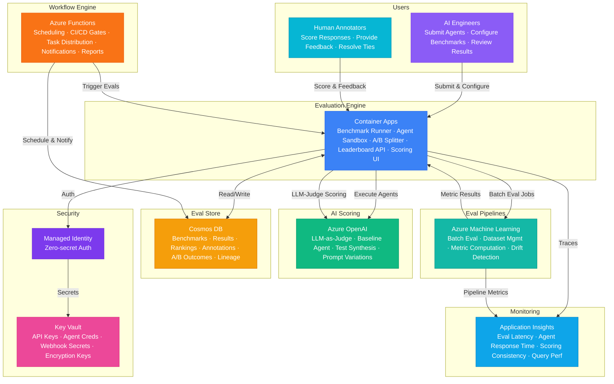

# Play 98 — Agent Evaluation Platform 🏆

> AI agent benchmarking — multi-dimensional scoring (7 dimensions), LLM-as-judge with calibration, adversarial safety testing, leaderboard comparison.

Build an agent evaluation platform. Score agents across 7 dimensions (task completion, accuracy, tool use, safety, latency, cost, conversation quality), calibrate LLM-as-judge against human annotations, generate diverse test suites with adversarial probes, and publish leaderboard rankings with baseline comparison.

## Quick Start
```bash
cd solution-plays/98-agent-evaluation-platform
az deployment group create -g $RG -f infra/main.bicep -p infra/parameters.json
code .
# Use @builder to implement, @reviewer to audit, @tuner to optimize
```

## Architecture



📐 [Full architecture details](architecture.md)

| Service | Purpose |
|---------|---------|
| Azure OpenAI (gpt-4o) | LLM-as-judge + test case generation |
| Cosmos DB (Serverless) | Test suites, eval results, leaderboard |
| Azure Functions | Evaluation pipeline orchestration |
| Container Apps | Dashboard API + leaderboard UI |

## Pre-Tuned Defaults
- Dimensions: 7 weighted (task 20%, accuracy 20%, tools 15%, safety 15%, latency 10%, cost 10%, quality 10%)
- Judge: gpt-4o · temperature 0 · calibrated against 50+ human annotations · safety veto rule
- Tests: 5 types (single-turn, multi-turn, tool use, adversarial, edge cases) · monthly rotation
- Leaderboard: Per-dimension breakdown · baseline comparison · version tracking

## DevKit (AI-Assisted Development)
| Primitive | What It Does |
|-----------|-------------|
| `agent.md` | Root orchestrator with builder→reviewer→tuner handoffs |
| `copilot-instructions.md` | Eval domain (multi-dimensional scoring, judge bias, adversarial testing) |
| 3 agents | Builder (gpt-4o), Reviewer (gpt-4o-mini), Tuner (gpt-4o-mini) |
| 3 skills | Deploy (240+ lines), Evaluate (115+ lines), Tune (240+ lines) |
| 4 prompts | `/deploy`, `/test`, `/review`, `/evaluate` with agent routing |

## Cost Estimate
| Service | Dev/mo | Prod/mo | Enterprise/mo |
|---------|--------|---------|---------------|
| Azure OpenAI | $40 (PAYG) | $600 (PAYG) | $2,000 (PTU Reserved) |
| Container Apps | $10 (Consumption) | $350 (Dedicated) | $1,000 (Dedicated HA) |
| Azure Cosmos DB | $5 (Serverless) | $280 (5000 RU/s) | $750 (15000 RU/s) |
| Azure Machine Learning | $0 (Basic) | $300 (Standard) | $900 (Standard HA) |
| Azure Functions | $0 (Consumption) | $200 (Premium EP2) | $500 (Premium EP3) |
| Key Vault | $1 (Standard) | $5 (Standard) | $20 (Premium HSM) |
| Application Insights | $0 (Free) | $45 (Pay-per-GB) | $150 (Pay-per-GB) |
| **Total** | **$56** | **$1,780** | **$5,320** |

💰 [Full cost breakdown](cost.json)

## vs. Play 32 (Testing Expert)
| Aspect | Play 32 | Play 98 |
|--------|---------|---------|
| Focus | Code test generation (unit/integration) | AI agent quality benchmarking |
| Target | Source code | Agent endpoints |
| Scoring | Test pass/fail + coverage | 7-dimension weighted score + leaderboard |
| Safety | Security scanning | Adversarial probes (jailbreak, injection) |

📖 [Full documentation](spec/README.md) · 🌐 [frootai.dev/solution-plays/98-agent-evaluation-platform](https://frootai.dev/solution-plays/98-agent-evaluation-platform) · 📦 [FAI Protocol](spec/fai-manifest.json)


## FAI Manifest

| Field | Value |
|-------|-------|
| Play | `98-agent-evaluation-platform` |
| Version | `1.0.0` |
| Knowledge | T3-Production-Patterns, T2-Responsible-AI, O2-AI-Agents |
| WAF Pillars | responsible-ai, reliability, operational-excellence, cost-optimization |
