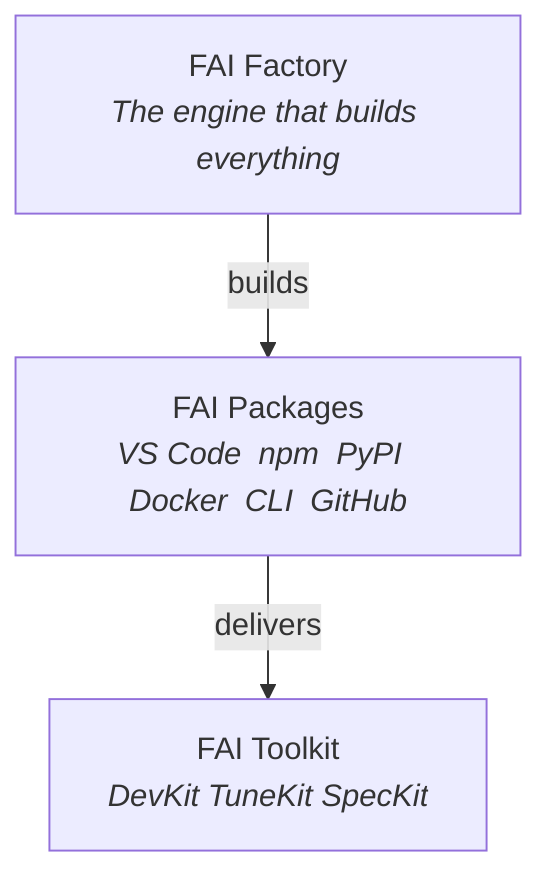
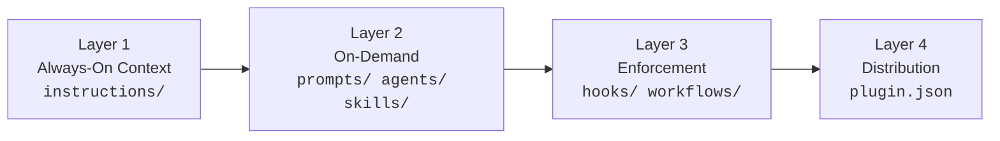
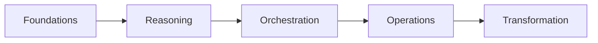

<p align="center">
  
</p>

<h1 align="center">FrootAI</h1>
<p align="center"><strong>From the Roots to the Fruits</strong></p>
<p align="center"><em>Open AI architecture ecosystem for Infra, Platform & App teams.</em></p>

<p align="center">
  <a href="https://frootai.dev"></a>
  <a href="https://github.com/frootai/frootai"></a>
  <a href="https://www.npmjs.com/package/frootai-mcp"></a>
  <a href="https://marketplace.visualstudio.com/items?itemName=pavleenbali.frootai"></a>
  <a href="https://pypi.org/project/frootai/"></a>
  <a href="https://www.npmjs.com/package/frootai-mcp"></a>
  <a href="./LICENSE"></a>
</p>

---

### What is FrootAI?

**FROOT** = **F**oundations  **R**easoning  **O**rchestration  **O**perations  **T**ransformation

An open ecosystem where **Infra**, **Platform**, and **App** teams build AI  *Frootfully*.

| | What | # | For Whom | Links |
|:--:|------|:-:|----------|-------|
|  | **Solution Plays** | 20 | Infra & platform engineers | [Website](https://frootai.dev/solution-plays)  [GitHub](https://github.com/frootai/frootai/tree/main/solution-plays) |
|  | **MCP Server** | 23 tools | AI agents (Copilot, Claude, Cursor) | [Website](https://frootai.dev/mcp-tooling)  [npm](https://www.npmjs.com/package/frootai-mcp) |
|  | **Knowledge Modules** | 16 | Cloud architects, CSAs | [Website](https://frootai.dev/docs)  [GitHub](https://github.com/frootai/frootai/tree/main/docs) |
|  | **VS Code Extension** | 19 cmds | Developers | [Website](https://frootai.dev/vscode-extension)  [Marketplace](https://marketplace.visualstudio.com/items?itemName=pavleenbali.frootai) |
|  | **Python SDK** | 0 deps | Data scientists | [PyPI](https://pypi.org/project/frootai/) |
|  | **CLI** | 6 cmds | Everyone | [Website](https://frootai.dev/cli) |

---

### Get Started

```bash
npx frootai-mcp@latest                          # MCP Server  add to any AI agent
code --install-extension pavleenbali.frootai     # VS Code Extension
pip install frootai                              # Python SDK
docker run -i ghcr.io/frootai/frootai-mcp        # Docker  zero install
npx frootai init                                 # CLI  scaffold a project
```

<details>
<summary><strong>MCP Config (Claude Desktop / VS Code / Cursor)</strong></summary>

```json
{
  "mcpServers": {
    "frootai": { "command": "npx", "args": ["frootai-mcp@latest"] }
  }
}
```

Works with: **GitHub Copilot**  **Claude Desktop**  **Cursor**  **Windsurf**  **Azure AI Foundry**  any MCP client

</details>

---

### The FAI Ecosystem



---

### MCP Server  23 Tools

| Category | # | Tools |
|----------|:-:|-------|
| **Static** | 6 | `list_modules`  `get_module`  `lookup_term`  `search_knowledge`  `get_architecture_pattern`  `get_froot_overview` |
| **Live** | 4 | `fetch_azure_docs`  `fetch_external_mcp`  `list_community_plays`  `get_github_agentic_os` |
| **Agent Chain** | 3 | `agent_build`  `agent_review`  `agent_tune` |
| **AI Ecosystem** | 4 | `get_model_catalog`  `get_azure_pricing`  `compare_models`  `compare_plays` |
| **Compute** | 6 | `estimate_cost`  `embedding_playground`  `generate_architecture_diagram`  `run_evaluation` + 2 more |

---

### Solution Plays

<details>
<summary><strong>20 pre-tuned, deployable AI solutions</strong>  click to expand</summary>
<br>

| # | Solution | What It Deploys |
|:-:|---------|----------------|
| 01 | **Enterprise RAG Q&A** | AI Search + OpenAI + Container App |
| 02 | **AI Landing Zone** | VNet + Private Endpoints + RBAC + GPU |
| 03 | **Deterministic Agent** | Reliable agent with guardrails + eval |
| 04 | **Call Center Voice AI** | Real-time speech + sentiment analysis |
| 05 | **IT Ticket Resolution** | Auto-triage + resolution with KB |
| 06 | **Document Intelligence** | PDF/image extraction pipeline |
| 07 | **Multi-Agent Service** | Orchestrated agent collaboration |
| 08 | **Copilot Studio Bot** | Low-code conversational AI |
| 09 | **AI Search Portal** | Enterprise search with facets |
| 10 | **Content Moderation** | Safety filters + content classification |
| 11 | **AI Landing Zone Adv.** | Multi-region + DR + compliance |
| 12 | **Model Serving on AKS** | GPU clusters + model endpoints |
| 13 | **Fine-Tuning Workflow** | Data prep  train  eval  deploy |
| 14 | **Cost-Optimized Gateway** | Smart routing + token budgets |
| 15 | **Multi-Modal Doc Proc** | Images + tables + handwriting |
| 16 | **Copilot Teams Ext.** | Teams bot with AI backend |
| 17 | **AI Observability** | Tracing + metrics + alerting |
| 18 | **Prompt Management** | Versioning + A/B testing + rollback |
| 19 | **Edge AI with Phi-4** | On-device inference, no cloud |
| 20 | **Anomaly Detection** | Time-series + pattern recognition |

Every play ships with: `.github` Agentic OS (19 files)  DevKit  TuneKit  SpecKit  Bicep infra

</details>

---

### .github Agentic OS

Every solution play includes 4 layers, 7 primitives  **380 agentic OS files total**.



---

<details>
<summary><strong>The FROOT Framework</strong></summary>
<br>



| Layer | Modules | What You Learn |
|:-----:|---------|---------------|
|  **F** | F1  F2  F3  F4 | Tokens, models, glossary, Agentic OS |
|  **R** | R1  R2  R3 | Prompts, RAG, grounding, deterministic AI |
|  **O** | O1  O2  O3 | Semantic Kernel, agents, MCP, tools |
|  **O** | O4  O5  O6 | Azure AI Foundry, GPU infra, Copilot ecosystem |
|  **T** | T1  T2  T3 | Fine-tuning, responsible AI, production patterns |

**16 modules  200+ AI terms  60,000+ words**

</details>

---

<details>
<summary><strong>Distribution Channels</strong></summary>
<br>

| Channel | Install | Version | Links |
|---------|---------|:-------:|-------|
| **npm** | `npm install frootai-mcp` | 3.2.0 | [Website](https://frootai.dev/mcp-tooling)  [npmjs.com](https://www.npmjs.com/package/frootai-mcp) |
| **PyPI SDK** | `pip install frootai` | 3.3.0 | [PyPI](https://pypi.org/project/frootai/) |
| **PyPI MCP** | `pip install frootai-mcp` | 3.2.0 | [PyPI](https://pypi.org/project/frootai-mcp/) |
| **Docker** | `docker run -i ghcr.io/frootai/frootai-mcp` | latest | [Website](https://frootai.dev/docker)  [GHCR](https://github.com/frootai/frootai/pkgs/container/frootai-mcp) |
| **VS Code** | `code --install-extension pavleenbali.frootai` | 1.4.0 | [Website](https://frootai.dev/vscode-extension)  [Marketplace](https://marketplace.visualstudio.com/items?itemName=pavleenbali.frootai) |
| **CLI** | `npx frootai <command>` | 3.2.0 | [Website](https://frootai.dev/cli) |
| **REST API** |  | live | [API Docs](https://frootai.dev/api-docs) |
| **GitHub** |  | latest | [github.com/frootai/frootai](https://github.com/frootai/frootai) |

</details>

---

<details>
<summary><strong>Repository Structure</strong></summary>
<br>

```
frootai/frootai
 mcp-server/            23 MCP tools + knowledge.json (682KB)
 vscode-extension/      VS Code extension (19 commands)
 python-sdk/            Python SDK  offline, zero deps
 python-mcp/            Python MCP Server  23 tools
 functions/             REST API + Agent FAI chatbot
 solution-plays/        20 plays with .github Agentic OS
 docs/                  16 FROOT knowledge modules
 config/                Configurator data + spec templates
 scripts/               Build, sync, validate automation
 workshops/             3 hands-on workshops
 community-plugins/     ServiceNow, Salesforce, SAP
 bicep-registry/        Azure Bicep modules
 CONTRIBUTING.md
 LICENSE (MIT)
```

</details>

---

### Platform

| | Page | What |
|:--:|------|------|
|  | [frootai.dev](https://frootai.dev) | Homepage |
|  | [/docs](https://frootai.dev/docs) | 16 knowledge modules |
|  | [/solution-plays](https://frootai.dev/solution-plays) | Browse all 20 plays |
|  | [/chatbot](https://frootai.dev/chatbot) | Agent FAI |
|  | [/configurator](https://frootai.dev/configurator) | Play recommendation wizard |
|  | [/packages](https://frootai.dev/packages) | Distribution channels |
|  | [/setup-guide](https://frootai.dev/setup-guide) | Installation guide |
|  | [/learning-hub](https://frootai.dev/learning-hub) | Workshops & certs |

---

### Contributing

Open source under MIT. See [CONTRIBUTING.md](./CONTRIBUTING.md).

 **Star the repo** to help others discover FrootAI.

---

<p align="center">
  <a href="https://frootai.dev">Website</a>  
  <a href="https://frootai.dev/chatbot">Agent FAI</a>  
  <a href="https://frootai.dev/docs">Docs</a>  
  <a href="https://github.com/frootai/frootai/issues">Issues</a>
</p>
<p align="center"><em>It's simply Frootful.</em> </p>