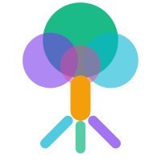

<p align="center">
  
</p>

<h1 align="center">FrootAI</h1>
<p align="center"><strong>From the Roots to the Fruits. It's simply Frootful.</strong></p>
<p align="center"><em>An open ecosystem where Infra, Platform, and App teams build AI — Frootfully.</em></p>
<p align="center"><em>An open glue for the GenAI ecosystem, enabling deterministic and reliable AI solutions.</em></p>

<p align="center">
  <a href="https://frootai.dev"></a>
  <a href="https://github.com/frootai/frootai"></a>
  <a href="https://www.npmjs.com/package/frootai-mcp"></a>
  <a href="https://marketplace.visualstudio.com/items?itemName=frootai.frootai-vscode"></a>
  <a href="https://pypi.org/project/frootai/"></a>
  <a href="https://www.npmjs.com/package/frootai-mcp"></a>
  <a href="./LICENSE"></a>
</p>

---

### The Philosophy Behind FrootAI — The Essence of the FAI Engine

FrootAI is an intelligent way of packaging skills, knowledge, and the essential components of the GenAI ecosystem — all **synced**, not standalone. Infrastructure, platform, and application layers are woven together so that every piece understands and builds on the others. That's what *"from the roots to the fruits"* means: a fully connected ecosystem where Infra, Platform, and App teams build AI — *Frootfully*.

<details>
<summary><strong>The FROOT Framework</strong></summary>
<br>

**FROOT** = **F**oundations · **R**easoning · **O**rchestration · **O**perations · **T**ransformation

| Layer | What You Learn |
|:-----:|---------------|
| **F** | Tokens, models, glossary, Agentic OS |
| **R** | Prompts, RAG, grounding, deterministic AI |
| **O** | Semantic Kernel, agents, MCP, tools |
| **O** | Azure AI Foundry, GPU infra, Copilot ecosystem |
| **T** | Fine-tuning, responsible AI, production patterns |

</details>

| What | For Whom | Link |
|------|----------|------|
| **Solution Plays** | Infra & platform engineers | [Browse Plays](https://frootai.dev/solution-plays) |
| **MCP Server** | AI agents (Copilot, Claude, Cursor) | [MCP Tooling](https://frootai.dev/mcp-tooling) |
| **Knowledge Modules** | Cloud architects, CSAs | [Docs](https://frootai.dev/docs) |
| **VS Code Extension** | Developers | [VS Code Extension](https://frootai.dev/vscode-extension) |
| **Python SDK** | Data scientists | [Python SDK](https://frootai.dev/python) |
| **CLI** | Everyone | [CLI Docs](https://frootai.dev/cli) |

---

### Get Started

```bash
npx frootai-mcp@latest                          # MCP Server  add to any AI agent
code --install-extension frootai.frootai-vscode     # VS Code Extension
pip install frootai                              # Python SDK
docker run -i ghcr.io/frootai/frootai-mcp        # Docker  zero install
npx frootai init                                 # CLI  scaffold a project
```

<details>
<summary><strong>MCP Config (Claude Desktop / VS Code / Cursor)</strong></summary>

```json
{
  "mcpServers": {
    "frootai": { "command": "npx", "args": ["frootai-mcp@latest"] }
  }
}
```

Works with: **GitHub Copilot**  **Claude Desktop**  **Cursor**  **Windsurf**  **Azure AI Foundry**  any MCP client

</details>

---

### The FAI Ecosystem

<p align="center">
  
</p>

---

### FAI Protocol — The Binding Glue

FrootAI introduces the **FAI Protocol** — a context-wiring specification that connects 9 AI primitives (agents, instructions, skills, hooks, workflows, plugins, tools, prompts, guardrails) into evaluated, deployed, production-ready systems.

| Component | What It Is | File |
|-----------|-----------|------|
| **FAI Protocol** | The spec — how primitives declare context and wiring | `fai-manifest.json` |
| **FAI Layer** | The conceptual glue — shared context across primitives | Design principle |
| **FAI Engine** | The runtime — reads manifests, wires primitives, evaluates quality | `engine/index.js` |
| **FAI Factory** | CI/CD — validates, builds, and packs primitives | `scripts/validate-primitives.js` |
| **FAI Marketplace** | Discovery registry for plugins | `marketplace.json` |

**Primitives:**

| Folder | What Lives Here | Schema |
|--------|----------------|--------|
| `schemas/` | 7 JSON schemas validating all primitive types | Draft-07 |
| `agents/` | Standalone `.agent.md` files with WAF alignment | `agent.schema.json` |
| `instructions/` | `.instructions.md` files with `applyTo` globs | `instruction.schema.json` |
| `skills/` | `SKILL.md` folders with optional bundled assets | `skill.schema.json` |
| `hooks/` | Security hooks (secrets scanner, tool guardian, governance audit) | `hook.schema.json` |
| `plugins/` | Themed bundles of agents + skills + hooks | `plugin.schema.json` |
| `engine/` | FAI Engine v0.1 — manifest reader, context resolver, evaluator | — |

```bash
npm run validate:primitives     # Validate all primitives against schemas
npm run generate:marketplace    # Generate marketplace.json from plugins/
npm run scaffold                # Interactive CLI to create new primitives
node engine/index.js <manifest> # Load a play with the FAI Engine
```

---

### MCP Server — 25 Tools

| Category | # | Tools |
|----------|:-:|-------|
| **Static** | 6 | `list_modules`  `get_module`  `lookup_term`  `search_knowledge`  `get_architecture_pattern`  `get_froot_overview` |
| **Live** | 4 | `fetch_azure_docs`  `fetch_external_mcp`  `list_community_plays`  `get_github_agentic_os` |
| **Agent Chain** | 3 | `agent_build`  `agent_review`  `agent_tune` |
| **AI Ecosystem** | 4 | `get_model_catalog`  `get_azure_pricing`  `compare_models`  `compare_plays` |
| **Compute** | 6 | `estimate_cost`  `embedding_playground`  `generate_architecture_diagram`  `run_evaluation` + 2 more |

---

### Solution Plays

<details>
<summary><strong>50 pre-tuned, deployable AI solutions</strong> — click to expand</summary>
<br>

| # | Solution | What It Deploys |
|:-:|---------|----------------|
| 01 | **Enterprise RAG Q&A** | AI Search + OpenAI + Container App |
| 02 | **AI Landing Zone** | VNet + Private Endpoints + RBAC + GPU |
| 03 | **Deterministic Agent** | Reliable agent with guardrails + eval |
| 04 | **Call Center Voice AI** | Real-time speech + sentiment analysis |
| 05 | **IT Ticket Resolution** | Auto-triage + resolution with KB |
| 06 | **Document Intelligence** | PDF/image extraction pipeline |
| 07 | **Multi-Agent Service** | Orchestrated agent collaboration |
| 08 | **Copilot Studio Bot** | Low-code conversational AI |
| 09 | **AI Search Portal** | Enterprise search with facets |
| 10 | **Content Moderation** | Safety filters + content classification |
| 11 | **AI Landing Zone Adv.** | Multi-region + DR + compliance |
| 12 | **Model Serving on AKS** | GPU clusters + model endpoints |
| 13 | **Fine-Tuning Workflow** | Data prep  train  eval  deploy |
| 14 | **Cost-Optimized Gateway** | Smart routing + token budgets |
| 15 | **Multi-Modal Doc Proc** | Images + tables + handwriting |
| 16 | **Copilot Teams Ext.** | Teams bot with AI backend |
| 17 | **AI Observability** | Tracing + metrics + alerting |
| 18 | **Prompt Management** | Versioning + A/B testing + rollback |
| 19 | **Edge AI with Phi-4** | On-device inference, no cloud |
| 20 | **Anomaly Detection** | Time-series + pattern recognition |
| 21 | **Agentic RAG** | Autonomous retrieval + multi-source |
| 22 | **Multi-Agent Swarm** | Distributed teams + supervisor |
| 23 | **Browser Automation** | Playwright MCP + vision |
| 24 | **AI Code Review** | CodeQL + OWASP + AI comments |
| 25 | **Conversation Memory** | Short/long/episodic memory |
| 26 | **Semantic Search** | Vector + hybrid + reranking |
| 27 | **AI Data Pipeline** | ETL + LLM augmentation |
| 28 | **Knowledge Graph RAG** | Cosmos DB Gremlin + entities |
| 29 | **MCP Gateway** | Proxy + rate limiting + discovery |
| 30 | **AI Security Hardening** | OWASP LLM Top 10 + jailbreak defense |
| 31 | **Low-Code AI Builder** | Visual AI pipeline design + deploy |
| 32 | **AI-Powered Testing** | Autonomous test generation, polyglot |
| 33 | **Voice AI Agent** | Speech-to-text + conversational AI |
| 34 | **Edge AI Deployment** | ONNX quantization + IoT Hub |
| 35 | **AI Compliance Engine** | GDPR, HIPAA, SOC 2, EU AI Act |
| 36 | **Multimodal Agent** | GPT-4o Vision + text + code |
| 37 | **AI-Powered DevOps** | Incident triage + runbook + GitOps |
| 38 | **Document Understanding v2** | Multi-page PDF + entity linking |
| 39 | **AI Meeting Assistant** | Transcription + action items |
| 40 | **Copilot Studio Advanced** | Declarative agents + M365 Graph |
| 41 | **AI Red Teaming** | Adversarial testing + safety scoring |
| 42 | **Computer Use Agent** | Vision-based desktop automation |
| 43 | **AI Video Generation** | Text-to-video pipeline |
| 44 | **Foundry Local On-Device** | Air-gapped LLM inference |
| 45 | **Real-Time Event AI** | Streaming event processing |
| 46 | **Healthcare Clinical AI** | HIPAA-compliant decision support |
| 47 | **Synthetic Data Factory** | Privacy-safe dataset generation |
| 48 | **AI Model Governance** | Model registry + compliance |
| 49 | **Creative AI Studio** | Multi-modal content creation |
| 50 | **Financial Risk Intelligence** | Risk assessment + fraud detection |

Every play ships with: `fai-manifest.json` + `.github` Agentic OS (agents, instructions, prompts, skills) + DevKit + TuneKit + SpecKit + Bicep infra + evaluation test set

</details>

---

<details>
<summary><strong>Distribution Channels</strong></summary>
<br>

| Channel | Install | Version | Links |
|---------|---------|:-------:|-------|
| **npm** | `npm install frootai-mcp` | 3.2.0 | [Website](https://frootai.dev/mcp-tooling)  [npmjs.com](https://www.npmjs.com/package/frootai-mcp) |
| **PyPI SDK** | `pip install frootai` | 3.3.0 | [PyPI](https://pypi.org/project/frootai/) |
| **PyPI MCP** | `pip install frootai-mcp` | 3.2.0 | [PyPI](https://pypi.org/project/frootai-mcp/) |
| **Docker** | `docker run -i ghcr.io/frootai/frootai-mcp` | latest | [Website](https://frootai.dev/docker)  [GHCR](https://github.com/frootai/frootai/pkgs/container/frootai-mcp) |
| **VS Code** | `code --install-extension frootai.frootai-vscode` | 1.4.0 | [Website](https://frootai.dev/vscode-extension)  [Marketplace](https://marketplace.visualstudio.com/items?itemName=frootai.frootai-vscode) |
| **CLI** | `npx frootai <command>` | 3.2.0 | [Website](https://frootai.dev/cli) |
| **REST API** |  | live | [API Docs](https://frootai.dev/api-docs) |
| **GitHub** |  | latest | [github.com/frootai/frootai](https://github.com/frootai/frootai) |

</details>

---

<details>
<summary><strong>Repository Structure</strong></summary>
<br>

```
frootai/frootai
├── agents/               238 standalone .agent.md files (WAF-aligned)
├── instructions/         176 standalone .instructions.md files
├── skills/               322 skill folders with SKILL.md
├── hooks/                10 security hooks (secrets, tools, governance, PII, cost...)
├── plugins/              77 themed bundles (1,008 items, 416 categories)
├── workflows/            13 agentic workflows (safe-outputs, NL → YAML)
├── cookbook/              16 step-by-step recipes
├── schemas/              7 JSON schemas validating all primitive types
├── engine/               FAI Engine v0.1 (7 modules — manifest reader → evaluator)
├── solution-plays/       50 deployable plays with DevKit+TuneKit+SpecKit+Bicep
├── mcp-server/           MCP tools + knowledge.json (45 tools)
├── vscode-extension/     VS Code extension (31 commands)
├── python-sdk/           Python SDK — offline, zero deps
├── python-mcp/           Python MCP Server
├── functions/            REST API + Agent FAI chatbot
├── docs/                 FROOT knowledge modules (18 modules, 664 KB)
├── config/               Configurator data + spec templates
├── scripts/              21 build/validate/generate scripts
├── marketplace.json      Auto-generated plugin registry
├── website-data/         8 JSON feeds for frootai.dev
├── workshops/            Hands-on workshops
├── community-plugins/    ServiceNow, Salesforce, SAP
├── bicep-registry/       Azure Bicep modules
├── .github/workflows/    15 CI/CD pipelines
├── .vscode/              15 tasks + schema validation + MCP
├── CONTRIBUTING.md
└── LICENSE (MIT)
```

</details>

---

### Links

| Resource | Link |
|---|---|
| **Website** | [frootai.dev](https://frootai.dev) |
| **Docs** | [Knowledge Modules](https://frootai.dev/docs) |
| **Solution Plays** | [Browse All Plays](https://frootai.dev/solution-plays) |
| **Agent FAI** | [Chatbot](https://frootai.dev/chatbot) |
| **Configurator** | [Play Recommendation Wizard](https://frootai.dev/configurator) |
| **Packages** | [Distribution Channels](https://frootai.dev/packages) |
| **Setup Guide** | [Installation Guide](https://frootai.dev/setup-guide) |
| **Learning Hub** | [Workshops & Certs](https://frootai.dev/learning-hub) |
| **CLI** | [CLI Reference](https://frootai.dev/cli) |
| **REST API** | [API Docs](https://frootai.dev/api-docs) |
| **Contact** | [info@frootai.dev](mailto:info@frootai.dev) |

---

### Contributing

Open source under MIT. See [CONTRIBUTING.md](./CONTRIBUTING.md).

 **Star the repo** to help others discover FrootAI.

---

<p align="center">
  <a href="https://frootai.dev">Website</a> · 
  <a href="https://frootai.dev/chatbot">Agent FAI</a> · 
  <a href="https://frootai.dev/docs">Docs</a> · 
  <a href="https://frootai.dev/solution-plays">Solution Plays</a>
</p>
<p align="center"><em>It's simply Frootful.</em></p>
<p align="center">© 2026 FrootAI — MIT License</p>