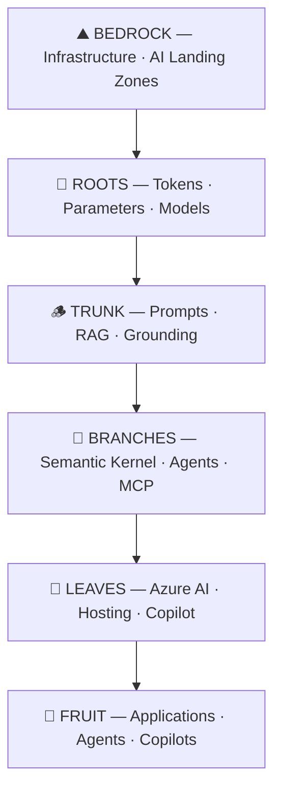

# 🌳 FrootAI — From Root to Fruit

> **The open glue that binds infrastructure, platform, and application for AI architecture.**
> From a single token to a production agent fleet.

[](https://gitpavleenbali.github.io/frootai/)
[](./mcp-server/)
[](./LICENSE)

---

## What is FrootAI?

**FrootAI** = AI **F**oundations · **R**easoning · **O**rchestration · **O**perations · **T**ransformation

It's three things in one:

| | What | For Whom |
|---|------|----------|
| 🎓 | **17 knowledge modules** covering AI architecture end-to-end | Cloud Architects, AI Engineers, CSAs |
| 🔌 | **MCP Server** — add to any AI agent as a callable skill set | Agent builders, Copilot developers |
| 🔗 | **The open glue** — removes silos between infra, platform, and app teams | Everyone |

---

## Quick Start

### Read the docs

```
https://gitpavleenbali.github.io/frootai/
```

### Add to your AI agent (MCP)

```bash
git clone https://github.com/gitpavleenbali/frootai.git
cd frootai/mcp-server
npm install
```

Then add to your MCP config:

```json
{
  "mcpServers": {
    "frootai": {
      "command": "node",
      "args": ["/path/to/frootai/mcp-server/index.js"]
    }
  }
}
```

Works with: **Claude Desktop** · **VS Code / GitHub Copilot** · **Cursor** · **Windsurf** · **Azure AI Foundry** · any MCP client

---

## The FROOT Framework



| Layer | Modules | What You Learn |
|-------|---------|---------------|
| 🌱 **F — Foundations** | F1, F2, F3 | Tokens, transformers, model selection, 200+ AI terms |
| 🪵 **R — Reasoning** | R1, R2, R3 | Prompts, RAG, grounding, deterministic AI |
| 🌿 **O — Orchestration** | O1, O2, O3 | Semantic Kernel, agents, MCP, tools |
| 🍃 **O — Operations** | O4, O5, O6 | Azure AI Foundry, GPU infra, Copilot ecosystem |
| 🍎 **T — Transformation** | T1, T2, T3 | Fine-tuning, responsible AI, production patterns |

---

## MCP Server — 5 Tools

| Tool | What It Does |
|------|-------------|
| `list_modules` | Browse all 17 modules by FROOT layer |
| `get_module` | Read any module content (F1–T3) |
| `lookup_term` | Look up any of 200+ AI/ML terms |
| `search_knowledge` | Full-text search across all modules |
| `get_architecture_pattern` | 7 pre-built decision guides |

**Architecture patterns:** `rag_pipeline` · `agent_hosting` · `model_selection` · `cost_optimization` · `deterministic_ai` · `multi_agent` · `fine_tuning_decision`

[📖 Full MCP documentation →](./mcp-server/README.md)

---

## Repository Structure

```
frootai/
├── docs/                  ← 17 knowledge modules (markdown)
│   ├── README.md           FROOT framework overview
│   ├── GenAI-Foundations.md  F1
│   ├── LLM-Landscape.md     F2
│   ├── ...                   (all 17 modules)
│   └── T3-Production-Patterns.md  T3
├── mcp-server/            ← MCP server (npm-publishable)
│   ├── index.js             Server entry point
│   ├── knowledge.json       Bundled knowledge (664 KB)
│   ├── build-knowledge.js   Bundle generator
│   └── package.json         npm config
├── website/               ← Docusaurus site
│   ├── docusaurus.config.ts
│   ├── sidebars.ts
│   └── src/
├── .github/workflows/     ← CI/CD pipeline
│   └── deploy.yml           Auto-deploy to GitHub Pages
└── .vscode/mcp.json       ← VS Code auto-connects MCP
```

---

## Why FrootAI?

| Problem | FrootAI Solution |
|---------|-----------------|
| Infra teams don't speak AI | 🌱 Foundations layer — tokens, models, glossary |
| RAG pipelines are poorly designed | 🪵 Reasoning layer — RAG architecture, grounding |
| Agent frameworks are confusing | 🌿 Orchestration layer — SK vs Agent Framework comparison |
| AI workloads are expensive | 🍃 Operations layer — cost optimization, hosting patterns |
| AI agents hallucinate in production | 🍎 Transformation layer — determinism, safety, production patterns |
| Teams work in silos | 🔗 FrootAI is the open glue — shared vocabulary across teams |
| Agents burn tokens searching the web | 🔌 MCP server — curated, pre-written, 90% cost reduction |

---

## Contributing

FrootAI is open source. Contributions welcome:

1. **Add content** — improve existing modules or propose new ones
2. **Add MCP tools** — extend the server with new capabilities
3. **Report issues** — found a mistake? Open an issue
4. **Star the repo** — help others discover FrootAI

---

## License

MIT — use it, extend it, embed it, ship it.

---

> **FrootAI** — *The open glue for AI architecture. From root to fruit.*
> Built by [Pavleen Bali](https://linkedin.com/in/pavleenbali)
