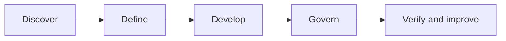

<p align="center">
  <a href="https://frootai.dev"></a>
</p>

<h1 align="center">FrootAI</h1>
<p align="center"><strong>The open protocol and community catalog for composable AI systems.</strong></p>
<p align="center">Connect agents, instructions, skills, hooks, workflows, plugins, tools, prompts, and guardrails into governed Solution Plays.</p>

<p align="center">
  <a href="https://frootai.dev"></a>
  <a href="https://github.com/frootai/frootai/actions/workflows/validate-plays.yml"></a>
  <a href="https://github.com/frootai/frootai/actions/workflows/validate-primitives.yml"></a>
  <a href="https://www.npmjs.com/package/frootai-mcp"></a>
  <a href="https://www.npmjs.com/package/frootai"></a>
  <a href="https://marketplace.visualstudio.com/items?itemName=frootai.frootai-vscode"></a>
  <a href="./LICENSE"></a>
</p>

<p align="center">
  <a href="https://frootai.dev/getting-started"><strong>Get started</strong></a> ·
  <a href="https://frootai.dev/solution-plays">Solution Plays</a> ·
  <a href="https://frootai.dev/docs">Documentation</a> ·
  <a href="https://frootai.dev/mcp-tooling">MCP</a> ·
  <a href="https://frootai.dev/chatbot">Ask Agent FAI</a>
</p>

---

## What FrootAI provides

FrootAI is a vendor-neutral context-wiring system for AI delivery. The **FAI Protocol** defines how reusable primitives are assembled into complete, evaluated Solution Plays without coupling the architecture to one model, cloud, or agent framework.

| Public building block | Current catalog | Purpose |
|---|---:|---|
| Solution Plays | **101** | Complete architecture, DevKit, TuneKit, SpecKit, infrastructure, and evaluation contracts |
| Agents | **238** | Specialized roles with explicit responsibilities and constraints |
| Instructions | **176** | Scoped coding, architecture, governance, and operational policies |
| Skills | **333** | Reusable procedures, domain knowledge, and delivery playbooks |
| Hooks | **11** | Lifecycle guardrails and deterministic checks |
| Plugins | **77** | Installable bundles of compatible primitives |
| Knowledge modules | **25** | FROOT learning path from foundations through production |

Catalog counts come from the committed Factory catalog and are validated in CI.

## Start with an outcome

The fastest path is to choose a Solution Play, install its Agentic OS assets, and adapt the included architecture and evaluation gates.

1. **Discover** — compare [Solution Plays](https://frootai.dev/solution-plays) or search the [Solution Accelerator](https://frootai.dev/solution-accelerator).
2. **Define** — inspect the Play architecture, security boundaries, cost direction, and Well-Architected alignment.
3. **Develop** — use the packaged agents, instructions, skills, prompts, hooks, and MCP configuration.
4. **Govern** — validate the FAI manifest and retain evidence for every automated decision.
5. **Verify and improve** — run evaluation gates, review failures, and tune configuration before deployment.


```mermaid
flowchart LR
  D["Discover"] --> F["Define"] --> B["Develop"] --> G["Govern"] --> V["Verify and improve"]
```

## Install a delivery surface

Published artifacts are the supported installation boundary for distribution products.

| Surface | Install | Current release |
|---|---|---:|
| FrootAI MCP | `npx -y frootai-mcp` | 6.1.1 |
| FrootAI CLI | `npx -y frootai@6.2.0` | 6.2.0 |
| VS Code | `code --install-extension frootai.frootai-vscode` | 6.7.3 |
| Python SDK | `pip install frootai==5.1.0` | 5.1.0 |
| Python MCP | `pip install frootai-mcp==6.1.0` | 6.1.0 |

### MCP configuration

```json
{
  "servers": {
    "frootai": {
      "command": "npx",
      "args": ["-y", "frootai-mcp"]
    }
  }
}
```

Use the [MCP setup guide](https://frootai.dev/mcp-tooling) for VS Code, Claude, Cursor, Docker, Python, and hosted read-only access.

Container availability and immutable image tags are published on the [FrootAI packages page](https://frootai.dev/packages). Pin an explicit version or digest before production use.

Existing deployments that reference `ghcr.io/frootai/frootai-mcp` should verify package visibility and migrate to a published immutable tag or digest before changing production configuration.

## The FAI Protocol

A Solution Play is wired by `fai-manifest.json`. The manifest resolves compatible primitives, shared knowledge, guardrails, configuration, infrastructure, and evaluation requirements.

```json
{
  "schemaVersion": "1.0.0",
  "play": "01-enterprise-rag",
  "primitives": {
    "agents": ["./.github/agents/builder.agent.md"],
    "instructions": ["./.github/instructions/security.instructions.md"],
    "skills": ["./.github/skills/evaluate-rag/SKILL.md"]
  },
  "evaluation": {
    "required": true
  }
}
```

- [Protocol specification](./fai-protocol/)
- [Schemas](./schemas/)
- [Conformance suite](./conformance/)
- [Solution Plays](./solution-plays/)
- [Public primitives](./agents/)

## Public repository scope

This repository is the public home for the FAI Protocol, schemas, conformance assets, community primitives, Solution Plays, learning content, examples, governance, and public integration contracts.

Distribution products and hosted services are released through controlled delivery pipelines. Historical or transitional implementation directories that remain in this repository are not the release authority and will be addressed only through compatibility-gated migrations. No consumer-facing path should be removed without replacement contracts and release-continuity validation.

See [Repository Scope](./REPOSITORY_SCOPE.md) for the durable public/private boundary.

## Repository map

```text
agents/             Public agent primitives
instructions/       Scoped instruction primitives
skills/             Reusable skills and bundled references
hooks/              Lifecycle and policy hooks
plugins/            Community-distributed primitive bundles
workflows/          Agentic workflow definitions
solution-plays/     Complete public architecture contracts
fai-protocol/       FAI Protocol specification
schemas/            Machine-readable contracts
conformance/        Protocol compatibility fixtures and results
docs/               FROOT knowledge modules
cookbook/           Composition recipes
workshops/          Hands-on learning material
orchard/             Public registry, schemas, and community submissions
```

## Trust and engineering standards

- **Evidence over claims** — catalog and conformance results are generated and checked.
- **Least privilege** — integrations use explicit permissions and bounded tool access.
- **No secret material** — never commit credentials, private keys, customer data, or production configuration.
- **Versioned contracts** — schema and manifest changes require compatibility review.
- **Reproducible delivery** — published artifacts are versioned and validated before release.
- **Responsible AI** — security, safety, reliability, cost, and observability are part of the architecture contract.

Report vulnerabilities privately through [SECURITY.md](./SECURITY.md). Do not open a public security issue.

## Contributing

Contributions are welcome for public protocol work, schemas, documentation, primitives, Solution Plays, recipes, workshops, and community registry content.

Before opening a pull request:

1. Read [CONTRIBUTING.md](./CONTRIBUTING.md) and [GOVERNANCE.md](./GOVERNANCE.md).
2. Follow the [Code of Conduct](./CODE_OF_CONDUCT.md).
3. Keep changes inside the documented public repository scope.
4. Add validation or conformance evidence where the contract changes.
5. Use the issue and pull-request templates so reviews remain reproducible.

For help, see [SUPPORT.md](./SUPPORT.md). For planned public work, see [ROADMAP.md](./ROADMAP.md).

## License

The public protocol, catalog, and community material in this repository are available under the [MIT License](./LICENSE), unless a contained file or third-party component states otherwise. Hosted services and separately distributed products may have additional terms documented with those services or artifacts.

---

<p align="center"><strong>From the Roots to the Fruits.</strong><br>Connected, governed, and ready to grow.</p>
