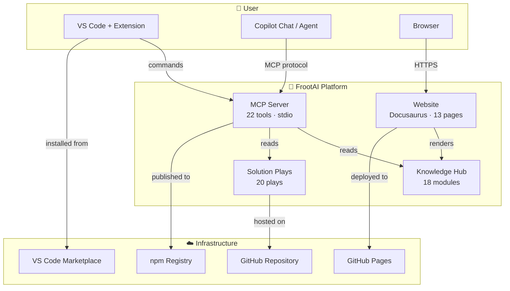
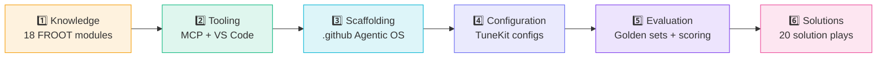
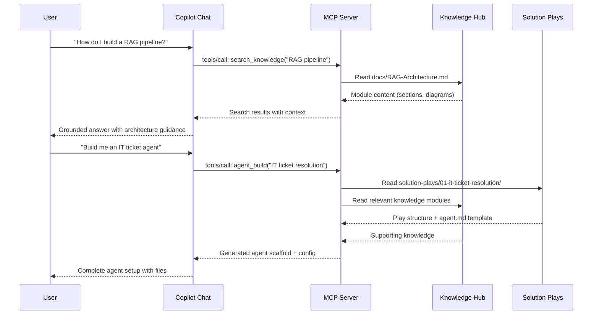
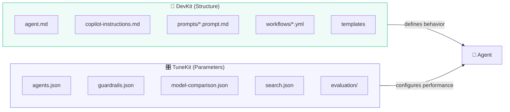
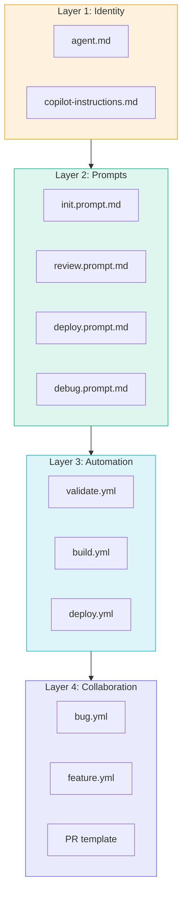
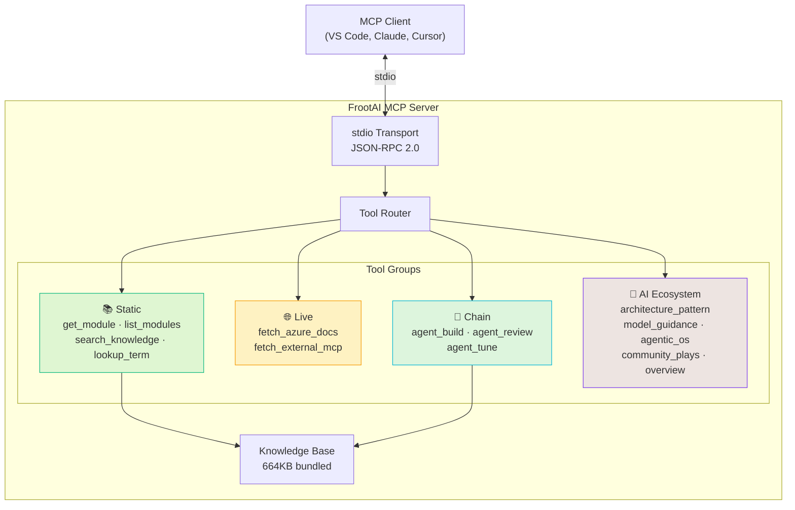
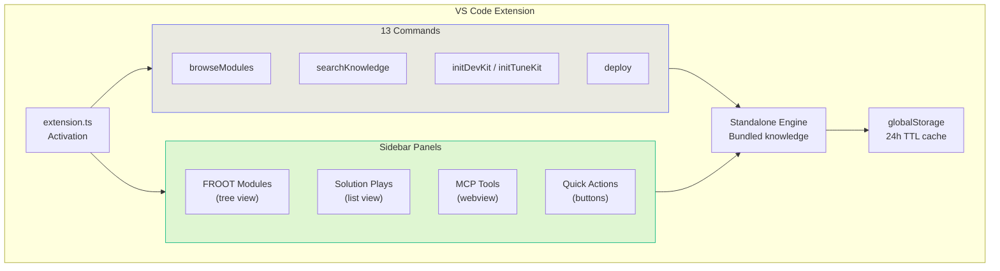
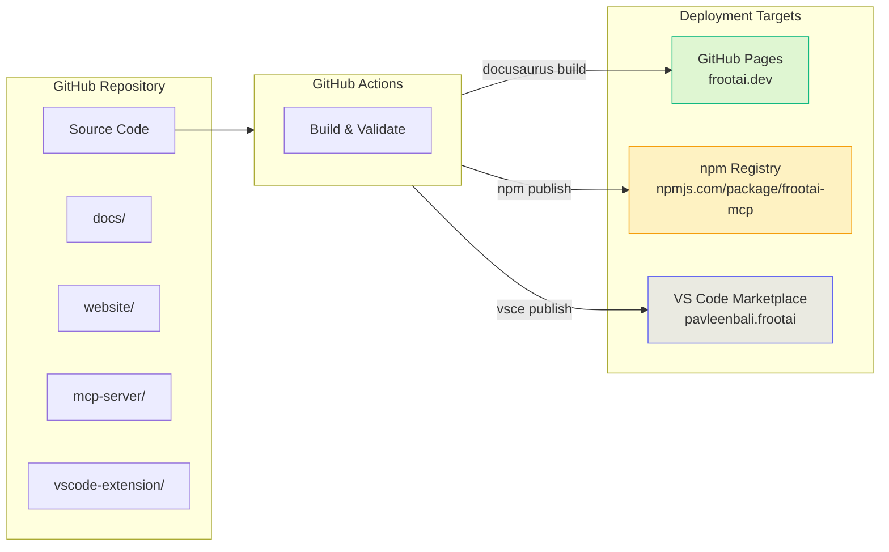

# FrootAI Architecture Overview

> System design, data flow, and component architecture of the FrootAI platform.

---

## 1. System Architecture

### Component Summary

| Component | Technology | Transport | Artifact |
|---|---|---|---|
| **Website** | Docusaurus 3, React, TypeScript | HTTPS | Static site on GitHub Pages |
| **MCP Server** | Node.js, JSON-RPC 2.0 | stdio | npm package (`frootai-mcp`) |
| **VS Code Extension** | TypeScript, VS Code API | In-process | VSIX on Marketplace |
| **Knowledge Hub** | Markdown + Mermaid | File system | `docs/*.md` |
| **Solution Plays** | Markdown, JSON, Python, YAML | File system | `solution-plays/*/` |

---

## 2. The 6 Layers

FrootAI is organized in 6 conceptual layers, from foundational infrastructure to user-facing solutions:

| Layer | Name | Contents |
|---|---|---|
| **1. Knowledge** | FROOT Framework | 18 modules across 5 layers (F·R·O·O·T) |
| **2. Tooling** | Developer Kit | MCP Server (22 tools) + VS Code Extension (13 commands) |
| **3. Scaffolding** | Agentic OS | `.github/` files — agent rules, prompts, CI, templates |
| **4. Configuration** | TuneKit | `config/` — models, guardrails, routing, search, chunking |
| **5. Evaluation** | Quality Gates | `evaluation/` — golden sets, scoring scripts, benchmarks |
| **6. Solutions** | Plays | 20 pre-built scenario accelerators |

---

## 3. Data Flow

How a user's request flows through the system:

### Request Types

| Type | Flow | Tools Used |
|---|---|---|
| **Knowledge Query** | User → Chat → MCP → Docs → Response | `search_knowledge`, `get_module`, `lookup_term` |
| **Agent Build** | User → Chat → MCP → Plays + Docs → Scaffold | `agent_build` |
| **Agent Review** | User → Chat → MCP → Analysis → Findings | `agent_review` |
| **Parameter Tune** | User → Chat → MCP → Config → Optimized | `agent_tune` |
| **Azure Docs** | User → Chat → MCP → Azure → Response | `fetch_azure_docs` |

---

## 4. DevKit + TuneKit Model

FrootAI uses a **two-part approach** to make projects agent-ready:

| Aspect | DevKit | TuneKit |
|---|---|---|
| **Purpose** | Define what the agent does | Configure how well it does it |
| **Location** | `.github/` | `config/` + `evaluation/` |
| **Changes** | Per-project, rarely | Per-iteration, frequently |
| **Content** | Markdown rules, YAML workflows | JSON parameters, Python scripts |
| **Analogy** | The recipe | The seasoning |

---

## 5. .github Agentic OS

The Agentic OS is structured around **7 primitives** organized in **4 layers**:

### The 7 Primitives

| # | Primitive | File(s) | Purpose |
|---|---|---|---|
| 1 | **Agent Rules** | `agent.md` | Behavioral boundaries and instructions |
| 2 | **Context** | `copilot-instructions.md` | Project knowledge for AI assistants |
| 3 | **Prompts** | `prompts/*.prompt.md` | Reusable, parameterized prompt templates |
| 4 | **Workflows** | `workflows/*.yml` | CI/CD automation pipelines |
| 5 | **Templates** | `ISSUE_TEMPLATE/`, `pull_request_template.md` | Structured collaboration |
| 6 | **Config** | `config/*.json` | Tunable parameters |
| 7 | **Evaluation** | `evaluation/` | Quality benchmarks and scoring |

### Composition

Primitives are **independent but synergistic**:
- `agent.md` alone = basic agent behavior
- `agent.md` + `copilot-instructions.md` = context-aware agent
- All 7 primitives = fully-equipped AI-native project

---

## 6. MCP Server Architecture

### Tool Groups

| Group | Count | Network Required | Description |
|---|---|---|---|
| **Static** | 4 | No | Query bundled knowledge — fast, offline |
| **Live** | 2 | Yes | Fetch real-time external documentation |
| **Chain** | 3 | No | Multi-step agent workflows (build → review → tune) |
| **AI Ecosystem** | 5+ | No | Architecture patterns, model guidance, platform info |

### Bundle

The npm package bundles **all knowledge** (664KB) so the server works offline. No database, no API keys, no external dependencies at runtime.

---

## 7. VS Code Extension Architecture

### Key Design Decisions

| Decision | Rationale |
|---|---|
| **Standalone engine** | Works without MCP server or network |
| **Bundled knowledge** | No external fetching for core features |
| **24h cache TTL** | Balance freshness vs. offline reliability |
| **Layer colors** | Visual identification of FROOT layers |
| **Tool grouping** | Logical organization matches MCP server groups |

---

## 8. Deployment Architecture

### Deployment Channels

| Target | Artifact | Trigger | URL |
|---|---|---|---|
| **GitHub Pages** | Static site | Push to `main` (website/) | `frootai.dev` |
| **npm Registry** | Node.js package | Release tag (`v*`) | `npmjs.com/package/frootai-mcp` |
| **VS Code Marketplace** | VSIX extension | Release tag (`v*`) | `marketplace.visualstudio.com` |
| **GitHub Releases** | Release notes + assets | Release tag (`v*`) | `github.com/frootai/frootai/releases` |

### No Backend Required

FrootAI is **entirely static**:
- Website = pre-built HTML/CSS/JS
- MCP Server = local stdio process
- VS Code Extension = local extension
- No databases, no cloud functions, no API servers

This zero-backend architecture means:
- **Zero hosting cost** (GitHub Pages is free)
- **Zero latency** for core operations
- **Zero downtime** (static files never crash)
- **Zero security surface** (no attack vectors)

---

> **Next**: [Admin Guide](./admin-guide) · [User Guide](./user-guide-complete) · [API Reference](./api-reference)
