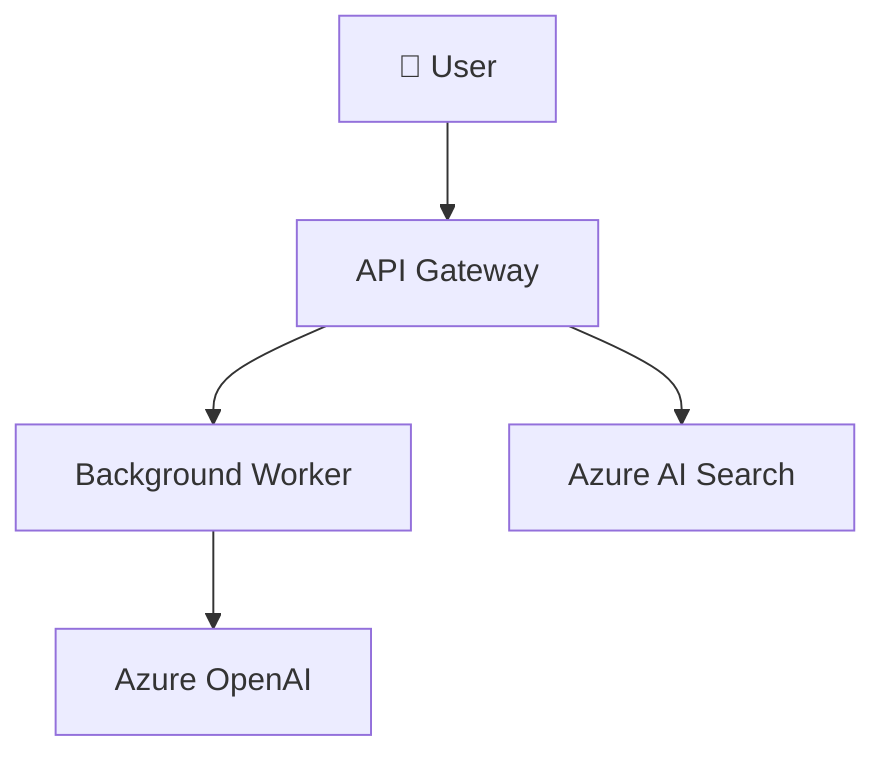

# Architecture Blueprint Generator

Analyze codebases and produce comprehensive architecture documentation.

## When to Use

- Starting a new project — define the target architecture
- Onboarding — document an existing system's architecture
- Architecture review — identify gaps, single points of failure, security boundaries
- Before major refactoring — capture current state for comparison

---

## Step 1: Detect Technology Stack

Scan the repository for framework indicators:

```python
from pathlib import Path

INDICATORS = {
    "package.json": "Node.js",
    "requirements.txt": "Python",
    "pyproject.toml": "Python",
    "*.csproj": ".NET",
    "go.mod": "Go",
    "Cargo.toml": "Rust",
    "pom.xml": "Java (Maven)",
    "build.gradle": "Java/Kotlin (Gradle)",
    "main.bicep": "Azure IaC (Bicep)",
    "main.tf": "Terraform",
    "docker-compose.yml": "Docker Compose",
    "azure.yaml": "Azure Developer CLI",
}

def detect_stack(root: Path) -> list[str]:
    detected = []
    for pattern, tech in INDICATORS.items():
        if list(root.rglob(pattern)):
            detected.append(tech)
    return detected
```

## Step 2: Map Service Boundaries

Identify microservices or modules from directory structure:

```python
def discover_services(root: Path) -> list[dict]:
    """Find service boundaries by looking for entry points and Dockerfiles."""
    services = []
    for dockerfile in root.rglob("Dockerfile"):
        svc_dir = dockerfile.parent
        services.append({
            "name": svc_dir.name,
            "path": str(svc_dir.relative_to(root)),
            "has_tests": bool(list(svc_dir.rglob("test*"))),
            "has_infra": bool(list(svc_dir.rglob("*.bicep")))
                         or bool(list(svc_dir.rglob("*.tf"))),
            "endpoints": extract_routes(svc_dir),
        })
    return services
```

## Step 3: Generate Architecture Diagram

Produce Mermaid diagrams at multiple abstraction levels:

```python
def generate_c4_context(services: list[dict], external: list[str]) -> str:
    """Generate C4 Context diagram in Mermaid."""
    lines = ["graph TB"]
    lines.append('    User["👤 User"]')
    for svc in services:
        lines.append(f'    {svc["name"]}["{svc["name"]}"]')
        lines.append(f'    User --> {svc["name"]}')
    for ext in external:
        lines.append(f'    {ext}[("{ext}")]')
    return "\n".join(lines)
```

### Example Output



## Step 4: Document Trust Zones

```markdown
## Trust Zones

| Zone | Services | Network | Auth |
|------|----------|---------|------|
| Public | API Gateway, CDN | Internet-facing, WAF-protected | OAuth2 / API Key |
| Application | API, Workers | Private VNet subnet | Managed Identity |
| Data | SQL, Storage, Search | Private endpoints only | RBAC + Private Link |
| Management | Bastion, Monitor | Hub VNet | AAD + MFA |
```

## Step 5: Cost Profile

```markdown
## Cost Estimate (Monthly)

| Service | SKU | Est. Cost | Notes |
|---------|-----|-----------|-------|
| Azure OpenAI | S0 80K TPM | $X | PAYG, consider PTU if >60% util |
| AI Search | Standard S1 | $X | 1 replica, 1 partition for dev |
| App Service | P1v3 | $X | Auto-scale 1-4 instances |
| SQL Database | S2 (50 DTU) | $X | Consider serverless for dev |
| **Total** | | **$X/mo** | |
```

## Checklist

- [ ] Technology stack detected and documented
- [ ] Service boundaries mapped with entry points
- [ ] C4 diagrams generated (Context, Container, Component)
- [ ] Trust zones defined with network and auth controls
- [ ] Data flow documented with sensitivity classification
- [ ] Cost profile estimated per environment

## Troubleshooting

| Issue | Fix |
|-------|-----|
| Blueprint too abstract | Add specific SKUs, regions, SLAs, and policy constraints |
| Missing services | Check for serverless functions and background jobs beyond Dockerfiles |
| Stale diagrams | Generate diagrams from code in CI, not manually |
