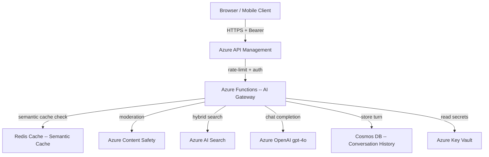

# FAI Architecture Blueprint

Creates living, commit-tracked architecture blueprints that combine visual diagrams, component responsibility matrices, data flow descriptions, and WAF alignment in a single document. Prevents the gap between "what was designed" and "what was built" by making blueprints pull from the same source of truth as the infrastructure code.

## When to Invoke

| Signal | Example |
|--------|---------|
| Starting a new solution play | No architecture doc exists yet |
| Services have drifted from original design | Code added components not in any diagram |
| Onboarding a new team member | Need a visual walkthrough of the system |
| Preparing for a WAF review | Need pillar mapping per component |

## Workflow

### Step 1 — Discover Existing Components

Scan the repository for service definitions, infrastructure files, and API contracts.

```bash
# Discover services from Bicep resources
grep -r "resource " infra/ --include="*.bicep" | \
  grep -v "//" | awk '{print $2, $3}' | sort -u

# From docker-compose
grep "^  [a-z]" docker-compose.yml | tr -d ':' | sort

# From solution-play manifest
cat fai-manifest.json | node -e "
  const d = JSON.parse(require('fs').readFileSync('/dev/stdin', 'utf8'));
  console.log(JSON.stringify(d.infrastructure?.resources ?? [], null, 2));
"
```

### Step 2 — Generate Service Topology Diagram



### Step 3 — Component Responsibility Table

| Component | Responsibility | Owner | SLA | Data Class |
|-----------|---------------|-------|-----|------------|
| API Management | Auth, rate limiting, routing | Platform | 99.95% | Public |
| AI Gateway (Functions) | Orchestration, caching, safety | App | 99.9% | Internal |
| Azure OpenAI | Text generation | Azure | 99.9% | Confidential |
| AI Search | Hybrid retrieval | App | 99.9% | Internal |
| Cosmos DB | Conversation persistence | App | 99.999% | Confidential |
| Redis Cache | Semantic cache | App | 99.9% | Internal |
| Key Vault | Secret management | Platform | 99.99% | Restricted |
| Content Safety | Input/output moderation | App | 99.9% | Confidential |

### Step 4 — Data Flow Annotation

```yaml
# data-flows.yaml — machine-readable flow registry
flows:
  - id: user-query
    type: sync
    path: [Client, APIM, FuncApp, ContentSafety, Redis, AISearch, AOAI]
    latency_budget_ms: 3000
    pii: true
    encryption: tls1.3

  - id: history-write
    type: async
    path: [FuncApp, CosmosDB]
    latency_budget_ms: 500
    pii: true
    encryption: at-rest-aes256
```

### Step 5 — WAF Pillar Mapping

| Component | Reliability | Security | Cost | Performance | OpEx | Resp. AI |
|-----------|------------|---------|------|-------------|------|----------|
| APIM | circuit-breaker | RBAC, JWT | pay-per-call | caching | API versioning | rate limiting |
| AI Gateway | retry + DLQ | Managed Identity | semantic cache | streaming | App Insights | content safety |
| Azure OpenAI | PTU fallback | private endpoint | model routing | TPM quota | audit logs | content filter |

### Step 6 — Key Design Decisions

| ID | Decision | Reason | Trade-off |
|----|----------|--------|-----------|
| D-01 | Semantic cache in Redis | 40% cost reduction on repeated queries | Cache invalidation complexity |
| D-02 | Azure Functions for gateway | Serverless scaling, low ops overhead | Cold start on first request |
| D-03 | Hybrid search (BM25 + vector) | Better recall than pure vector | Slightly higher latency |

## Output Files

```
docs/
  architecture-blueprint.md        <- This document (human-readable)
  data-flows.yaml                   <- Machine-readable flow registry
  architecture-blueprint.mermaid    <- Standalone diagram for tooling
```

## WAF Alignment

| Pillar | Contribution |
|--------|-------------|
| Operational Excellence | Blueprints committed to repo ensure design and code stay in sync |
| Reliability | Data flow annotations include latency budgets enabling SLO definition |
| Security | Data classification per component drives encryption and access decisions |

## Compatible Solution Plays

- **Play 02** — AI Landing Zone (infrastructure topology)
- **Play 01** — Enterprise RAG (service topology)
- **Play 11** — AI Landing Zone Advanced

## Blueprint Freshness Check

Run this script in CI to flag components in deployment that are not documented in the blueprint:

```bash
#!/usr/bin/env bash
# Check for undocumented resources
DEPLOYED=$(az resource list --resource-group "$RG_NAME" \
  --query "[].name" --output tsv | sort)

DOCUMENTED=$(grep -oP '(?<=\[)[A-Za-z ]+(?=\])' docs/architecture-blueprint.md | \
  tr '[:upper:]' '[:lower:]' | sort)

UNDOCUMENTED=$(comm -23 <(echo "$DEPLOYED") <(echo "$DOCUMENTED"))
if [ -n "$UNDOCUMENTED" ]; then
  echo "WARNING: undocumented resources detected:"
  echo "$UNDOCUMENTED"
  exit 1
fi
echo "Blueprint is up to date with deployed resources."
```

## Notes

- Blueprints are living documents — update the decision log (Step 6) for every significant architecture change
- Use Mermaid for diagrams; they render natively in GitHub, VS Code, and frootai.dev
- `data-flows.yaml` can be consumed by scripts to auto-generate network security group rules
- Run the freshness check in CI to catch undocumented resources before they become architecture drift
