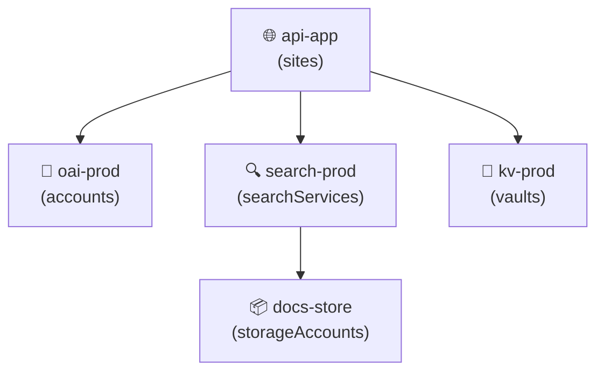

# Azure Resource Visualizer

Generate visual topology diagrams from Azure resource configurations.

## When to Use

- Creating architecture documentation for a resource group
- Reviewing resource dependencies and network topology
- Presenting infrastructure to non-technical stakeholders
- Detecting orphaned or misconfigured resources visually

---

## Resource Graph to Mermaid

```python
from azure.mgmt.resourcegraph import ResourceGraphClient
from azure.mgmt.resourcegraph.models import QueryRequest
from azure.identity import DefaultAzureCredential

def generate_topology(subscription_id: str, resource_group: str) -> str:
    client = ResourceGraphClient(DefaultAzureCredential())
    query = QueryRequest(
        query=f"""Resources
| where resourceGroup == '{resource_group}'
| project name, type, id, dependsOn=properties.dependencies
| order by type""",
        subscriptions=[subscription_id],
    )
    resources = client.resources(query).data

    lines = ["graph TB"]
    type_icons = {
        "microsoft.web/sites": "🌐",
        "microsoft.cognitiveservices/accounts": "🧠",
        "microsoft.search/searchservices": "🔍",
        "microsoft.storage/storageaccounts": "📦",
        "microsoft.keyvault/vaults": "🔐",
        "microsoft.cache/redis": "⚡",
    }

    for r in resources:
        icon = type_icons.get(r["type"].lower(), "📌")
        short_type = r["type"].split("/")[-1]
        lines.append(f'    {r["name"]}["{icon} {r["name"]}\n({short_type})"]')

    return "\n".join(lines)
```

## CLI Approach

```bash
# Export resource list as starting point for manual diagram
az resource list --resource-group $RG \
  --query "[].{Name:name, Type:type, Location:location}" -o table

# Export network topology
az network watcher show-topology --resource-group $RG -o json > topology.json
```

## Sample Mermaid Output



## Cost Heatmap Annotation

```python
def annotate_cost(resources: list[dict], cost_data: dict) -> list[dict]:
    """Add cost tier to each resource for visual heatmap."""
    for r in resources:
        monthly = cost_data.get(r["name"], 0)
        if monthly > 500:
            r["cost_tier"] = "🔴 HIGH"
        elif monthly > 100:
            r["cost_tier"] = "🟡 MEDIUM"
        else:
            r["cost_tier"] = "🟢 LOW"
    return resources
```

## Troubleshooting

| Issue | Cause | Fix |
|-------|-------|-----|
| Diagram too cluttered | Too many resources in one view | Filter by type or group by subnet |
| Missing dependencies | ARM doesn't track all runtime deps | Add manual edges for app→service connections |
| Stale diagram | Generated once, never updated | Regenerate in CI on infra changes |
