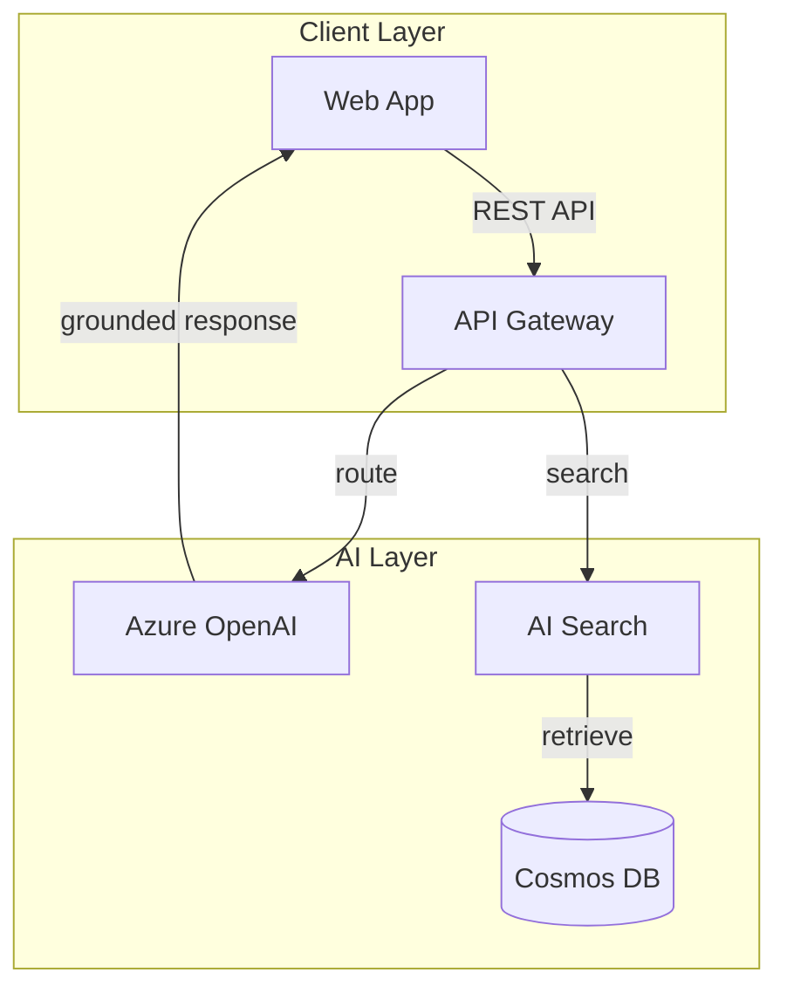

# FAI Documentation Writer

This skill enforces documentation standards for FAI projects — structure, style, diagrams, code examples, cross-referencing, and automated generation. All documentation follows the Diátaxis framework and targets architects, platform engineers, and developers building AI solutions on Azure.

## Documentation Structure

Every FAI project requires these documentation artifacts in order of priority:

| Document | Location | Purpose | Audience |
|----------|----------|---------|----------|
| README.md | repo root | Entry point — what, why, quickstart | Everyone |
| ARCHITECTURE.md | docs/ | System design, component diagrams, data flow | Architects |
| API.md | docs/ | Endpoint reference, SDK methods, error codes | Developers |
| USER-GUIDE.md | docs/ | Step-by-step workflows for end users | Operators |
| ADR-NNN.md | docs/decisions/ | Architecture Decision Records | Team leads |
| CHANGELOG.md | repo root | Release history per Keep a Changelog | All |
| CONTRIBUTING.md | repo root | Dev setup, PR process, coding standards | Contributors |

README.md must contain: one-sentence description, architecture diagram (Mermaid), prerequisites list with exact versions, quickstart (< 5 commands to running), configuration table, and link to full docs.

## Diátaxis Framework

Classify every documentation page into exactly one Diátaxis quadrant:

- **Tutorial** — learning-oriented, hands-on lesson with a concrete outcome. Verb: "Learn". Structure: numbered steps, each step produces visible output. Never skip steps or assume knowledge. Include expected output after each command.
- **How-to** — task-oriented, solves a specific problem. Verb: "How to". Structure: prerequisites → steps → verification. No explanation of why — link to Explanation docs for that.
- **Reference** — information-oriented, accurate and complete. Verb: "Reference". Structure: tables, type signatures, parameter lists. Generated from code where possible. No tutorials embedded.
- **Explanation** — understanding-oriented, discusses concepts and architecture. Verb: "Understanding". Structure: prose with diagrams. Compares alternatives, explains tradeoffs.

```markdown
<!-- Tag every doc page with its quadrant -->
> **Type:** Tutorial | **Duration:** 30 min | **Prerequisites:** Node 22+, Azure CLI

<!-- WRONG: mixing quadrants -->
## How to Deploy (then embeds a 20-step tutorial with explanations)

<!-- RIGHT: separate pages, cross-linked -->
- [Tutorial: Your First Deployment](docs/tutorial-first-deploy.md)
- [How to: Deploy to Production](docs/howto-deploy-prod.md)
- [Reference: Deployment Configuration](docs/ref-deploy-config.md)
- [Explanation: Deployment Architecture](docs/explanation-deploy-arch.md)
```

## Markdown Conventions

Enforce these rules (aligned with markdownlint defaults):

- Headings: ATX style (`#`), increment by one level, no duplicate H1
- Line length: 120 chars max for prose (code blocks exempt)
- Lists: `-` for unordered, `1.` for ordered (let renderer auto-number)
- Code fences: triple backtick with language identifier — never indent-style
- Links: reference-style for repeated URLs, inline for one-off
- Tables: align columns with pipes, include header separator row
- Front matter: YAML between `---` fences, validate with schema

```markdown
<!-- markdownlint configuration (.markdownlint.json) -->
{
  "MD013": { "line_length": 120, "code_blocks": false, "tables": false },
  "MD024": { "siblings_only": true },
  "MD033": { "allowed_elements": ["details", "summary", "br"] },
  "MD041": true
}
```

Run `markdownlint --fix docs/` in CI. Add to pre-commit hooks:

```yaml
# .pre-commit-config.yaml
repos:
  - repo: https://github.com/igorshubovych/markdownlint-cli
    rev: v0.42.0
    hooks:
      - id: markdownlint-fix
        args: ["--config", ".markdownlint.json"]
```

## Code Example Standards

Every code example must be runnable without modification. Apply these rules:

1. **Include imports** — first example in each language shows full imports and setup
2. **Realistic values** — use `contoso.com`, `invoice-processor`, `sku-12345` — never `foo`, `bar`
3. **Error handling** — at least one example per section shows try/catch or error response
4. **Pinned versions** — all `pip install` and `npm install` show exact versions
5. **Expected output** — show what the user should see after running

```python
# GOOD: runnable, realistic, error-handled, versioned
# pip install openai==1.52.0 azure-identity==1.19.0

from openai import AzureOpenAI
from azure.identity import DefaultAzureCredential

client = AzureOpenAI(
    azure_endpoint="https://contoso-ai.openai.azure.com",
    azure_ad_token_provider=DefaultAzureCredential().get_token(
        "https://cognitiveservices.azure.com/.default"
    ).token,
    api_version="2024-10-21",
)

try:
    response = client.chat.completions.create(
        model="gpt-4o",
        messages=[{"role": "user", "content": "Summarize this invoice."}],
        temperature=0,
    )
    print(response.choices[0].message.content)
except Exception as e:
    print(f"API call failed: {e}")
# Expected output: "The invoice from Contoso Ltd dated..."
```

Mark non-runnable examples explicitly with `<!-- conceptual -->` above the fence.

## Cross-Referencing

Use relative links between docs within a repo. Link to external FAI resources with full URLs.

```markdown
<!-- Within same repo — relative paths -->
See [Deployment Config](../docs/ref-deploy-config.md) for all parameters.
Architecture decisions are tracked in [ADR-003](docs/decisions/ADR-003.md).

<!-- To FAI ecosystem — full URLs -->
This play follows the [Enterprise RAG pattern](https://frootai.dev/solution-plays/01).
See the [FAI Glossary](https://frootai.dev/learning-hub/glossary) for term definitions.
```

Rules: every acronym links to its glossary definition on first use. Every config parameter links to its reference page. Dead links fail CI — use `markdown-link-check` in the pipeline.

## Versioned Documentation

For projects with multiple supported versions:

- Store docs alongside code in the same branch — docs version with code
- Tag docs pages with `> **Applies to:** v2.x | v3.x` at the top
- Use `docs/v2/` and `docs/v3/` subdirectories only when APIs diverge significantly
- CHANGELOG.md is the canonical version history — never duplicate in README
- Git tags trigger doc snapshots: `git tag v3.1.0` → CI publishes versioned docs

## Diagram Standards

### Mermaid (Preferred for In-Repo Diagrams)

Use Mermaid for diagrams that live in markdown. Rules:

- `graph TD` for architecture overviews (top-down)
- `sequenceDiagram` for API flows and agent interactions
- `stateDiagram-v2` for lifecycle and workflow states
- `C4Context` for system boundary diagrams
- Max 15 nodes per diagram — split complex systems into sub-diagrams
- Label every edge — no unlabeled arrows
- Use subgraph for logical grouping



### Draw.io (For Complex Architecture)

Use Draw.io (`.drawio.svg`) when diagrams exceed Mermaid's capability — multi-region deployments, detailed network topologies 50+ nodes. Export as SVG, commit both `.drawio` source and `.svg` render. Reference in markdown: ``.

## Changelog Format

Follow [Keep a Changelog](https://keepachangelog.com/en/1.1.0/) exactly:

```markdown
# Changelog

All notable changes to this project will be documented in this file.

The format is based on [Keep a Changelog](https://keepachangelog.com/en/1.1.0/),
and this project adheres to [Semantic Versioning](https://semver.org/spec/v2.0.0.html).

## [Unreleased]

### Added
- FAI manifest validation in CI pipeline

## [2.1.0] - 2026-04-10

### Added
- Support for hybrid search with semantic reranking

### Changed
- Upgraded Azure OpenAI SDK from 1.50.0 to 1.52.0

### Fixed
- Token counting overflow on documents exceeding 128K tokens
```

Categories in order: Added, Changed, Deprecated, Removed, Fixed, Security. Never use "Updated" or "Misc". Every entry starts with a verb. Link version headers to git compare URLs.

## Automated Doc Generation

Generate reference docs from code — never maintain them manually.

```json
// TypeScript: typedoc.json
{
  "entryPoints": ["src/index.ts"],
  "out": "docs/api",
  "plugin": ["typedoc-plugin-markdown"],
  "excludePrivate": true,
  "readme": "none"
}
```

```python
# Python: generate from docstrings with pdoc
# pip install pdoc==15.0.0
# pdoc --output-dir docs/api src/frootai_sdk

def create_play(name: str, template: str = "enterprise-rag") -> dict:
    """Initialize a new FAI solution play from a template.

    Args:
        name: Play identifier in NN-kebab-case format (e.g., "42-invoice-processor").
        template: Base template name. One of: enterprise-rag, agentic-rag,
            deterministic-agent, landing-zone.

    Returns:
        dict with keys: path (str), manifest (dict), primitives_count (int).

    Raises:
        ValueError: If name doesn't match NN-kebab-case pattern.
        FileExistsError: If play directory already exists.
    """
```

Wire generation into CI so docs rebuild on every merge to main:

```yaml
# .github/workflows/docs.yml
- name: Generate API docs
  run: npx typedoc --options typedoc.json
- name: Check for uncommitted doc changes
  run: git diff --exit-code docs/api/
```

## Architecture Decision Records

Use ADR format for every significant technical choice:

```markdown
# ADR-003: Use AI Search over Elasticsearch for RAG Retrieval

**Status:** Accepted
**Date:** 2026-03-15
**Deciders:** @architect, @lead-dev

## Context
Need a vector search backend that supports hybrid (keyword + semantic) retrieval
with integrated reranking, managed by Azure with private endpoint support.

## Decision
Use Azure AI Search with semantic ranker enabled. Index documents with both
vector embeddings (text-embedding-3-large, 3072 dims) and keyword fields.

## Consequences
- **Positive:** Native Azure integration, managed scaling, built-in reranker
- **Negative:** Higher cost than self-hosted Elasticsearch (~$250/mo for S1)
- **Risk:** Vendor lock-in — mitigated by abstracting retriever interface
```

## Quality Checklist

Before merging any documentation PR, verify:

- [ ] Every page tagged with one Diátaxis quadrant
- [ ] README has architecture diagram, quickstart, and config table
- [ ] All code examples run without modification (tested in CI)
- [ ] No placeholder text (`TODO`, `TBD`, `coming soon`, `foo`, `bar`)
- [ ] Cross-references resolve — `markdown-link-check` passes
- [ ] markdownlint passes with zero warnings
- [ ] Mermaid diagrams render — validated with `mermaid-diagram-validator`
- [ ] CHANGELOG follows Keep a Changelog format
- [ ] API reference generated from code, not hand-written
- [ ] WAF pillar alignment noted where applicable
- [ ] Glossary terms link to definitions on first use

