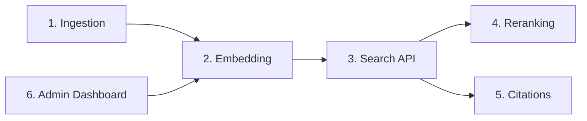

# Feature Breakdown

Decompose large features into ordered, right-sized implementation slices.

## When to Use

- Planning a multi-week epic into sprint-sized slices
- Creating implementation plans from PRDs or specs
- Identifying dependencies and critical path
- Sequencing releases for incremental delivery

---

## Breakdown Process

### Step 1: Identify Capabilities

```markdown
## Feature: AI-Powered Search

### Capabilities
1. Document ingestion pipeline
2. Embedding generation and indexing
3. Hybrid search API endpoint
4. Results ranking and reranking
5. Citation extraction
6. Admin dashboard for index management
```

### Step 2: Dependency Graph



### Step 3: Size and Sequence

```markdown
| Slice | Depends On | Size | Risk | Sprint |
|-------|-----------|------|------|--------|
| 1. Ingestion pipeline | None | M | Low | 1 |
| 2. Embedding + indexing | 1 | L | Medium | 1-2 |
| 3. Search API (basic) | 2 | M | Low | 2 |
| 4. Reranking | 3 | S | Medium | 3 |
| 5. Citations | 3 | S | Low | 3 |
| 6. Admin dashboard | 2 | L | Low | 3-4 |
```

## Slice Quality Rules

| Rule | Why |
|------|-----|
| Each slice is independently deployable | Enables incremental delivery |
| Each slice has a clear "done" definition | Prevents scope creep |
| Critical path slices first | Unblocks downstream work early |
| Risky slices early | Fail fast on unknowns |
| No slice > 5 story points | Keeps estimation accurate |

## Automation

```python
def generate_breakdown(feature_spec: str) -> str:
    return llm(f"""Break this feature into implementation slices.
For each slice provide: name, dependencies, size (S/M/L), risk (Low/Med/High), sprint.
Order by dependency then risk (risky first).

Feature spec:
{feature_spec}

Output as markdown table.""")
```

## Troubleshooting

| Issue | Cause | Fix |
|-------|-------|-----|
| Slices too large | Not decomposed enough | Split until each is 1-3 days of work |
| Circular dependencies | Wrong decomposition axis | Reorganize by vertical slices, not layers |
| Critical path unclear | Missing dependency analysis | Draw dependency graph first |
| Scope creep mid-sprint | No "done" definition per slice | Add acceptance criteria to each |

## Best Practices

| Practice | Rationale |
|----------|-----------|
| Start simple, add complexity when needed | Avoid over-engineering |
| Automate repetitive tasks | Consistency and speed |
| Document decisions and tradeoffs | Future reference for the team |
| Validate with real data | Don't rely on synthetic tests alone |
| Review with peers | Fresh eyes catch blind spots |
| Iterate based on feedback | First version is never perfect |

## Quality Checklist

- [ ] Requirements clearly defined
- [ ] Implementation follows project conventions
- [ ] Tests cover happy path and error paths
- [ ] Documentation updated
- [ ] Peer reviewed
- [ ] Validated in staging environment

## Related Skills

- `fai-implementation-plan-generator` — Planning and milestones
- `fai-review-and-refactor` — Code review patterns
- `fai-quality-playbook` — Engineering quality standards
