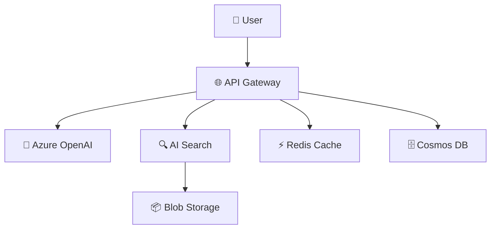
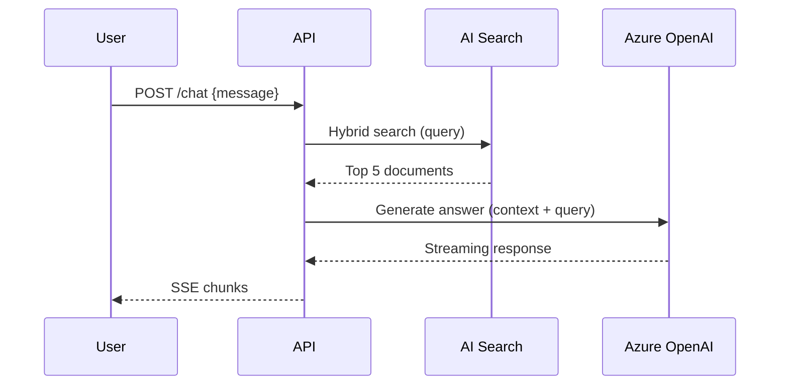
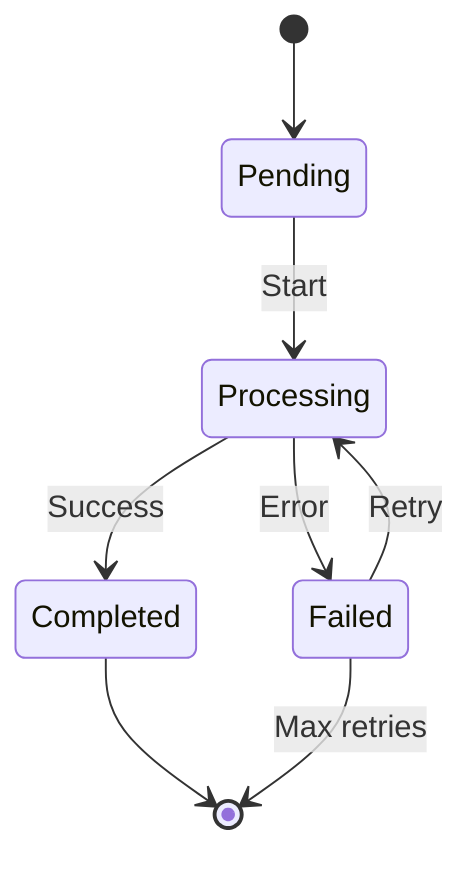

# Mermaid Diagram Generator

Generate architecture and flow diagrams in Mermaid syntax.

## When to Use

- Creating architecture diagrams that render in GitHub markdown
- Documenting API flows or state machines
- Generating diagrams from code analysis
- Adding visual documentation to ADRs or README

---

## Architecture Diagram



## Sequence Diagram



## State Machine



## Generator from Code

```python
def generate_architecture_mermaid(services: list[dict],
                                   connections: list[dict]) -> str:
    lines = ["graph TB"]
    icons = {"api": "🌐", "ai": "🧠", "search": "🔍",
             "db": "🗄️", "storage": "📦", "cache": "⚡"}
    for svc in services:
        icon = icons.get(svc.get("type", ""), "📌")
        lines.append(f'    {svc["id"]}["{icon} {svc["name"]}"]')
    for conn in connections:
        label = f"|{conn['label']}|" if conn.get("label") else ""
        lines.append(f'    {conn["from"]} -->{label} {conn["to"]}')
    return "\n".join(lines)
```

## Rendering

| Platform | Support |
|----------|---------|
| GitHub Markdown | Native (```mermaid block) |
| VS Code | Mermaid Preview extension |
| Docusaurus | @docusaurus/theme-mermaid |
| Confluence | Mermaid macro plugin |

## Troubleshooting

| Issue | Cause | Fix |
|-------|-------|-----|
| Diagram not rendering | Wrong code fence language | Use ```mermaid (not ```diagram) |
| Layout too dense | Too many nodes | Group with subgraph blocks |
| Arrows crossing | Default layout algorithm | Reorder node definitions |
| Special chars break | Unescaped quotes in labels | Wrap labels in double quotes |

## Best Practices

| Practice | Rationale |
|----------|-----------|
| Start simple, add complexity when needed | Avoid over-engineering |
| Automate repetitive tasks | Consistency and speed |
| Document decisions and tradeoffs | Future reference for the team |
| Validate with real data | Don't rely on synthetic tests alone |
| Review with peers | Fresh eyes catch blind spots |
| Iterate based on feedback | First version is never perfect |

## Quality Checklist

- [ ] Requirements clearly defined
- [ ] Implementation follows project conventions
- [ ] Tests cover happy path and error paths
- [ ] Documentation updated
- [ ] Peer reviewed
- [ ] Validated in staging environment

## Related Skills

- `fai-implementation-plan-generator` — Planning and milestones
- `fai-review-and-refactor` — Code review patterns
- `fai-quality-playbook` — Engineering quality standards
