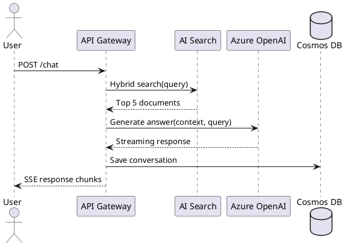
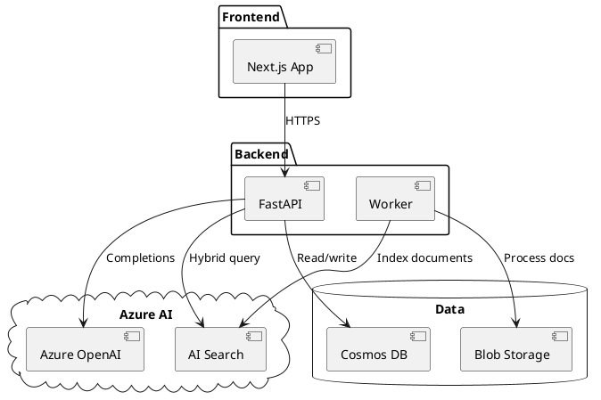
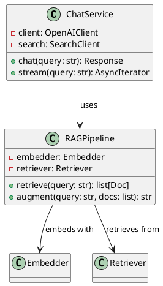
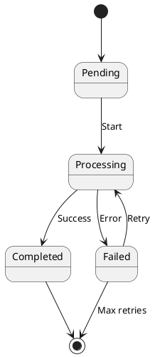

# PlantUML Generator

Generate UML diagrams with PlantUML syntax for documentation and architecture.

## When to Use

- Creating sequence diagrams for API flows
- Documenting class hierarchies and relationships
- Generating architecture diagrams with deployment views
- Embedding diagrams in documentation via CI rendering

---

## Sequence Diagram



## Component Diagram



## Class Diagram



## State Diagram



## CI Rendering

```bash
# Install PlantUML
apt-get install plantuml

# Render all .puml files to PNG
find docs/ -name "*.puml" -exec plantuml {} \;
```

## Troubleshooting

| Issue | Cause | Fix |
|-------|-------|-----|
| Diagram not rendering | PlantUML not installed | Install Java + PlantUML |
| Layout messy | Too many elements | Use packages to group |
| Arrows crossing | Default layout | Reorder participants/components |
| Font too small | Default scaling | Add `scale 1.5` at top |
