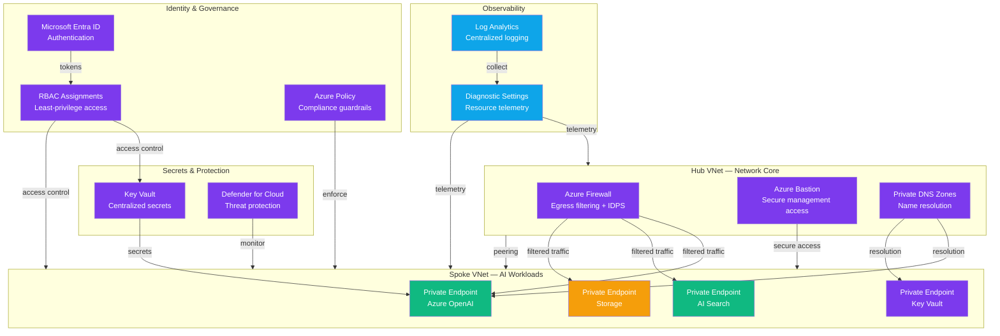

# Architecture — Play 02: AI Landing Zone

## Overview

The AI Landing Zone provides a secure, governed Azure foundation for hosting AI workloads. It implements a hub-spoke network topology with private endpoints, centralized identity management via Managed Identity and RBAC, and governance guardrails through Azure Policy — ensuring every AI service deployed on top inherits enterprise-grade security and compliance.

## Architecture Diagram

## Data Flow

1. **Network provisioning** — Hub VNet created with Azure Firewall, Bastion, and Private DNS Zones
2. **Spoke peering** — AI workload spoke VNet peers to hub for centralized egress and DNS
3. **Private endpoints** — PaaS services (OpenAI, Search, Storage, Key Vault) exposed only via private IPs
4. **Identity binding** — Managed Identities assigned to workloads, RBAC scoped to least privilege
5. **Policy enforcement** — Azure Policy denies public endpoints, enforces tagging, restricts SKUs
6. **Secrets management** — Key Vault stores all credentials; workloads access via Managed Identity
7. **Monitoring** — Diagnostic settings route all resource telemetry to centralized Log Analytics
8. **Threat detection** — Defender for Cloud continuously scans for vulnerabilities and misconfigurations

## Service Roles

| Service | Layer | Role |
|---------|-------|------|
| Virtual Network (Hub) | Network | Centralized egress, DNS, and management |
| Virtual Network (Spoke) | Network | AI workload isolation with private connectivity |
| Azure Firewall | Network | Egress filtering, threat intelligence, IDPS |
| Azure Bastion | Network | Secure RDP/SSH without public IPs |
| Private Endpoints | Network | Private connectivity to PaaS services |
| Private DNS Zones | Network | Name resolution for private endpoints |
| Microsoft Entra ID | Identity | Authentication and conditional access |
| RBAC | Identity | Least-privilege access control |
| Azure Policy | Governance | Compliance guardrails and enforcement |
| Key Vault | Security | Centralized secrets and certificates |
| Defender for Cloud | Security | Threat protection and posture management |
| Log Analytics | Monitoring | Centralized logging and alerting |

## Security Architecture

- **Zero-trust network** — all PaaS services accessible only via private endpoints; no public IPs
- **Hub-spoke isolation** — workloads in spoke VNets cannot reach each other without explicit peering
- **Centralized egress** — all outbound traffic routes through Azure Firewall with threat intelligence
- **Managed Identity** — no credentials in code; workloads authenticate via system-assigned identity
- **RBAC least-privilege** — custom roles scoped to specific resource groups and operations
- **Policy guardrails** — deny creation of public endpoints, enforce CMK, require tags
- **Defender for Cloud** — continuous vulnerability scanning and security posture management
- **Key Vault soft-delete** — protection against accidental secret deletion with 90-day recovery

## Scaling

| Metric | Dev | Production | Enterprise |
|--------|-----|------------|------------|
| Spoke VNets | 1 | 3-5 | 10-50 |
| Private Endpoints | 3-5 | 10-20 | 30-100 |
| Firewall throughput | 250 Mbps | 5 Gbps | 30 Gbps |
| RBAC assignments | 10-20 | 50-200 | 500-2000 |
| Policy assignments | 5-10 | 20-50 | 100-300 |
| Log Analytics ingestion | 500 MB/day | 20 GB/day | 100 GB/day |
| DNS zones | 3-5 | 10-15 | 20-40 |
