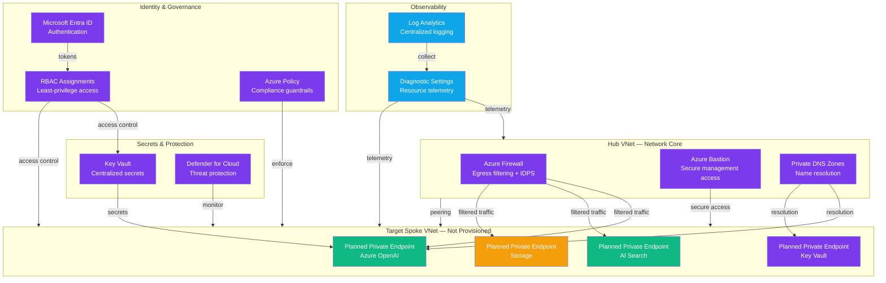

# Architecture — Play 02: AI Landing Zone

## Overview

This document describes the target AI Landing Zone. The current resource-group Bicep implements only one VNet with three subnets, an NSG, two private DNS zones and links, Key Vault, Log Analytics, and a user-assigned identity. Hub-spoke networking, private endpoint resources, Firewall, Bastion, Policy assignments, Defender configuration, diagnostics, and workload onboarding are not currently provisioned.

## Architecture Diagram

```mermaid
graph TB
    subgraph Hub["Hub VNet — Network Core"]
        FW[Azure Firewall<br/>Egress filtering + IDPS]
        BAS[Azure Bastion<br/>Secure management access]
        DNS[Private DNS Zones<br/>Name resolution]
    end

    subgraph Spoke["Target Spoke VNet — Not Provisioned"]
        PE_AOI[Planned Private Endpoint<br/>Azure OpenAI]
        PE_SEARCH[Planned Private Endpoint<br/>AI Search]
        PE_STOR[Planned Private Endpoint<br/>Storage]
        PE_KV[Planned Private Endpoint<br/>Key Vault]
    end

    subgraph Identity["Identity & Governance"]
        ENTRA[Microsoft Entra ID<br/>Authentication]
        RBAC[RBAC Assignments<br/>Least-privilege access]
        POLICY[Azure Policy<br/>Compliance guardrails]
    end

    subgraph Security["Secrets & Protection"]
        KV[Key Vault<br/>Centralized secrets]
        DEF[Defender for Cloud<br/>Threat protection]
    end

    subgraph Monitoring["Observability"]
        LA[Log Analytics<br/>Centralized logging]
        DIAG[Diagnostic Settings<br/>Resource telemetry]
    end

    Hub -->|peering| Spoke
    FW -->|filtered traffic| PE_AOI
    FW -->|filtered traffic| PE_SEARCH
    FW -->|filtered traffic| PE_STOR
    BAS -->|secure access| Spoke
    DNS -->|resolution| PE_AOI
    DNS -->|resolution| PE_KV
    ENTRA -->|tokens| RBAC
    RBAC -->|access control| KV
    RBAC -->|access control| Spoke
    POLICY -->|enforce| Spoke
    DEF -->|monitor| Spoke
    KV -->|secrets| PE_AOI
    LA -->|collect| DIAG
    DIAG -->|telemetry| Hub
    DIAG -->|telemetry| Spoke

    style FW fill:#7c3aed,color:#fff
    style BAS fill:#7c3aed,color:#fff
    style DNS fill:#7c3aed,color:#fff
    style PE_AOI fill:#10b981,color:#fff
    style PE_SEARCH fill:#10b981,color:#fff
    style PE_STOR fill:#f59e0b,color:#fff
    style PE_KV fill:#7c3aed,color:#fff
    style ENTRA fill:#7c3aed,color:#fff
    style RBAC fill:#7c3aed,color:#fff
    style POLICY fill:#7c3aed,color:#fff
    style KV fill:#7c3aed,color:#fff
    style DEF fill:#7c3aed,color:#fff
    style LA fill:#0ea5e9,color:#fff
    style DIAG fill:#0ea5e9,color:#fff
```

## Data Flow

1. **Network provisioning** — Hub VNet created with Azure Firewall, Bastion, and Private DNS Zones
2. **Spoke peering** — AI workload spoke VNet peers to hub for centralized egress and DNS
3. **Private connectivity target** — future private endpoint resources connect approved PaaS services; DNS zones alone do not create that connectivity
4. **Identity binding** — Managed Identities assigned to workloads, RBAC scoped to least privilege
5. **Policy target** — subscription owners define and assign policies for public access, tags, and SKUs; the current Bicep creates no assignments
6. **Secrets management** — Key Vault stores all credentials; workloads access via Managed Identity
7. **Monitoring** — Diagnostic settings route all resource telemetry to centralized Log Analytics
8. **Threat detection** — Defender for Cloud continuously scans for vulnerabilities and misconfigurations

## Service Roles

| Service | Layer | Role |
|---------|-------|------|
| Virtual Network (Hub) | Network | Centralized egress, DNS, and management |
| Virtual Network (Spoke) | Network | AI workload isolation with private connectivity |
| Azure Firewall | Network | Egress filtering, threat intelligence, IDPS |
| Azure Bastion | Network | Secure RDP/SSH without public IPs |
| Private Endpoints | Network | Private connectivity to PaaS services |
| Private DNS Zones | Network | Name resolution for private endpoints |
| Microsoft Entra ID | Identity | Authentication and conditional access |
| RBAC | Identity | Least-privilege access control |
| Azure Policy | Governance | Compliance guardrails and enforcement |
| Key Vault | Security | Centralized secrets and certificates |
| Defender for Cloud | Security | Threat protection and posture management |
| Log Analytics | Monitoring | Centralized logging and alerting |

## Security Architecture

- **Network boundary** — the current Key Vault disables public network access; equivalent controls for target PaaS services require resources and verification not present here
- **Hub-spoke isolation** — workloads in spoke VNets cannot reach each other without explicit peering
- **Centralized egress** — all outbound traffic routes through Azure Firewall with threat intelligence
- **Managed Identity** — no credentials in code; workloads authenticate via system-assigned identity
- **RBAC least-privilege** — custom roles scoped to specific resource groups and operations
- **Policy guardrails** — deny creation of public endpoints, enforce CMK, require tags
- **Defender for Cloud** — continuous vulnerability scanning and security posture management
- **Key Vault soft-delete** — protection against accidental secret deletion with 90-day recovery

## Scaling

| Metric | Dev | Production | Enterprise |
|--------|-----|------------|------------|
| Spoke VNets | 1 | 3-5 | 10-50 |
| Private Endpoints | 3-5 | 10-20 | 30-100 |
| Firewall throughput | 250 Mbps | 5 Gbps | 30 Gbps |
| RBAC assignments | 10-20 | 50-200 | 500-2000 |
| Policy assignments | 5-10 | 20-50 | 100-300 |
| Log Analytics ingestion | 500 MB/day | 20 GB/day | 100 GB/day |
| DNS zones | 3-5 | 10-15 | 20-40 |
