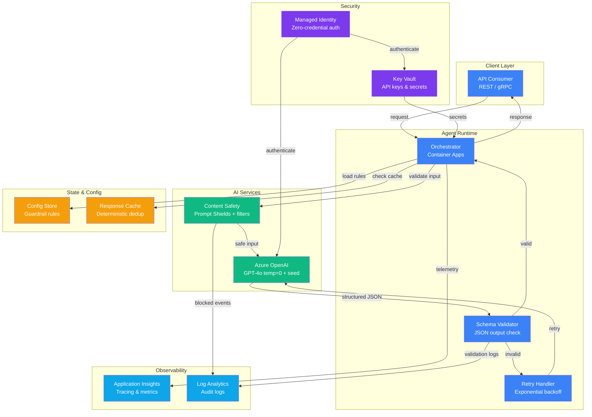

# Architecture — Play 03: Deterministic Agent

## Overview

The Deterministic Agent architecture delivers reliable, reproducible AI outputs by combining GPT-4o at temperature=0 with seed pinning, structured JSON output schemas, and multi-layer guardrails. The agent runtime validates every response against a defined schema before returning results, with Content Safety providing input/output filtering and circuit breakers handling upstream failures.

## Architecture Diagram

## Data Flow

1. **Request intake** — API consumer sends a structured request to the Container Apps endpoint
2. **Input guardrails** — Content Safety validates the prompt for injection attacks and unsafe content
3. **Cache check** — orchestrator checks if an identical input has a cached deterministic response
4. **LLM invocation** — Azure OpenAI called with `temperature=0`, `seed=42`, `response_format=json_object`
5. **Schema validation** — JSON response validated against the expected output schema
6. **Retry loop** — if validation fails, retry with adjusted prompt (max 3 attempts with backoff)
7. **Output guardrails** — Content Safety filters the final response before returning to client
8. **Response delivery** — validated, filtered response returned; cached for future identical inputs
9. **Audit logging** — all invocations, validations, and guardrail triggers logged to Log Analytics

## Service Roles

| Service | Layer | Role |
|---------|-------|------|
| Container Apps | Compute | Agent runtime — orchestration, validation, retry logic |
| Azure OpenAI | AI | GPT-4o with deterministic config (temp=0, seed, JSON mode) |
| Content Safety | AI | Input/output filtering — prompt injection, content moderation |
| Key Vault | Security | API keys and connection string management |
| Managed Identity | Security | Zero-credential authentication to all Azure services |
| Application Insights | Monitoring | Distributed tracing, determinism scoring metrics |
| Log Analytics | Monitoring | Structured audit logs for compliance and debugging |

## Security Architecture

- **Managed Identity** — Container Apps authenticates to OpenAI and Key Vault without credentials
- **Content Safety pre-filter** — every prompt scanned for injection attacks before LLM invocation
- **Content Safety post-filter** — every response scanned for harmful content before delivery
- **Structured output** — `response_format: json_object` prevents free-form text leakage
- **Schema validation** — responses must conform to a strict JSON schema; rejects hallucinated fields
- **Rate limiting** — per-client token budgets enforced at the orchestrator layer
- **Key Vault** — all secrets rotated on schedule; never stored in environment variables or code
- **Audit trail** — every invocation logged with input hash, output hash, and validation result

## Scaling

| Metric | Dev | Production | Enterprise |
|--------|-----|------------|------------|
| Requests/day | 500 | 10,000 | 100,000 |
| Container replicas | 1 (scale-to-zero) | 2-5 | 5-20 |
| Token budget/request | 2,000 | 4,000 | 8,000 |
| Cache hit rate target | — | 30-50% | 50-70% |
| Retry budget | 3 attempts | 3 attempts | 3 attempts |
| Guardrail latency | <100ms | <100ms | <100ms |
| P95 end-to-end latency | <5s | <3s | <2s |
