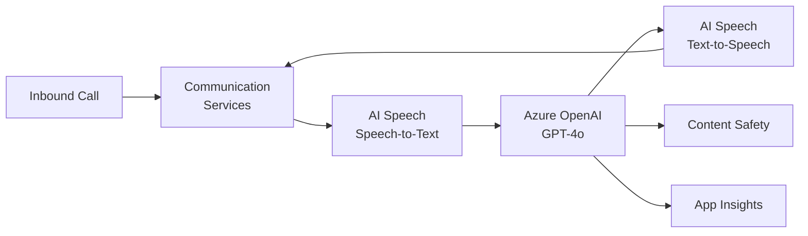

# Solution Play 04: Call Center Voice AI

> **Complexity:** High | **Status:** ✅ Ready
> Voice-enabled customer service — Azure Communication Services + AI Speech + OpenAI agent orchestration.

## Architecture

## Azure Services

| Service | Purpose |
|---------|---------|
| Azure Communication Services | Voice call routing and telephony |
| Azure AI Speech | Real-time speech-to-text and text-to-speech |
| Azure OpenAI Service | Intent detection and response generation |
| Azure AI Content Safety | Filter harmful content in real-time |
| Azure Container Apps | Host the voice agent orchestrator |

## DevKit (.github Agentic OS)

This play includes the full .github Agentic OS (19 files):
- **Layer 1:** copilot-instructions.md + 3 modular instruction files
- **Layer 2:** 4 slash commands + 3 chained agents (builder → reviewer → tuner)
- **Layer 3:** 3 skill folders (deploy-azure, evaluate, tune)
- **Layer 4:** guardrails.json + 2 agentic workflows
- **Infrastructure:** infra/main.bicep + parameters.json

Run `Ctrl+Shift+P` → **FrootAI: Init DevKit** in VS Code.

## TuneKit (AI Configuration)

| Config File | What It Controls |
|-------------|-----------------|
| config/openai.json | Model selection, temperature, response length for voice |
| config/guardrails.json | PII redaction, call recording consent, profanity filter |
| config/agents.json | Agent behavior tuning — escalation triggers, hold music |
| config/model-comparison.json | Model selection: GPT-4o vs GPT-4o-mini for latency |

Run `Ctrl+Shift+P` → **FrootAI: Init TuneKit** in VS Code.

## Quick Start

1. Install: `code --install-extension psbali.frootai`
2. Init DevKit → 19 .github files + infra
3. Init TuneKit → AI configs + evaluation
4. Open Copilot Chat → ask to build this solution
5. Use /review → /deploy → ship

> **FrootAI Solution Play 04** — DevKit builds it. TuneKit ships it.
