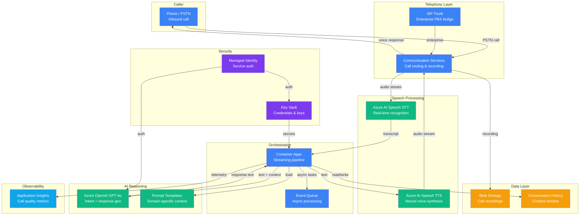

# Architecture — Play 04: Call Center Voice AI

## Overview

The Call Center Voice AI architecture delivers a real-time voice customer service pipeline by chaining Azure Communication Services (telephony), Azure AI Speech (STT/TTS), and Azure OpenAI (conversational AI) into a low-latency streaming pipeline. Callers interact naturally via phone, with speech recognized in real-time, processed by GPT-4o for intent and response, then synthesized back to speech — all within a target of under 2 seconds round-trip.

## Architecture Diagram

## Data Flow

1. **Call intake** — caller dials in via PSTN; Communication Services routes to available agent pipeline
2. **Audio streaming** — real-time audio stream sent to Azure AI Speech STT for continuous recognition
3. **Transcript delivery** — recognized text pushed to the orchestrator with conversation history context
4. **Intent processing** — GPT-4o analyzes transcript, extracts intent, generates natural language response
5. **Voice synthesis** — response text sent to Azure AI Speech TTS for neural voice generation
6. **Audio playback** — synthesized audio streamed back to caller through Communication Services
7. **Conversation loop** — steps 2-6 repeat for each caller utterance (streaming, not batch)
8. **Call recording** — full audio recording stored in Blob Storage for compliance and QA
9. **Post-call analytics** — async batch transcription and sentiment analysis queued for processing

## Service Roles

| Service | Layer | Role |
|---------|-------|------|
| Communication Services | Telephony | PSTN call handling, routing, recording |
| Azure AI Speech (STT) | Speech | Real-time speech-to-text recognition |
| Azure AI Speech (TTS) | Speech | Neural text-to-speech voice synthesis |
| Azure OpenAI | AI | Conversational understanding and response generation |
| Container Apps | Compute | Streaming pipeline orchestration |
| Blob Storage | Storage | Call recordings and transcription archive |
| Key Vault | Security | Telephony credentials and API key management |
| Application Insights | Monitoring | Call quality, latency tracing, accuracy metrics |

## Security Architecture

- **Managed Identity** — all service-to-service auth without credentials in code
- **Private endpoints** — Speech, OpenAI, and Storage accessible only via private network
- **Call recording encryption** — recordings encrypted at rest with customer-managed keys
- **PII redaction** — post-call transcripts processed through PII detection before storage
- **RBAC** — operators have read-only access to recordings; AI services have no access
- **Key Vault** — SIP credentials, API keys rotated on 90-day schedule
- **Content filtering** — Azure OpenAI content filters active for all voice interactions
- **Compliance** — call recording retention policies aligned to regulatory requirements

## Scaling

| Metric | Dev | Production | Enterprise |
|--------|-----|------------|------------|
| Concurrent calls | 2-5 | 50-200 | 500-2,000 |
| Container replicas | 1 | 3-10 | 10-50 |
| STT streams | 2-5 | 50-200 | 500-2,000 |
| Round-trip latency target | <3s | <2s | <1.5s |
| Recording storage/month | 5 GB | 200 GB | 1 TB |
| Phone numbers | 1 | 10-50 | 100-500 |
| Calls/day | 50 | 2,000 | 20,000 |
