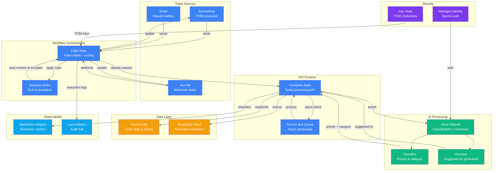

# Architecture — Play 05: IT Ticket Resolution

## Overview

The IT Ticket Resolution architecture automates the classification, routing, and resolution of IT support tickets using Azure OpenAI for intelligent analysis and Logic Apps for workflow orchestration. Tickets flow from ITSM systems (ServiceNow, Jira Service Management) through an AI-powered pipeline that classifies priority, identifies resolution patterns, suggests or auto-applies fixes, and escalates complex cases to human agents — reducing mean time to resolution by 60-80%.

## Architecture Diagram

## Data Flow

1. **Ticket intake** — tickets arrive from ServiceNow, Jira, or email; Logic Apps normalizes the format
2. **Classification** — Azure OpenAI analyzes ticket text to determine category (network, software, hardware, access) and priority (P1-P4)
3. **Knowledge lookup** — resolution engine searches the knowledge base for matching resolution templates
4. **Resolution generation** — GPT-4o generates a tailored resolution based on ticket details and KB matches
5. **Business rules** — Logic Apps applies SLA rules, auto-resolves known patterns, escalates unknowns
6. **State persistence** — ticket state, classification, and resolution stored in Cosmos DB
7. **ITSM update** — Logic Apps pushes classification, priority, and suggested resolution back to source ITSM
8. **Escalation** — unresolvable tickets routed to human agents with AI-generated context summary
9. **Metrics tracking** — classification accuracy, resolution rate, and MTTR tracked in Application Insights

## Service Roles

| Service | Layer | Role |
|---------|-------|------|
| Azure OpenAI | AI | Ticket classification, priority inference, resolution generation |
| Container Apps | Compute | Ticket processing API and AI orchestration runtime |
| Logic Apps | Compute | Workflow orchestration — ITSM connectors, SLA rules, routing |
| Service Bus Queue | Compute | Async ticket processing for batch and retry scenarios |
| Cosmos DB | Storage | Ticket state, classification history, resolution knowledge base |
| Key Vault | Security | ITSM API credentials, Azure OpenAI keys |
| Application Insights | Monitoring | Resolution metrics, classification accuracy, MTTR dashboards |
| Log Analytics | Monitoring | Workflow execution audit trail, escalation logs |

## Security Architecture

- **Managed Identity** — Container Apps and Logic Apps authenticate to Azure OpenAI without credentials
- **Key Vault** — ITSM API keys (ServiceNow, Jira) stored securely with automatic rotation
- **RBAC** — ticket data accessible only by authorized service principals and support staff
- **Private endpoints** — Cosmos DB and Azure OpenAI accessible only via private network
- **PII handling** — ticket content containing PII masked before logging to Application Insights
- **Audit trail** — every classification decision and resolution logged with reasoning for compliance
- **Content filtering** — Azure OpenAI content filters prevent inappropriate resolution suggestions
- **Encryption** — all ticket data encrypted at rest (Cosmos DB) and in transit (TLS 1.2+)

## Scaling

| Metric | Dev | Production | Enterprise |
|--------|-----|------------|------------|
| Tickets/day | 50 | 2,000 | 20,000 |
| Container replicas | 1 (scale-to-zero) | 2-5 | 5-15 |
| Logic Apps executions/month | 1,000 | 50,000 | 500,000 |
| Classification latency (P95) | <5s | <3s | <2s |
| Auto-resolution rate target | — | 40-60% | 60-80% |
| Cosmos DB RU/s | 400 (serverless) | 4,000 | 40,000 |
| Knowledge base articles | 50 | 500 | 5,000 |
