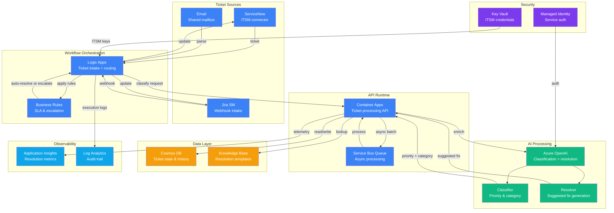

# Architecture — Play 05: IT Ticket Resolution

## Overview

This is the target ITSM workflow architecture. The current Bicep does not provision the depicted ITSM connectors, Logic Apps, Container Apps, Service Bus, Cosmos DB, private endpoints, managed identity, or knowledge base. No current evidence establishes classification, resolution, SLA, recurrence, or mean-time outcomes.

## Architecture Diagram

```mermaid
graph TB
    subgraph Sources["Ticket Sources"]
        SNOW[ServiceNow<br/>ITSM connector]
        JIRA[Jira SM<br/>Webhook intake]
        EMAIL[Email<br/>Shared mailbox]
    end

    subgraph Intake["Workflow Orchestration"]
        LA_WF[Logic Apps<br/>Ticket intake + routing]
        RULES[Business Rules<br/>SLA & escalation]
    end

    subgraph AI["AI Processing"]
        AOAI[Azure OpenAI<br/>Classification + resolution]
        CLASS[Classifier<br/>Priority & category]
        RESOLVE[Resolver<br/>Suggested fix generation]
    end

    subgraph Compute["API Runtime"]
        CA[Container Apps<br/>Ticket processing API]
        QUEUE[Service Bus Queue<br/>Async processing]
    end

    subgraph Data["Data Layer"]
        COSMOS[Cosmos DB<br/>Ticket state & history]
        KB[Knowledge Base<br/>Resolution templates]
    end

    subgraph Security["Security"]
        KV[Key Vault<br/>ITSM credentials]
        MI[Managed Identity<br/>Service auth]
    end

    subgraph Monitoring["Observability"]
        AI_INS[Application Insights<br/>Resolution metrics]
        LA_LOG[Log Analytics<br/>Audit trail]
    end

    SNOW -->|ticket| LA_WF
    JIRA -->|webhook| LA_WF
    EMAIL -->|parse| LA_WF
    LA_WF -->|classify request| CA
    CA -->|enrich| AOAI
    AOAI --> CLASS
    AOAI --> RESOLVE
    CLASS -->|priority + category| CA
    RESOLVE -->|suggested fix| CA
    CA -->|lookup| KB
    CA -->|read/write| COSMOS
    CA -->|async batch| QUEUE
    QUEUE -->|process| CA
    LA_WF -->|apply rules| RULES
    RULES -->|auto-resolve or escalate| LA_WF
    LA_WF -->|update| SNOW
    LA_WF -->|update| JIRA
    MI -->|auth| AOAI
    KV -->|ITSM keys| LA_WF
    CA -->|telemetry| AI_INS
    LA_WF -->|execution logs| LA_LOG

    style SNOW fill:#3b82f6,color:#fff
    style JIRA fill:#3b82f6,color:#fff
    style EMAIL fill:#3b82f6,color:#fff
    style LA_WF fill:#3b82f6,color:#fff
    style RULES fill:#3b82f6,color:#fff
    style AOAI fill:#10b981,color:#fff
    style CLASS fill:#10b981,color:#fff
    style RESOLVE fill:#10b981,color:#fff
    style CA fill:#3b82f6,color:#fff
    style QUEUE fill:#3b82f6,color:#fff
    style COSMOS fill:#f59e0b,color:#fff
    style KB fill:#f59e0b,color:#fff
    style KV fill:#7c3aed,color:#fff
    style MI fill:#7c3aed,color:#fff
    style AI_INS fill:#0ea5e9,color:#fff
    style LA_LOG fill:#0ea5e9,color:#fff
```

## Data Flow

1. **Ticket intake target** — approved connectors normalize a versioned ticket envelope after PII minimization
2. **Classification** — Azure OpenAI analyzes ticket text to determine category (network, software, hardware, access) and priority (P1-P4)
3. **Knowledge lookup** — resolution engine searches the knowledge base for matching resolution templates
4. **Resolution generation** — GPT-4o generates a tailored resolution based on ticket details and KB matches
5. **Policy target** — risk tier and durable approval determine whether an action may proceed
6. **State target** — an owned durable store records versions, approvals, connector attempts, verification, and rollback
7. **ITSM update target** — an idempotent connector checks source version and conflict policy before writing
8. **Escalation** — unresolvable tickets routed to human agents with AI-generated context summary
9. **Metrics tracking** — classification accuracy, resolution rate, and MTTR tracked in Application Insights

## Service Roles

| Service | Layer | Role |
|---------|-------|------|
| Azure OpenAI | AI | Ticket classification, priority inference, resolution generation |
| Container Apps | Compute | Ticket processing API and AI orchestration runtime |
| Logic Apps | Compute | Workflow orchestration — ITSM connectors, SLA rules, routing |
| Service Bus Queue | Compute | Async ticket processing for batch and retry scenarios |
| Cosmos DB | Storage | Ticket state, classification history, resolution knowledge base |
| Key Vault | Security | ITSM API credentials, Azure OpenAI keys |
| Application Insights | Monitoring | Resolution metrics, classification accuracy, MTTR dashboards |
| Log Analytics | Monitoring | Workflow execution audit trail, escalation logs |

## Security Architecture

- **Identity target** — attended actions preserve user authority and unattended actions use a justified workload identity; neither is provisioned here
- **Key Vault** — ITSM API keys (ServiceNow, Jira) stored securely with automatic rotation
- **RBAC** — ticket data accessible only by authorized service principals and support staff
- **Private connectivity target** — target services require private endpoint resources and verification not present in the current Bicep
- **PII handling** — ticket content containing PII masked before logging to Application Insights
- **Audit trail** — every classification decision and resolution logged with reasoning for compliance
- **Content filtering** — Azure OpenAI content filters prevent inappropriate resolution suggestions
- **Encryption target** — the selected state store and connectors require verified encryption settings and transport policy

## Scaling

| Metric | Dev | Production | Enterprise |
|--------|-----|------------|------------|
| Tickets/day | 50 | 2,000 | 20,000 |
| Container replicas | 1 (scale-to-zero) | 2-5 | 5-15 |
| Logic Apps executions/month | 1,000 | 50,000 | 500,000 |
| Classification latency (P95) | <5s | <3s | <2s |
| Automatic action rate | Not set | Set only after approved pilot evidence | Set only after operated evidence |
| Cosmos DB RU/s | 400 (serverless) | 4,000 | 40,000 |
| Knowledge base articles | 50 | 500 | 5,000 |
