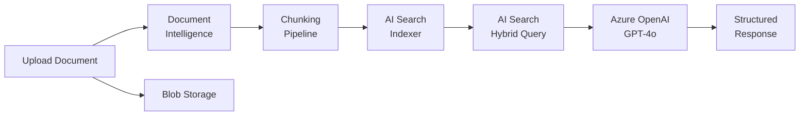

# Solution Play 06: Document Intelligence

> **Complexity:** Medium | **Status:** ✅ Ready
> Extract, classify, and index documents — Azure Document Intelligence + AI Search + OpenAI.

## Architecture

## Azure Services

| Service | Purpose |
|---------|---------|
| Azure AI Document Intelligence | OCR, layout analysis, and field extraction |
| Azure AI Search | Index and retrieve extracted document content |
| Azure OpenAI Service | Summarization and Q&A over documents |
| Azure Blob Storage | Store uploaded documents and processed outputs |
| Azure Container Apps | Host the document processing pipeline |

## DevKit (.github Agentic OS)

This play includes the full .github Agentic OS (19 files):
- **Layer 1:** copilot-instructions.md + 3 modular instruction files
- **Layer 2:** 4 slash commands + 3 chained agents (builder → reviewer → tuner)
- **Layer 3:** 3 skill folders (deploy-azure, evaluate, tune)
- **Layer 4:** guardrails.json + 2 agentic workflows
- **Infrastructure:** infra/main.bicep + parameters.json

Run `Ctrl+Shift+P` → **FrootAI: Init DevKit** in VS Code.

## TuneKit (AI Configuration)

| Config File | What It Controls |
|-------------|-----------------|
| config/openai.json | Model parameters for document Q&A and summarization |
| config/guardrails.json | PII redaction, document retention, access controls |
| config/agents.json | Agent behavior tuning for extraction accuracy |
| config/model-comparison.json | Model selection guide for document tasks |
| config/search.json | Retrieval settings — hybrid ratio, top-k, reranker |
| config/chunking.json | Chunk size, overlap, semantic vs fixed splitting |

Run `Ctrl+Shift+P` → **FrootAI: Init TuneKit** in VS Code.

## Quick Start

1. Install: `code --install-extension frootai.frootai-vscode`
2. Init DevKit → 19 .github files + infra
3. Init TuneKit → AI configs + evaluation
4. Open Copilot Chat → ask to build this solution
5. Use /review → /deploy → ship

> **FrootAI Solution Play 06** — DevKit builds it. TuneKit ships it.
