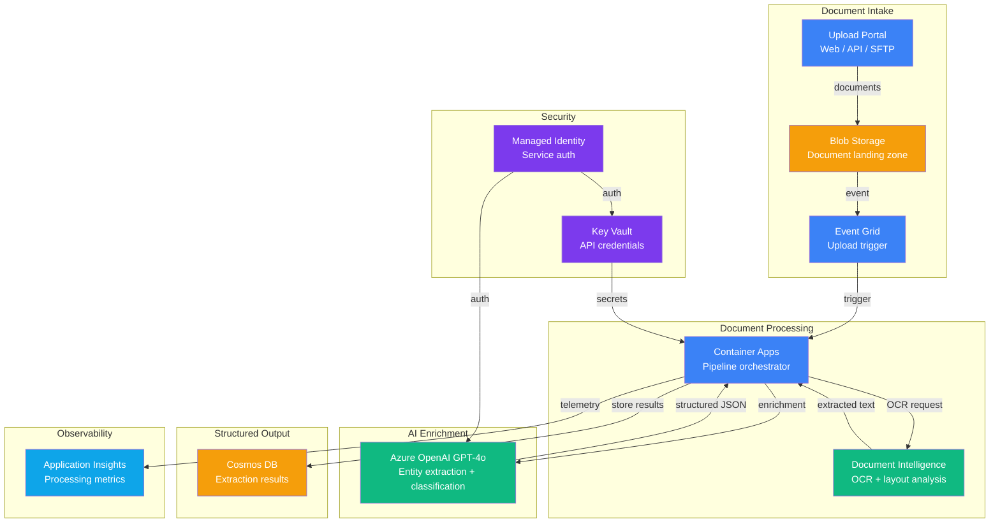

# Play 06 — Document Intelligence 📄

> Extract, classify, and structure document data with OCR + LLM.

Feed PDFs, invoices, receipts, and forms into Azure Document Intelligence for OCR, then GPT-4o extracts structured fields into typed JSON. Handles multi-page documents, handwriting, tables, and stamps.

## Quick Start
```bash
cd solution-plays/06-document-intelligence
az deployment group create -g $RG -f infra/main.bicep -p infra/parameters.json
code .  # Use @builder for extraction, @reviewer for accuracy audit, @tuner for throughput
```

## Key Metrics
- Field extraction: ≥95% (prebuilt), ≥90% (custom) · Processing: <10s/page · PII recall: ≥99%

## DevKit
| Primitive | What It Does |
|-----------|-------------|
| 3 agents | Builder (OCR/extraction), Reviewer (accuracy/PII audit), Tuner (model selection/cost) |
| 3 skills | Deploy (117 lines), Evaluate (110 lines), Tune (105 lines) |

## Architecture



> 📐 [Full architecture details](architecture.md) — data flow, security architecture, scaling guide

## Cost Estimate

| Service | Dev/PoC | Production | Enterprise |
|---------|---------|-----------|------------|
| Document Intelligence | $0 (Free) | $100 (Standard S0) | $400 (Standard S0) |
| Azure OpenAI | $40 (PAYG) | $250 (PAYG) | $900 (PTU Reserved) |
| Blob Storage | $2 (Hot LRS) | $25 (Hot LRS) | $80 (Hot GRS) |
| Container Apps | $10 (Consumption) | $80 (Dedicated) | $250 (Dedicated HA) |
| Cosmos DB | $5 (Serverless) | $50 (Autoscale) | $200 (Autoscale) |
| Key Vault | $1 (Standard) | $3 (Standard) | $10 (Premium HSM) |
| Application Insights | $0 (Free) | $25 (Pay-per-GB) | $80 (Pay-per-GB) |
| Event Grid | $0 (Free) | $2 (Basic) | $10 (Basic) |
| **Total** | **$58/mo** | **$535/mo** | **$1,930/mo** |

> 💰 [Full cost breakdown](cost.json) — per-service SKUs, usage assumptions, optimization tips

📖 [Full docs](spec/README.md) · 🌐 [frootai.dev/solution-plays/06-document-intelligence](https://frootai.dev/solution-plays/06-document-intelligence)
