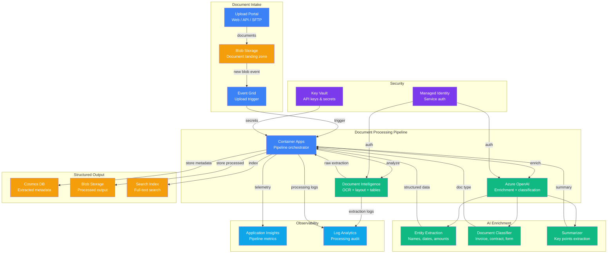

# Architecture — Play 06: Document Intelligence

## Overview

The Document Intelligence architecture provides an end-to-end pipeline for extracting, classifying, and structuring data from unstructured documents. Azure Document Intelligence handles OCR and layout analysis, while Azure OpenAI enriches extractions with entity recognition, summarization, and classification. An event-driven pipeline automatically processes documents as they arrive in Blob Storage, storing structured results in Cosmos DB for downstream consumption.

## Architecture Diagram

## Data Flow

1. **Document upload** — users upload PDFs, images, or scanned documents via web portal, API, or SFTP
2. **Blob landing** — documents stored in the Blob Storage landing zone container
3. **Event trigger** — Event Grid fires a BlobCreated event to the Container Apps orchestrator
4. **OCR extraction** — Document Intelligence performs layout analysis, OCR, table detection, and key-value extraction
5. **AI enrichment** — Azure OpenAI processes raw extraction for entity recognition, classification, and summarization
6. **Classification** — document typed as invoice, contract, form, receipt, or correspondence
7. **Structured output** — extracted metadata (entities, amounts, dates, classifications) stored in Cosmos DB
8. **Processed storage** — enriched documents with annotations saved to output Blob container
9. **Search indexing** — structured data indexed for full-text and faceted search
10. **Audit logging** — every processing step logged with extraction confidence scores and timings

## Service Roles

| Service | Layer | Role |
|---------|-------|------|
| Blob Storage | Storage | Document landing zone and processed output archive |
| Event Grid | Compute | Event-driven trigger for new document processing |
| Container Apps | Compute | Pipeline orchestration — routing, batching, error handling |
| Document Intelligence | AI | OCR, layout analysis, table extraction, key-value pairs |
| Azure OpenAI | AI | Entity extraction, document classification, summarization |
| Cosmos DB | Storage | Extracted metadata, entity store, classification results |
| Key Vault | Security | API keys and Document Intelligence credentials |
| Application Insights | Monitoring | Pipeline throughput, extraction accuracy, processing time |
| Log Analytics | Monitoring | Processing audit trail, error diagnostics |

## Security Architecture

- **Managed Identity** — Container Apps authenticates to Document Intelligence, OpenAI, and Storage without credentials
- **Private endpoints** — Blob Storage, Cosmos DB, and AI services accessible only via private network
- **Encryption at rest** — all documents and extracted data encrypted with platform or customer-managed keys
- **Immutable storage** — compliance-critical documents stored with immutability policies (WORM)
- **RBAC** — document access scoped by classification; finance docs restricted to finance roles
- **PII detection** — extracted PII flagged and masked in logs; original retained only in secure storage
- **Key Vault** — all API keys and connection strings managed centrally with rotation policies
- **Content filtering** — Azure OpenAI content filters active to prevent harmful content in summaries

## Scaling

| Metric | Dev | Production | Enterprise |
|--------|-----|------------|------------|
| Documents/day | 50 | 2,000 | 20,000 |
| Pages/day | 200 | 10,000 | 50,000 |
| Container replicas | 1 (scale-to-zero) | 2-5 | 5-20 |
| Cosmos DB RU/s | 400 (serverless) | 4,000 | 40,000 |
| Blob storage/month | 10 GB | 500 GB | 2 TB |
| Processing latency (P95) | <30s | <15s | <10s |
| Extraction accuracy target | — | 90%+ | 95%+ |
