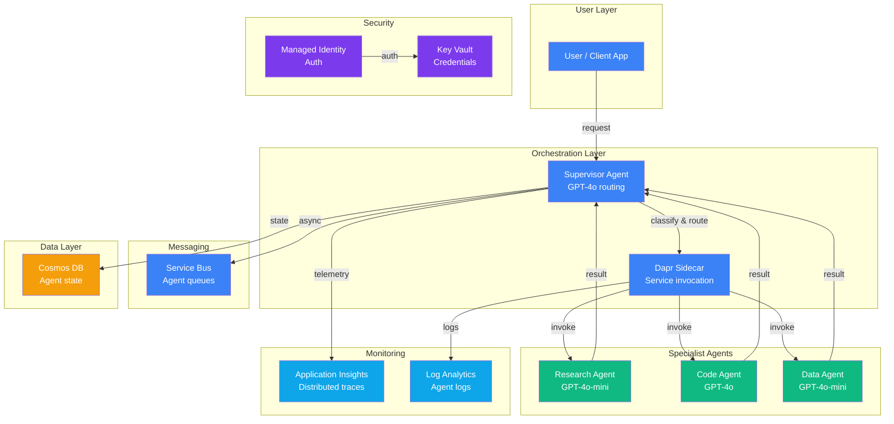

# Play 07 — Multi-Agent Service 🤖

> Supervisor agent routes to specialist agents with shared state and handoff protocol.

A supervisor agent receives requests, classifies intent, and delegates to specialist agents. Each agent has its own model config, tools, and memory. Loop prevention and max-iteration guards keep costs predictable.

## Quick Start
```bash
cd solution-plays/07-multi-agent-service
az deployment group create -g $RG -f infra/main.bicep -p infra/parameters.json
code .  # Use @builder for topology, @reviewer for loop detection, @tuner for routing
```

## Key Metrics
- Task completion: ≥90% · E2E latency: <30s · Cost per task: <$0.50

## DevKit
| Primitive | What It Does |
|-----------|-------------|
| 3 agents | Builder (topology/handoffs), Reviewer (loop/conflict audit), Tuner (routing/model selection) |
| 3 skills | Deploy (107 lines), Evaluate (108 lines), Tune (109 lines) |

## Architecture



> 📐 [Full architecture details](architecture.md) — data flow, security architecture, scaling guide

## Cost Estimate

| Service | Dev/PoC | Production | Enterprise |
|---------|---------|-----------|------------|
| Container Apps | $15 (Consumption) | $150 (Dedicated) | $450 (Dedicated HA) |
| Azure OpenAI | $80 (PAYG) | $500 (PAYG) | $1,800 (PTU Reserved) |
| Cosmos DB | $5 (Serverless) | $50 (Provisioned) | $250 (Provisioned) |
| Dapr | $0 (Included) | $0 (Included) | $0 (Included) |
| Service Bus | $5 (Basic) | $25 (Standard) | $100 (Premium) |
| Key Vault | $1 (Standard) | $3 (Standard) | $10 (Premium HSM) |
| Application Insights | $0 (Free) | $30 (Pay-per-GB) | $120 (Pay-per-GB) |
| Log Analytics | $0 (Free) | $20 (Pay-per-GB) | $60 (Commitment) |
| **Total** | **$106/mo** | **$778/mo** | **$2,790/mo** |

> 💰 [Full cost breakdown](cost.json) — per-service SKUs, usage assumptions, optimization tips

📖 [Full docs](spec/README.md) · 🌐 [frootai.dev/solution-plays/07-multi-agent-service](https://frootai.dev/solution-plays/07-multi-agent-service)
