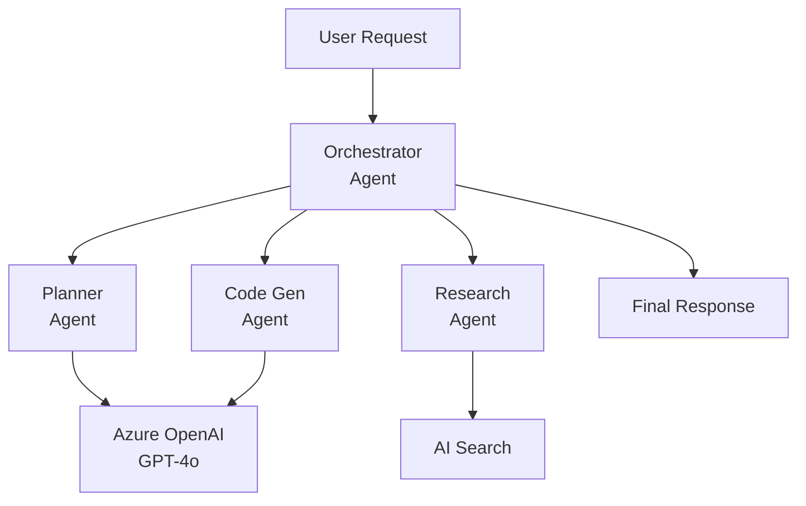

# Solution Play 07: Multi-Agent Service

> **Complexity:** High | **Status:** ✅ Ready
> Orchestrate multiple AI agents — Semantic Kernel + Azure OpenAI + agent-to-agent delegation.

## Architecture

## Azure Services

| Service | Purpose |
|---------|---------|
| Azure OpenAI Service | LLM backbone for all agents |
| Azure Container Apps | Host multi-agent orchestration service |
| Azure AI Search | Knowledge retrieval for research agent |
| Azure Service Bus | Inter-agent message passing and queuing |
| Azure Cosmos DB | Agent state persistence and conversation memory |

## DevKit (.github Agentic OS)

This play includes the full .github Agentic OS (19 files):
- **Layer 1:** copilot-instructions.md + 3 modular instruction files
- **Layer 2:** 4 slash commands + 3 chained agents (builder → reviewer → tuner)
- **Layer 3:** 3 skill folders (deploy-azure, evaluate, tune)
- **Layer 4:** guardrails.json + 2 agentic workflows
- **Infrastructure:** infra/main.bicep + parameters.json

Run `Ctrl+Shift+P` → **FrootAI: Init DevKit** in VS Code.

## TuneKit (AI Configuration)

| Config File | What It Controls |
|-------------|-----------------|
| config/openai.json | Model params per agent — temperature, max tokens |
| config/guardrails.json | Agent boundaries, loop prevention, max iterations |
| config/agents.json | Agent roles, delegation rules, fallback chains |
| config/model-comparison.json | Model selection per agent role and cost |

Run `Ctrl+Shift+P` → **FrootAI: Init TuneKit** in VS Code.

## Quick Start

1. Install: `code --install-extension frootai.frootai-vscode`
2. Init DevKit → 19 .github files + infra
3. Init TuneKit → AI configs + evaluation
4. Open Copilot Chat → ask to build this solution
5. Use /review → /deploy → ship

> **FrootAI Solution Play 07** — DevKit builds it. TuneKit ships it.
