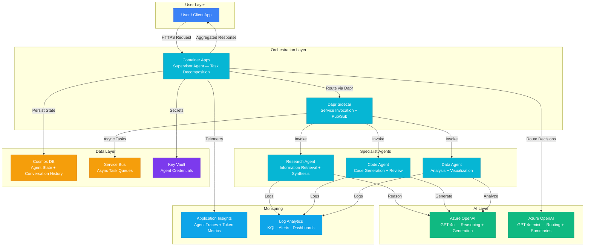

# Architecture — Play 07: Multi-Agent Service

## Overview

Supervisor-based multi-agent orchestration platform. A central supervisor agent receives user requests, decomposes complex tasks, delegates to specialist agents (research, code, data analysis), aggregates results, and returns a unified response. Built on Container Apps with Dapr for inter-agent communication and Cosmos DB for state persistence.

## Architecture Diagram

## Data Flow

1. **Request**: User sends a complex task → Supervisor agent receives and analyzes intent → GPT-4o-mini classifies task type and generates execution plan
2. **Decomposition**: Supervisor breaks task into sub-tasks → Creates execution DAG with dependencies → Publishes sub-tasks via Dapr service invocation or Service Bus
3. **Execution**: Specialist agents receive sub-tasks → Each agent calls GPT-4o with domain-specific system prompts → Results persisted to Cosmos DB with correlation IDs
4. **Aggregation**: Supervisor polls for completed sub-tasks → Merges results using GPT-4o → Resolves conflicts, deduplicates, formats unified response
5. **Monitoring**: Every agent call traced via Application Insights with distributed correlation → Token usage, latency, error rates tracked per agent

## Service Roles

| Service | Layer | Role |
|---------|-------|------|
| Container Apps (Supervisor) | Compute | Task decomposition, agent routing, result aggregation |
| Container Apps (Specialists) | Compute | Domain-specific task execution — research, code, data |
| Dapr | Platform | Service-to-service invocation, pub/sub, state management |
| Azure OpenAI (GPT-4o) | AI | Complex reasoning, code generation, data analysis |
| Azure OpenAI (GPT-4o-mini) | AI | Fast routing decisions, task classification, summaries |
| Cosmos DB | Data | Agent state persistence, conversation history, task tracking |
| Service Bus | Messaging | Reliable async task queuing between agents |
| Key Vault | Security | API keys, agent credentials, managed identity |
| Application Insights | Monitoring | Distributed tracing, per-agent metrics, token usage |
| Log Analytics | Monitoring | Centralized logging, KQL queries, alerting |

## Security Architecture

- **Managed Identity**: All inter-agent calls authenticated via workload identity — no shared secrets
- **Dapr ACLs**: Service invocation policies restrict which agents can call each other
- **Key Vault**: OpenAI keys and external service credentials stored securely
- **Network Isolation**: Container Apps environment with VNet integration (production)
- **Content Safety**: Supervisor validates all outbound responses before returning to user

## Scaling

| Metric | Dev | Production | Enterprise |
|--------|-----|-----------|------------|
| Concurrent tasks | 5 | 50-200 | 500+ |
| Active agents | 3 | 5-10 | 10-20 |
| Requests/minute | 10 | 100 | 500+ |
| Agent replicas (each) | 1 | 2-3 | 3-5 |
| Cosmos DB RU/s | Serverless | 400 | 4,000+ |
