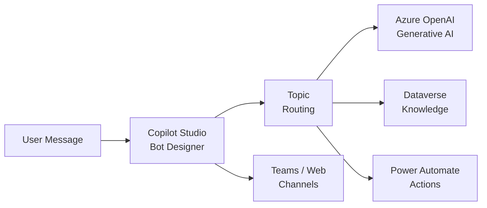

# Solution Play 08: Copilot Studio Bot

> **Complexity:** Low | **Status:** ✅ Ready
> Low-code conversational bot — Microsoft Copilot Studio + Dataverse + Power Platform connectors.

## Architecture

## Azure Services

| Service | Purpose |
|---------|---------|
| Microsoft Copilot Studio | Low-code bot builder with topic management |
| Azure OpenAI Service | Generative answers for unstructured queries |
| Dataverse | Structured knowledge base and entity storage |
| Power Automate | Backend actions — ticket creation, lookups |

## DevKit (.github Agentic OS)

This play includes the full .github Agentic OS (19 files):
- **Layer 1:** copilot-instructions.md + 3 modular instruction files
- **Layer 2:** 4 slash commands + 3 chained agents (builder → reviewer → tuner)
- **Layer 3:** 3 skill folders (deploy-azure, evaluate, tune)
- **Layer 4:** guardrails.json + 2 agentic workflows
- **Infrastructure:** infra/main.bicep + parameters.json

Run `Ctrl+Shift+P` → **FrootAI: Init DevKit** in VS Code.

## TuneKit (AI Configuration)

| Config File | What It Controls |
|-------------|-----------------|
| config/openai.json | Generative answers model and temperature |
| config/guardrails.json | Topic boundaries, fallback behavior, blocked topics |
| config/agents.json | Bot personality, escalation triggers |
| config/model-comparison.json | Model selection for generative answers |

Run `Ctrl+Shift+P` → **FrootAI: Init TuneKit** in VS Code.

## Quick Start

1. Install: `code --install-extension psbali.frootai`
2. Init DevKit → 19 .github files + infra
3. Init TuneKit → AI configs + evaluation
4. Open Copilot Chat → ask to build this solution
5. Use /review → /deploy → ship

> **FrootAI Solution Play 08** — DevKit builds it. TuneKit ships it.
