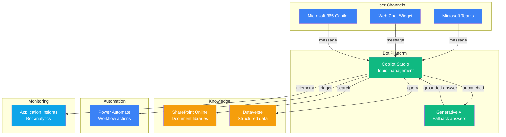

# Play 08 — Copilot Studio Bot 💬

> Low-code enterprise bot with Copilot Studio, knowledge grounding, and Dataverse.

Build an enterprise chatbot without writing code. Copilot Studio provides the canvas, SharePoint and Dataverse supply the knowledge, AI Search grounds the answers. Deploys to Teams, web, and mobile.

## Quick Start
```bash
cd solution-plays/08-copilot-studio-bot
code .  # Use @builder for topics/flows, @reviewer for conversation audit, @tuner for triggers
# Navigate to copilotstudio.microsoft.com to create and publish
```

## Key Metrics
- Topic trigger accuracy: ≥90% · Resolution rate: ≥65% · CSAT: ≥4.0/5.0

## DevKit
| Primitive | What It Does |
|-----------|-------------|
| 3 agents | Builder (topics/auth), Reviewer (flow/security audit), Tuner (triggers/knowledge) |
| 3 skills | Deploy (100 lines), Evaluate (106 lines), Tune (101 lines) |

## Architecture



> 📐 [Full architecture details](architecture.md) — data flow, security architecture, scaling guide

## Cost Estimate

| Service | Dev/PoC | Production | Enterprise |
|---------|---------|-----------|------------|
| Copilot Studio | $0 (Trial) | $200 (Standard) | $800 (Standard + Packs) |
| Dataverse | $0 (Included) | $40 (Additional) | $120 (Enterprise) |
| SharePoint Online | $0 (M365 Included) | $0 (M365 Included) | $30 (Advanced Mgmt) |
| Power Automate | $0 (Included) | $100 (Per-flow) | $300 (Per-user) |
| Azure OpenAI (via CS) | $0 (Included) | $0 (Included) | $200 (BYOA) |
| Application Insights | $0 (Free) | $15 (Pay-per-GB) | $50 (Pay-per-GB) |
| Key Vault | $1 (Standard) | $2 (Standard) | $10 (Premium HSM) |
| **Total** | **$1/mo** | **$357/mo** | **$1,510/mo** |

> 💰 [Full cost breakdown](cost.json) — per-service SKUs, usage assumptions, optimization tips

📖 [Full docs](spec/README.md) · 🌐 [frootai.dev/solution-plays/08-copilot-studio-bot](https://frootai.dev/solution-plays/08-copilot-studio-bot)
