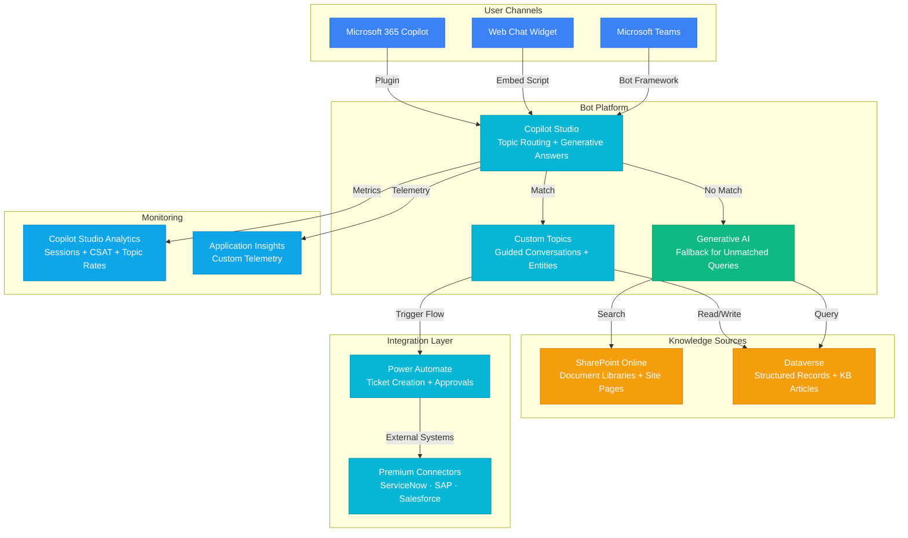

# Architecture — Play 08: Copilot Studio Bot

## Overview

Low-code enterprise conversational bot built with Microsoft Copilot Studio. The bot answers employee questions using SharePoint knowledge bases, triggers business workflows via Power Automate, and stores structured data in Dataverse. Publishes to Teams, web, and other Microsoft channels with built-in generative AI fallback for unmatched topics.

## Architecture Diagram

## Data Flow

1. **User Input**: Employee asks question in Teams or web widget → Bot Framework routes to Copilot Studio → Topic matching engine evaluates against defined topics
2. **Topic Match**: If topic matches → Guided conversation flow executes → Entities extracted → Dataverse queried for structured answers → Power Automate triggered for actions
3. **Generative Fallback**: If no topic matches → Generative AI searches SharePoint document libraries and Dataverse articles → GPT-4o generates grounded answer with source citations
4. **Actions**: Bot triggers Power Automate flows for side-effects — create IT tickets, submit approvals, update CRM records, send notifications
5. **Analytics**: Every session tracked — topic completion rates, user satisfaction, escalation rates, generative AI usage percentage

## Service Roles

| Service | Layer | Role |
|---------|-------|------|
| Copilot Studio | Platform | Bot builder, topic management, channel publishing, generative AI |
| SharePoint Online | Knowledge | Document libraries as grounding source for generative answers |
| Dataverse | Data | Structured records, KB articles, conversation logs, entity storage |
| Power Automate | Integration | Workflow automation, external system actions, approval flows |
| Azure OpenAI (via Studio) | AI | Generative answer fallback for unmatched topics |
| Application Insights | Monitoring | Custom telemetry, error tracking, usage metrics |
| Key Vault | Security | External connector credentials, API keys |

## Security Architecture

- **Entra ID SSO**: Users authenticated via Microsoft Entra ID — seamless Teams integration
- **DLP Policies**: Power Platform DLP prevents data leakage between connectors
- **Environment Isolation**: Separate dev/prod environments in Power Platform admin center
- **Row-Level Security**: Dataverse RBAC controls data access per business unit
- **Content Moderation**: Built-in Copilot Studio content safety filters on all AI responses

## Scaling

| Metric | Dev | Production | Enterprise |
|--------|-----|-----------|------------|
| Monthly sessions | 100 | 25,000 | 100,000+ |
| Custom topics | 10 | 50-100 | 200+ |
| Power Automate flows | 2 | 10-20 | 50+ |
| SharePoint sites | 1 | 5-10 | 20+ |
| Concurrent users | 5 | 200 | 1,000+ |
