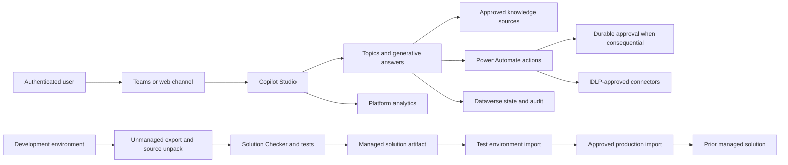

# Architecture - Play 08: Copilot Studio Bot

## Target Architecture

```mermaid
flowchart LR
  User[Authenticated user] --> Channel[Teams or web channel]
  Channel --> Bot[Copilot Studio]
  Bot --> Topics[Topics and generative answers]
  Topics --> Knowledge[Approved knowledge sources]
  Topics --> Flow[Power Automate actions]
  Flow --> Approval[Durable approval when consequential]
  Flow --> Connector[DLP-approved connectors]
  Topics --> Data[Dataverse state and audit]
  Bot --> Analytics[Platform analytics]
  Dev[Development environment] --> Export[Unmanaged export and source unpack]
  Export --> Check[Solution Checker and tests]
  Check --> Managed[Managed solution artifact]
  Managed --> Test[Test environment import]
  Test --> Production[Approved production import]
  Production --> Rollback[Prior managed solution]
```

The diagram is a target design, not deployment evidence. The repository does not
currently contain the solution export represented by `Export`.

## Authority Boundaries

| Surface | Authority | Required evidence |
|---|---|---|
| Topics, answers, channels | Copilot Studio solution | Exported source and publication receipt |
| Structured state and roles | Dataverse | Schema, role assignments, audit configuration |
| Actions and approvals | Power Automate | Flow definitions, connection references, approval receipts |
| Connector use | Tenant DLP policy | Policy export and connector classification |
| Promotion and rollback | Power Platform ALM | Managed imports, stage approvals, rollback test |
| Measurements | Platform analytics and test runs | Versioned dataset, query, timestamp, sample count |

## Release Flow

1. Makers work only in the owned development environment.
2. Export the unmanaged solution and unpack it into `solution/`.
3. Validate solution structure, connection references, environment variables,
   tenant DLP compatibility, roles, and consequential-action approvals.
4. Build a managed solution and import it into an isolated test environment.
5. Run topic, action, identity, DLP, approval, audit, and rollback tests.
6. Promote the exact managed artifact after human approval.
7. Publish channels, run smoke tests, and retain the prior managed artifact.

## Current Evidence Boundary

All release-flow receipts are unavailable. No trigger, completion, fallback,
safety, latency, cost, satisfaction, DLP, approval, import, publication, or
rollback outcome is claimed.