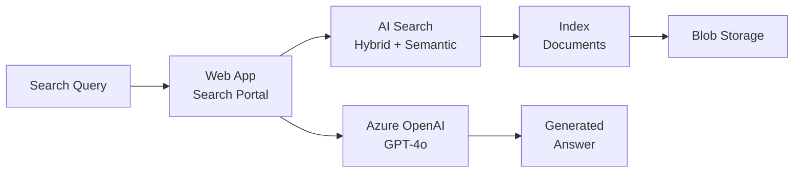

# Solution Play 09: AI Search Portal

> **Complexity:** Medium | **Status:** ✅ Ready
> Enterprise search portal — Azure AI Search + hybrid retrieval + OpenAI-powered answers.

## Architecture

## Azure Services

| Service | Purpose |
|---------|---------|
| Azure AI Search | Hybrid + semantic search with vector indexing |
| Azure OpenAI Service | Generate natural language answers from results |
| Azure App Service | Host the search portal web application |
| Azure Blob Storage | Store source documents for indexing |
| Azure AI Content Safety | Filter search results and generated answers |

## DevKit (.github Agentic OS)

This play includes the full .github Agentic OS (19 files):
- **Layer 1:** copilot-instructions.md + 3 modular instruction files
- **Layer 2:** 4 slash commands + 3 chained agents (builder → reviewer → tuner)
- **Layer 3:** 3 skill folders (deploy-azure, evaluate, tune)
- **Layer 4:** guardrails.json + 2 agentic workflows
- **Infrastructure:** infra/main.bicep + parameters.json

Run `Ctrl+Shift+P` → **FrootAI: Init DevKit** in VS Code.

## TuneKit (AI Configuration)

| Config File | What It Controls |
|-------------|-----------------|
| config/openai.json | Answer generation model, temperature, max tokens |
| config/guardrails.json | Content filtering, result ranking, access scoping |
| config/agents.json | Agent behavior for search refinement |
| config/model-comparison.json | Model selection for answer generation |
| config/search.json | Hybrid ratio, top-k, semantic reranker, filters |
| config/chunking.json | Document chunk size, overlap, splitting strategy |

Run `Ctrl+Shift+P` → **FrootAI: Init TuneKit** in VS Code.

## Quick Start

1. Install: `code --install-extension frootai.frootai-vscode`
2. Init DevKit → 19 .github files + infra
3. Init TuneKit → AI configs + evaluation
4. Open Copilot Chat → ask to build this solution
5. Use /review → /deploy → ship

> **FrootAI Solution Play 09** — DevKit builds it. TuneKit ships it.
