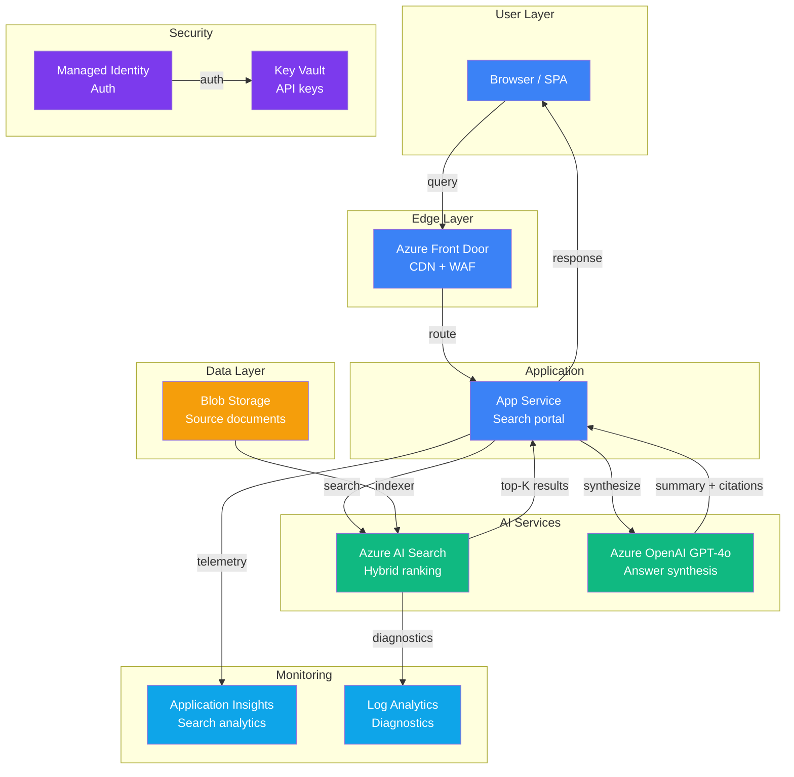

# Play 09 — AI Search Portal 🔎

> Enterprise search with hybrid ranking, GPT synthesis, and faceted navigation.

A search experience combining keyword matching with semantic understanding. AI Search handles retrieval with custom scoring profiles, GPT-4o synthesizes results into readable summaries with citations.

## Quick Start
```bash
cd solution-plays/09-ai-search-portal
az deployment group create -g $RG -f infra/main.bicep -p infra/parameters.json
code .  # Use @builder for index schema, @reviewer for relevance audit, @tuner for scoring
```

## Key Metrics
- NDCG@10: ≥0.7 · Zero-result rate: <5% · Query latency p95: <500ms

## DevKit
| Primitive | What It Does |
|-----------|-------------|
| 3 agents | Builder (index/search), Reviewer (relevance/access audit), Tuner (scoring/cost) |
| 3 skills | Deploy (128 lines), Evaluate (100 lines), Tune (104 lines) |

## Architecture



> 📐 [Full architecture details](architecture.md) — data flow, security architecture, scaling guide

## Cost Estimate

| Service | Dev/PoC | Production | Enterprise |
|---------|---------|-----------|------------|
| Azure AI Search | $75 (Basic) | $250 (Standard S1) | $1,000 (Standard S2) |
| App Service | $13 (B1) | $100 (P1v3) | $200 (P2v3) |
| Azure OpenAI | $40 (PAYG) | $250 (PAYG) | $1,000 (PTU Reserved) |
| Blob Storage | $2 (Hot LRS) | $20 (Hot LRS) | $60 (Hot GRS) |
| Azure Front Door | $0 (Not used) | $35 (Standard) | $100 (Premium) |
| Key Vault | $1 (Standard) | $3 (Standard) | $10 (Premium HSM) |
| Application Insights | $0 (Free) | $25 (Pay-per-GB) | $80 (Pay-per-GB) |
| Log Analytics | $0 (Free) | $15 (Pay-per-GB) | $50 (Commitment) |
| **Total** | **$131/mo** | **$698/mo** | **$2,500/mo** |

> 💰 [Full cost breakdown](cost.json) — per-service SKUs, usage assumptions, optimization tips

📖 [Full docs](spec/README.md) · 🌐 [frootai.dev/solution-plays/09-ai-search-portal](https://frootai.dev/solution-plays/09-ai-search-portal)
