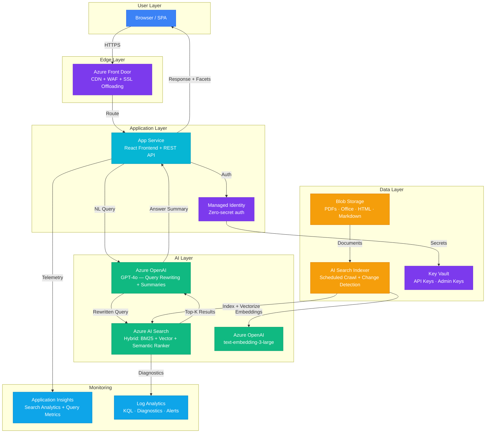

# Architecture — Play 09: AI Search Portal

## Overview

Enterprise search portal with semantic ranking and AI-powered answer summarization. Users search across organizational documents via a modern web UI with faceted navigation, filters, and natural language understanding. Azure AI Search handles hybrid retrieval (keyword + vector + semantic reranking), while GPT-4o generates concise answer summaries from top results.

## Architecture Diagram

## Data Flow

1. **Ingestion**: Documents uploaded to Blob Storage → AI Search Indexer runs on schedule (or change-detected) → Documents chunked, vectorized via text-embedding-3-large, and indexed with metadata facets
2. **Search**: User types query in portal → GPT-4o rewrites natural language into optimized search query → AI Search performs hybrid retrieval (BM25 + vector + semantic reranking) → Returns top-10 results with facets
3. **Summarization**: Top-5 results passed to GPT-4o → Model generates a concise answer summary with source citations → Summary displayed above document results
4. **Navigation**: Users refine via facets (file type, date, department, author) → Direct search with filters → Results paginated and highlighted with keyword matches
5. **Analytics**: Every query logged — latency, result count, click-through, zero-result rate → Dashboards in Application Insights for search quality improvement

## Service Roles

| Service | Layer | Role |
|---------|-------|------|
| App Service | Compute | React SPA hosting, REST API, Entra ID authentication |
| Azure AI Search | AI | Hybrid index, semantic reranking, faceted navigation |
| Azure OpenAI (GPT-4o) | AI | Query rewriting, answer summarization with citations |
| Azure OpenAI (Embeddings) | AI | Document vectorization during indexing |
| Blob Storage | Data | Source document storage, indexing source |
| AI Search Indexer | Data | Scheduled document crawling, chunking, vectorization |
| Azure Front Door | Networking | Global CDN, WAF protection, SSL offloading |
| Key Vault | Security | Search admin keys, OpenAI API keys |
| Managed Identity | Security | Zero-secret service-to-service authentication |
| Application Insights | Monitoring | Search analytics, query latency, click-through rates |
| Log Analytics | Monitoring | Centralized logging, KQL queries, alerting |

## Security Architecture

- **Entra ID Authentication**: Users sign in via Microsoft Entra ID — SSO with corporate directory
- **Managed Identity**: App Service → AI Search and OpenAI via managed identity — no keys in code
- **Private Endpoints**: AI Search and OpenAI accessible only via VNet in production
- **Azure Front Door WAF**: OWASP rules, rate limiting, bot protection on the portal
- **RBAC on Index**: Search results filtered by user's security group membership

## Scaling

| Metric | Dev | Production | Enterprise |
|--------|-----|-----------|------------|
| Concurrent users | 5-10 | 200-500 | 2,000+ |
| Documents indexed | 5K | 500K | 5M+ |
| Queries/minute | 10 | 200 | 1,000+ |
| App Service instances | 1 | 2-5 | 5-10 |
| Search replicas | 1 | 2 | 3-6 |
| Search partitions | 1 | 1-2 | 3-12 |
