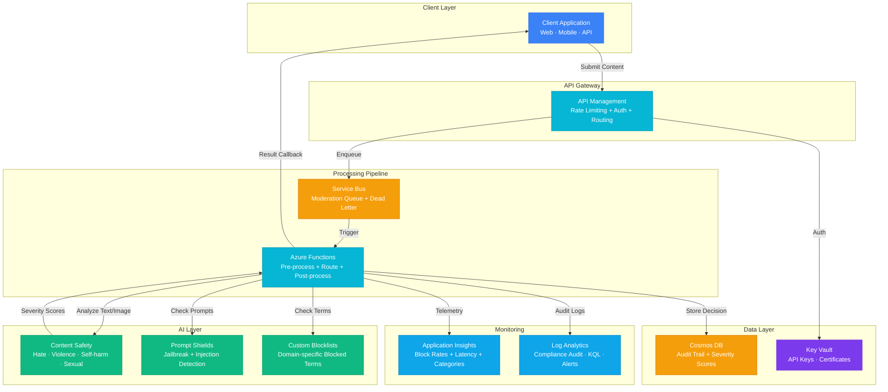

# Architecture — Play 10: Content Moderation

## Overview

AI-powered content moderation pipeline using Azure AI Content Safety. Incoming user-generated content (text, images) is submitted via API Management, queued for processing, analyzed by Content Safety for severity scoring across categories (hate, violence, self-harm, sexual), checked against custom blocklists, and routed through configurable action policies (allow, flag, block, escalate). All decisions are audited in Cosmos DB for compliance.

## Architecture Diagram

## Data Flow

1. **Submission**: Client app submits content (text or image) via API Management → Rate limiting and API key authentication applied → Content enqueued to Service Bus moderation queue
2. **Pre-processing**: Azure Function triggered by queue message → Content normalized (encoding, length truncation) → Custom blocklist fast-check for known-bad terms
3. **Analysis**: Content Safety API called for multi-category severity scoring (0-6 scale) → Prompt Shields check for jailbreak and injection patterns → Scores aggregated across all checks
4. **Decision**: Action policy applied based on severity thresholds — Allow (score 0-1), Flag for review (score 2-3), Block (score 4+), Escalate (score 6) → Decision recorded in Cosmos DB with full audit trail
5. **Response**: Result callback sent to client app (allow/block/flag status) → Blocked content returns generic safe message → Flagged content queued for human review

## Service Roles

| Service | Layer | Role |
|---------|-------|------|
| API Management | Gateway | Rate limiting, authentication, request routing |
| Service Bus | Messaging | Async moderation queue, dead-letter for failures |
| Azure Functions | Compute | Moderation pipeline orchestration, policy engine |
| Content Safety | AI | Multi-category content analysis, severity scoring |
| Prompt Shields | AI | Jailbreak detection, prompt injection defense |
| Custom Blocklists | AI | Domain-specific term blocking, fast-reject path |
| Cosmos DB | Data | Audit trail, moderation decisions, appeal records |
| Key Vault | Security | API keys, certificates, managed identity |
| Application Insights | Monitoring | Moderation metrics, latency, category distribution |
| Log Analytics | Monitoring | Compliance audit logging, KQL queries, alerts |

## Security Architecture

- **API Management**: API key + OAuth2 authentication, per-client rate limiting
- **Managed Identity**: Functions → Content Safety and Cosmos DB via managed identity
- **Key Vault**: All secrets and certificates stored securely, auto-rotated
- **Data Privacy**: Raw content TTL'd in Cosmos DB (30 days), only metadata retained long-term
- **Compliance Logging**: Every moderation decision logged immutably in Log Analytics
- **VNet Integration**: Functions and Cosmos DB behind private endpoints (enterprise)

## Scaling

| Metric | Dev | Production | Enterprise |
|--------|-----|-----------|------------|
| Content items/minute | 10 | 500 | 5,000+ |
| Concurrent moderations | 5 | 50 | 200+ |
| Avg latency per item | <2s | <1s | <500ms |
| Function instances | 1 | 5-20 | 20-100 |
| Cosmos DB RU/s | Serverless | 400 | 2,000+ |
| Service Bus throughput | Basic | Standard | Premium |
