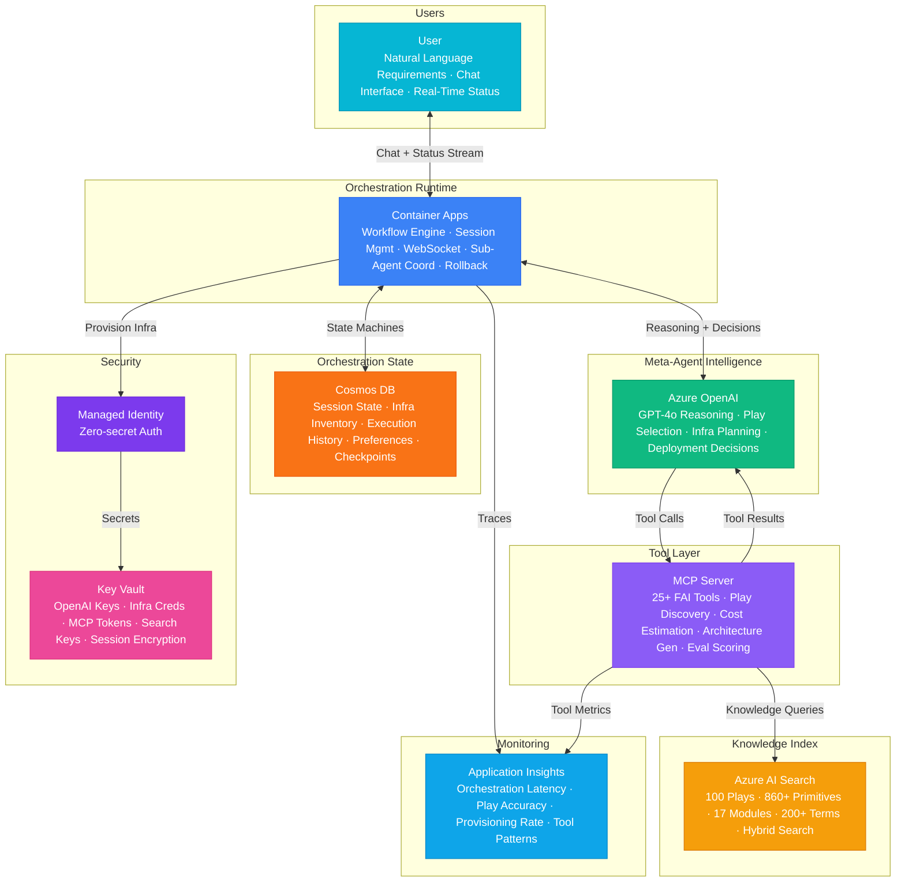

# Play 100 — FAI Meta-Agent 🎯

> The capstone play — self-orchestrating agent that routes users to the right play, initializes DevKit/TuneKit/SpecKit, and provides cross-play intelligence across all 101 solution plays.

Build the FAI Meta-Agent — FrootAI's master orchestrator. Semantic search over all 101 plays matches user intent to the best solution, cross-play intelligence suggests complementary plays (e.g., RAG + Governance), DevKit initializer scaffolds the complete development environment, and feedback loops continuously improve routing accuracy.

## Quick Start
```bash
cd solution-plays/100-fai-meta-agent
az deployment group create -g $RG -f infra/main.bicep -p infra/parameters.json
code .
# Use @builder to implement, @reviewer to audit, @tuner to optimize
```

## Architecture



📐 [Full architecture details](architecture.md)

| Service | Purpose |
|---------|---------|
| Azure OpenAI (gpt-4o) | Intent classification + routing rationale |
| Azure AI Search (Basic) | Play catalog semantic search (101 plays) |
| Cosmos DB (Serverless) | User context, recommendations, feedback |
| Container Apps | Meta-Agent API + configurator |

## Pre-Tuned Defaults
- Routing: Intent classification → semantic search → context reranking → combination check
- Combinations: 5 static pairs + dynamic rules for security/governance/evaluation
- DevKit: Full scaffold (copilot-instructions, agents, skills, hooks, prompts, config, spec)
- Feedback: 5 tracking events · monthly routing retrain · satisfaction ≥ 4.0 target

## DevKit (AI-Assisted Development)
| Primitive | What It Does |
|-----------|-------------|
| `agent.md` | Root orchestrator with builder→reviewer→tuner handoffs |
| `copilot-instructions.md` | Meta-agent domain (play routing, cross-play, DevKit init, FAI Protocol) |
| 3 agents | Builder (gpt-4o), Reviewer (gpt-4o-mini), Tuner (gpt-4o-mini) |
| 3 skills | Deploy (250+ lines), Evaluate (115+ lines), Tune (235+ lines) |
| 4 prompts | `/deploy`, `/test`, `/review`, `/evaluate` with agent routing |

## Cost Estimate
| Service | Dev/mo | Prod/mo | Enterprise/mo |
|---------|--------|---------|---------------|
| Azure OpenAI | $50 (PAYG) | $800 (PAYG) | $2,500 (PTU Reserved) |
| MCP Server | $10 (Consumption) | $200 (Dedicated) | $600 (HA) |
| Container Apps | $15 (Consumption) | $400 (Dedicated) | $1,200 (Dedicated HA) |
| Azure Cosmos DB | $5 (Serverless) | $280 (5000 RU/s) | $750 (15000 RU/s) |
| Azure AI Search | $0 (Free) | $250 (Standard S1) | $1,000 (Standard S2) |
| Key Vault | $1 (Standard) | $10 (Standard) | $40 (Premium HSM) |
| Application Insights | $0 (Free) | $60 (Pay-per-GB) | $200 (Pay-per-GB) |
| **Total** | **$81** | **$2,000** | **$6,290** |

💰 [Full cost breakdown](cost.json)

## The Capstone
Play 100 is unique — it's the only play that:
- **Routes to all 100 other plays** based on user intent
- **Initializes DevKit** for any play with one command
- **Suggests play combinations** (RAG+Governance, Voice+Safety, etc.)
- **Tracks feedback** to improve routing over time
- **Is the entry point** to the entire FrootAI ecosystem

📖 [Full documentation](spec/README.md) · 🌐 [frootai.dev/solution-plays/100-fai-meta-agent](https://frootai.dev/solution-plays/100-fai-meta-agent) · 📦 [FAI Protocol](spec/fai-manifest.json)
