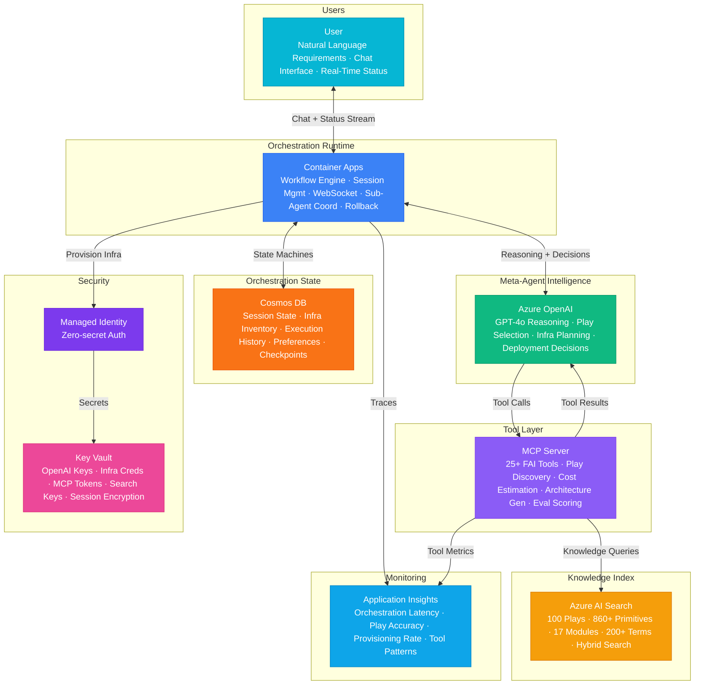

# Architecture — Play 100: FAI Meta-Agent — Self-Orchestrating Super-Agent That Selects Plays, Provisions Infrastructure, and Delivers Production AI

## Overview

The crown jewel of the FrootAI ecosystem — a self-orchestrating meta-agent that understands natural language requirements, selects optimal solution plays from the 100-play catalog, designs architecture, provisions Azure infrastructure, deploys production-ready AI systems, and runs evaluation pipelines to verify quality — all through a single conversational interface. Azure OpenAI provides the meta-agent's intelligence — GPT-4o handles high-level reasoning: analyzing user requirements against the play catalog, selecting optimal play combinations, planning multi-step orchestration workflows with dependency resolution, generating infrastructure configurations, and making deployment decisions; GPT-4o-mini handles efficient sub-tasks: requirement parsing, documentation generation, status summarization, and user communication; structured output ensures deterministic play configuration and infrastructure provisioning commands. The MCP Server exposes the tool orchestration layer — 25+ FAI MCP tools enabling the meta-agent to dynamically compose capabilities: play discovery (semantic search, filtering, comparison), architecture generation (Mermaid diagrams, service role tables), cost estimation (per-play pricing at dev/prod/enterprise scale), knowledge base queries (modules, glossary, best practices), evaluation scoring (quality gates, threshold checks), and infrastructure provisioning commands; the MCP protocol enables flexible tool composition where the meta-agent selects and sequences tools based on user intent. Container Apps host the meta-agent runtime — orchestration engine managing multi-step workflows from requirement analysis through production deployment, session management for long-running provisioning tasks, WebSocket interface for real-time status streaming to clients, sub-agent coordination for parallel infrastructure deployments, and retry/rollback management for failed provisioning steps. Cosmos DB maintains orchestration state — active session state machines tracking workflow progression, provisioned infrastructure inventory, play execution history with full audit trail, user preference profiles, cost tracking per session, and rollback checkpoints. Azure AI Search powers play knowledge retrieval — semantic search across 100 play architectures, 860+ primitives, 17 knowledge modules, and 200+ glossary terms; hybrid search for precise requirement-to-play matching; faceted filtering by complexity, services, industry, and WAF pillars. Designed for AI platform teams who want to accelerate from idea to production, enterprise architects exploring solution options, developers prototyping AI systems, and any user who wants the full power of the FAI ecosystem accessible through natural conversation.

## Architecture Diagram

## Data Flow

1. **Requirement Analysis & Play Selection**: User describes what they want to build in natural language — "I need a RAG chatbot for our internal knowledge base with document upload, Entra ID authentication, and Azure landing zone compliance" → Container Apps receive the request, create orchestration session in Cosmos DB, stream real-time status updates via WebSocket → GPT-4o analyzes the requirement: extracts key capabilities (RAG, document processing, authentication, compliance), identifies constraints (internal-only, landing zone), estimates complexity → MCP tools invoked: `semantic_search_plays` finds matching plays ranked by relevance (Play 01: Enterprise RAG 92%, Play 06: Document Intelligence 78%, Play 02: AI Landing Zone 85%), `get_play_detail` retrieves architecture details for top candidates, `compare_plays` generates side-by-side comparison → GPT-4o synthesizes recommendation: "I recommend combining Play 01 (Enterprise RAG) as the core with Play 02 (AI Landing Zone) for infrastructure compliance and incorporating document upload patterns from Play 06. Here's the architecture..." → User confirms or refines requirements through conversation
2. **Architecture Design & Cost Estimation**: Upon user confirmation, GPT-4o designs the combined architecture — merges service roles from selected plays, resolves service overlaps (single Cosmos DB instance serving both RAG state and document metadata), identifies integration points (AI Search shared between RAG retrieval and document indexing), maps WAF pillars across the combined solution → MCP tools invoked: `generate_architecture_diagram` produces Mermaid diagram for the combined architecture, `estimate_cost` calculates per-tier pricing (dev: $86/mo, prod: $1,735/mo, enterprise: $5,630/mo), `get_module` retrieves relevant knowledge sections for implementation guidance → Architecture artifacts stored in Cosmos DB session: Mermaid diagram, service inventory, cost breakdown, WAF alignment matrix, implementation guidance → User reviews architecture, requests modifications through conversation ("Can we add multi-language support?" → meta-agent incorporates Play 57 translation patterns), iterates until satisfied
3. **Infrastructure Provisioning**: User approves architecture for deployment — meta-agent transitions to provisioning phase → GPT-4o generates Bicep templates for all Azure resources: resource group, AI Search instance, Azure OpenAI deployment, Cosmos DB account, Container Apps environment, Key Vault, Application Insights, managed identities, RBAC assignments, private endpoints (if landing zone compliance required) → Container Apps orchestration engine executes provisioning in dependency order: resource group → networking (if applicable) → data stores (Cosmos DB, AI Search) → AI services (OpenAI) → compute (Container Apps, Functions) → security (Key Vault, RBAC) → monitoring (Application Insights) → Real-time status streaming via WebSocket: "✅ Resource group created → ✅ Cosmos DB provisioned → 🔄 Deploying AI Search (2/5 resources complete)..." → Rollback checkpoints saved in Cosmos DB after each successful step — if provisioning fails, meta-agent can revert to last known good state → Infrastructure inventory recorded: resource IDs, endpoints, connection details, estimated monthly cost
4. **Application Deployment & Configuration**: With infrastructure provisioned, meta-agent deploys the application layer — generates application code from play templates (API endpoints, RAG pipeline, document upload handler, authentication middleware), configures application settings (OpenAI endpoint, AI Search connection, Cosmos DB connection string via managed identity), deploys to Container Apps with appropriate scaling rules → MCP tools invoked: `search_knowledge` retrieves implementation best practices for each component, `get_architecture_pattern` provides RAG-specific configuration guidance (chunk size, overlap, retrieval top-k), `validate_config` checks configuration against play-specific rules → Deployment verification: health check endpoints confirmed, end-to-end test with sample query, latency measurement against SLA targets → Deployment artifacts and access details stored in Cosmos DB and presented to user
5. **Evaluation & Handoff**: Meta-agent runs evaluation pipeline against the deployed system — generates test cases from play-specific evaluation criteria, executes benchmark queries, scores responses using LLM-as-judge → MCP tools invoked: `run_evaluation` checks scores against thresholds (groundedness ≥ 4.0, relevance ≥ 4.0, coherence ≥ 4.0, fluency ≥ 4.0, safety ≥ 4.5), `get_best_practices` retrieves operational recommendations → Evaluation results presented: "Your RAG chatbot scored 4.3 groundedness, 4.5 relevance, 4.7 coherence — all passing! Here are optimization recommendations..." → Handoff package delivered: architecture documentation, infrastructure inventory, cost tracking dashboard, operational runbook, evaluation baseline, and recommended next steps → Session marked complete in Cosmos DB with full orchestration audit trail

## Service Roles

| Service | Layer | Role |
|---------|-------|------|
| Azure OpenAI | Intelligence | Meta-agent reasoning — requirement analysis, play selection, architecture design, infra planning, deployment decisions |
| MCP Server | Tools | 25+ FAI tools — play discovery, architecture generation, cost estimation, knowledge queries, evaluation scoring |
| Container Apps | Runtime | Orchestration engine, session management, WebSocket streaming, sub-agent coordination, rollback management |
| Azure AI Search | Knowledge | Semantic search across 100 plays, 860+ primitives, 17 modules, 200+ glossary terms; hybrid retrieval |
| Cosmos DB | State | Session state machines, infrastructure inventory, execution history, user preferences, rollback checkpoints |
| Key Vault | Security | OpenAI keys, infrastructure provisioning credentials, MCP tool tokens, session encryption keys |
| Application Insights | Monitoring | Orchestration latency, play selection accuracy, provisioning success rate, tool invocation patterns |

## Security Architecture

- **Infrastructure Provisioning Security**: Meta-agent provisions infrastructure using managed identity with scoped RBAC — service principal has only the minimum permissions needed for resource creation; Bicep templates validated against Azure Policy before deployment; no credentials stored in generated code or configuration
- **Managed Identity**: All service-to-service auth via managed identity — Container Apps to OpenAI, MCP Server to AI Search, orchestration engine to Cosmos DB; zero credentials in application code; provisioned infrastructure inherits managed identity patterns
- **Session Isolation**: Each orchestration session runs in isolated context — no cross-session state leakage; provisioning credentials scoped per session; rollback operations restricted to session owner; session data encrypted at rest with per-session keys
- **Audit Trail**: Every orchestration action recorded immutably in Cosmos DB — requirement submissions, play selections, architecture decisions, provisioning commands, deployment results, evaluation scores; complete lineage for governance and compliance review
- **RBAC**: Users submit requirements and review recommendations; platform operators manage meta-agent configuration and tool registrations; infrastructure administrators approve provisioning requests for production environments; auditors access orchestration history and cost reports
- **Cost Controls**: Per-session budget limits prevent runaway infrastructure provisioning; user confirmation required before any resource creation; automatic resource tagging with session ID, owner, and estimated monthly cost; teardown automation for abandoned sessions

## Scaling

| Metric | Dev | Production | Enterprise |
|--------|-----|-----------|------------|
| Concurrent orchestration sessions | 2 | 20 | 200 |
| Play selections/day | 10 | 200 | 5,000 |
| Infrastructure provisioning/day | 2 | 20 | 200 |
| MCP tool calls/day | 500 | 20,000 | 500,000 |
| Knowledge search queries/day | 200 | 10,000 | 250,000 |
| AI Search index size | 50MB | 5GB | 25GB |
| Session state entries | 100 | 10,000 | 500,000 |
| Container replicas | 1 | 3-6 | 10-30 |
